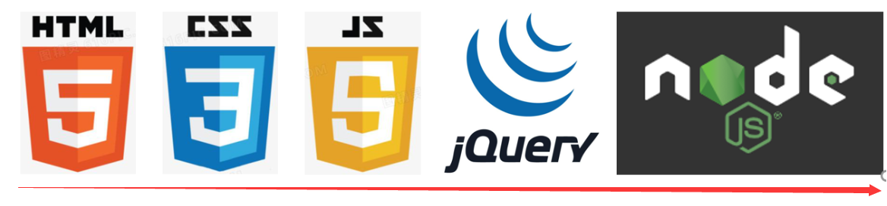

# VUE第二天

# 一. 预习

## 1.1 必安装 - vue-devtools

> 学习, 调试vue必备之利器 - 官方提供的呦

右上角-插件-谷歌访问助手-打开Chrome商店-搜索vue-devtools回车-然后添加至Chrome等待下载后自动安装-右上角显示已经添加即代表成功

如果实在打不开谷歌商店, 换个网 / 直接用备用文件夹里的vue-devtools插件包安装到浏览器扩展程序也一样用

==不要图标上带橘黄色beta的==

==如果这个网址打不开, 就用预习资料里备用的本地版安装也可以, 安装过程和上个插件安装过程一致==


## 1.2 vscode-插件补充

1. vue文件代码高亮插件-vscode中安装

   

2. 代码提示插件-vscode中安装

   

## 1.3 知识复习

- [ ] 表达式, 变量是什么
- [ ] new的作用和含义
- [ ] 实例化对象
- [ ] 什么是对象上的, 属性和方法
- [ ] 对象的赋值和取值
- [ ] this的指向
- [ ] npm/yarn是什么, package.json干什么的, 下载包的命令是什么, 什么是模块化开发
- [ ] 函数的形参实参, 得马上反应过来, 哪个是变量哪个是值, 谁传给谁了

如果通不过, 请记住口诀:

1. 变量是一个容器, 表达式原地都有返回结果

   ```js
   var a = 10;
   console.log(a); // a就是变量, 运行后使用变量里的值再原地打印
   console.log(10 + 50); // 10 + 50 就是表达式
   console.log(a > 9); // 这叫判断表达式, 原地结果是true
   ```

2. new 类名() - 原地得到一个实例对象 - 对象身上有key(或叫属性, 叫键都行), 对应的值是我们要使用的

3. 实例化对象就是new 类名() 创造出来的对象, 身上包含属性(key, 键) 对应的 值

4. 什么是属性和方法(固定格式)

   ```js
   let obj = { // 属性指的是a, b, c, d, e这些名字
       a: 10,
       b: [1, 2, 3],
       c: function(){},
       d () {},
       e: () => {} // 值是冒号:右边的值
   }
   // 这个格式是固定的, 必须张口就来, 张手就写, 准确率100%
   ```

5. 对象的复制和取值(固定格式)

   有=(赋值运算符) 就是赋值, 没有就是取值

   ```js
   let obj = {
       a: 10,
       b: 20
   }
   console.log(obj.a); // 从obj对象的a上取值, 原地打印10
   obj.b = 100; // 有=, 固定把右侧的值赋予给左侧的键, 再打印obj这个对象, b的值是100了
   ```

6. this指向口诀

   在function函数中, this默认指向当前函数的调用者  调用者.函数名()

   在箭头函数中, this指向外层"函数"作用域this的值


# 今日学习目标

1. 能够理解`vue`的概念和作用
2. 能够理解`@vue/cli`脚手架工程化开发
3. 能够使用`vue`指令

# 一. VUE概念

> 学习vue的目的，是高效的开发前端。


例如: 把数组数据-循环铺设到li中, 看看分别如何做的?

原生js做法

```vue
<ul id="myUl"></ul>
<script>
    let arr = ["春天", "夏天", "秋天", "冬天"];
    let myUl = document.getElementById("myUl");
    for (let i = 0; i < arr.length; i++) {
        let theLi = document.createElement("li");
        theLi.innerHTML = arr[i];
        myUl.appendChild(theLi);
    }
</script>
```

Vue.js做法

```vue
<li v-for="item in arr">{{item}}</li>
<script>
    new Vue({
        // ...
        data: {
            arr: ["春天", "夏天", "秋天", "冬天"] 
        }
    })
</script>
```

*注意: 虽然vue写起来很爽, 但是一定不要忘记, vue的底层还是原生js*

## 1.1 渐进式框架 - VUE

> 官网地址: https://cn.vuejs.org/ (作者: 尤雨溪)

**渐进式：逐渐使用，集成更多功能** -  逐渐进步, 想用什么就用什么, 不必全都使用 (可以联想一下vscode及它的插件库)



Vue渐进式: Vue从基础开始, 会循序渐进向前学习, 如下知识点可能你现在不明白, 但是学完整个vue回过头来看, 会很有帮助


**看上去很深奥，其实全都是在驱动数据，我们要理解后续学习过程中的各项数据流转特点**

## 1.2 库和框架

- 库:  封装的属性或方法 (例jquery.js)

- 框架: 拥有自己的规则和元素, 比库强大的多 (例vue.js)


## 1.3 Vue学习方式

- 传统开发模式：基于html/css/js文件开发vue

  

- 工程化开发方式：在webpack环境中开发vue，这是最推荐, 企业常用的方式

  

1. 每天的知识点自测最好做到了如指掌 - 做不到只能花30分钟去记住结论和公式
2. 记住vue指令作用, 基础语法 - 弄一个字典(一一映射关系)
3. 在课上例子, 练习, 案例, 作业, 项目中, 反复磨炼使用
4. 学会查找问题的方式和解决方式(弄个报错总结.md, 避免反复进坑)

> 记住语法, 特点和作用, 反复磨炼使用, 多总结

# 二. @vue/cli脚手架

## 2.1 概念

> 目标: webpack自己配置环境很麻烦, 下载@vue/cli包,用vue命令创建脚手架项目

概念：@vue/cli是Vue官方提供的一个全局模块包(得到vue命令), 此包用于创建脚手架项目

脚手架是为了保证各施工过程顺利进行而搭设的工作平台


**优势：**

- 开箱即用

- 0配置webpack
  - babel支持
  - css, less支持
  - 开发服务器支持

## 2.2 安装

> 目标: 把@vue/cli模块包按到全局, 电脑拥有vue命令, 才能创建脚手架工程

1. 全局安装命令

   ```bash
   yarn global add @vue/cli
   # 或者 npm install -g @vue/cli
   ```

   注意: 如果半天没动静(95%都是网速问题), 可以`ctrl c `终止

2. 查看vue脚手架版本

   ```bash
   vue -V
   ```

   **如果出现版本号就安装成功, 否则失败**

## 2.3 创建项目服务 - 启动！

> 目标: 使用vue命令, 创建脚手架项目

1. 创建项目

   ```bash
   # vue和create是命令, vuecli-demo是文件夹名
   vue create vuecli-demo
   ```

   *注意: 项目名不能带大写字母, 中文和特殊符号*

2. 选择模板

   > 可以上下箭头选择, 弄错了ctrl+c重来

   

3. 选择用什么方式下载脚手架项目需要的依赖包

   

4. 回车等待生成项目文件夹+文件+下载必须的第三方包们

   

5. 进入脚手架项目下, 启动内置的热更新本地服务器

   

   ```BASH
   npm run serve
   # 或 yarn serve
   ```

   

## 2.4 @vue/cli 目录和代码分析

> 目标: 讲解重点文件夹, 文件的作用, 以及文件里代码的意思


```bash
 vuecil-demo        # 项目目录
    ├── node_modules # 项目依赖的第三方包
    ├── public       # 静态文件目录
      ├── favicon.ico# 浏览器小图标
      └── index.html # 单页面的html文件(网页浏览的是它)
    ├── src          # 业务文件夹
      ├── assets     # 静态资源
        └── logo.png # vue的logo图片
      ├── components # 组件目录
        └── HelloWorld.vue # 欢迎页面vue代码文件 
      ├── App.vue    # 整个应用的根组件
      └── main.js    # 入口js文件
    ├── .gitignore   # git提交忽略配置
    ├── babel.config.js  # babel配置
    ├── package.json  # 依赖包列表
    ├── README.md    # 项目说明
	└── yarn.lock    # 项目包版本锁定和缓存地址
```

主要文件及含义

```js
node_modules下都是下载的第三方包 可以通过npm install下载，一般不会做为拷贝对象
public/index.html – 浏览器运行的网页
src/main.js – webpack打包的入口文件
src/App.vue – vue项目入口页面
package.json – 依赖包列表文件
```

## 2.5 @vue/cli 项目架构 (★★★)

### 2.5.1 项目入口 - main.js

>main.js 作为一个vue项目的入口文件


```js
// 项目入口-webpack打包从这开始

import Vue from 'vue' // 引入vue源码
import App from './App.vue' // 引入App.vue文件模块

Vue.config.productionTip = false // 一个控制台打印的提示

new Vue({ // 实例化Vue(传入配置对象)
  render: h => h(App), // 告诉vue渲染什么，准备渲染App页面
}).$mount('#app') // '渲染到哪里
```

**来看看哪里有这个`#app`** - `public/index.html`


### 2.5.2 main.js和App.vue以及index.html作用和关系

**作用：**

1. main.js - 项目打包入口 - Vue初始化
2. App.vue - Vue页面入口
3. index.html - 浏览器运行的文件

**关系：**

1. App.vue => main.js => index.html

## 2.6 @vue/cli 自定义配置

> 项目中没有webpack.config.js文件，因为@vue/cli用的vue.config.js

在package并列的处新建`vue.config.js`


```js
// vue 脚手架项目 - 默认的配置文件名
const {defineConfig} = require('@vue/cli-service')
module.exports = defineConfig({
  transpileDependencies: true,
  devServer: { // 自定义服务配置
    open: true, // 自动打开浏览器
    port: 3000
  }
})
```

## 2.7 eslint(仅供了解，后续也不需要自己配置)

> 目标：
>
> 1. 了解eslint的作用
> 2. 了解如何关闭eslint监测

**作用：**规范代码

如：有一个只声明不使用的变量


解决方法：

1. 手动解决掉错误, 以后项目中会讲如何自动解决

2. 暂时关闭eslint检查(因为现在主要精力在学习Vue语法上), 在vue.config.js中配置后重启服务

   

3. 单行注释

   ```js
   // 1. 下一行不进行监测
   // eslint-disable-next-line
   let a = 123

   // 2. 同一行不进行监测
   let a = 123 // eslint-disable-line
   ```

4. 多行注释

   ```js
   /* eslint-disable */
   let a = 123
   /* eslint-disable */
   ```

## 2.8 @vue/cli 单vue文件讲解

> 单vue文件好处, 独立作用域互不影响

- Vue推荐采用.vue文件来开发项目
- template里只能有一个根标签
- vue文件-独立模块-作用域互不影响
- style配合scoped属性, 保证样式只针对当前template内标签生效
- vue文件配合webpack, 把他们打包起来插入到index.html

```vue
<!-- template必须, 只能有一个根标签, 影响渲染到页面的标签结构 -->
<!-- 里面只能有一个标签！ -->
<template>
  <div>欢迎使用vue</div>
</template>

<!-- js相关 -->
<script>
export default {
  name: 'App'
}
</script>

<!-- 当前组件的样式, 设置scoped, 可以保证样式只对当前页面有效 -->
<style scoped>
</style>

```

## 2.9 @vue/cli 初始化项目清理

> 目标: 我们开始写我们自己的代码, 无需初始化脚手架是带来的页面

* src/App.vue默认有很多内容, 可以全部删除留下框

  ```vue
  <template>
  <div id="app"></div>
  </template>

  <script>
      export default {
          name: 'App',
          components: {}
      }
  </script>

  <style>
  </style>
  ```

  

* assets 和 components 文件夹下的所有文件都删除掉 (不要默认的欢迎页面)

  

## 2.10 总结

1. @vue/cli的本质是一个脚手架
2. 通过`vue create 项目名称`创建脚手架， 通过`npm run serve`启动
3. 脚手架的优势是不需要配置webpack直接可以使用
4. 脚手架项目打包的入口是`main.js`所有和项目有联系的代码都需要和它有联系
5. 浏览器真正运行的html是`public/index.html`
6. 单`vue`文件拥有独立的作用域，不会影响其他文件

# 三. VUE (★★★★★)

## 3.1 插值表达式（声明式渲染） - 插入的某个值

> 可以利用双大括号直接在dom标签中插入内容，不必进行webapi的一系列操作

语法：

```vue
 {{ 表达式 }}
```

例子：

**注意：**

1. dom中插值表达式赋值
2. vue的变量必须在data里声明

```vue
<!-- <vue 根据提示回车即可出现如下结构 -->
<template>
  <div>
    <!-- 2. 把值赋予到标签 -->
    <h1>{{ msg }}</h1>
    <h2>{{ obj.name }}</h2>
    <h3>{{ obj.age >= 18 ? '成年了' : '未成年' }}</h3>
  </div>
</template>

<script>
export default {
  // 1. 变量在data函数return的对象上
  data () {
    return {
      msg: 'Hello, Vue',
      obj: {
        name: '小vue',
        age: 5
      }
    }
  }
}
</script>

<style>
</style>
```

问：

1. 什么是插值表达式？
2. `Vue`中变量声明在哪里？

## 3.2 MVVM设计模式（面试必考）

场景： 当修改了data中的某个数据时， vue可以帮助我们在数据修改的同时，页面上的相应部分也会做出改变

演示: 在上个代码基础上, 在devtool工具改变M层的变量, 观察V层(视图的自动同步)


设计模式: 是一套被反复使用的、多数人知晓的、经过分类编目的、代码设计经验的总结。

+ MVVM，一种软件架构模式，决定了写代码的思想和层次
  + M：   model数据模型          (data里定义)	
  + V：    view视图                   （html页面）
  + VM： ViewModel视图模型  (vue.js源码)

- MVVM通过`数据双向绑定`让数据自动地双向同步  **不再需要操作DOM**
  - V（修改视图） -> M（数据自动同步）
  - M（修改数据） -> V（视图自动同步）


**1. 在vue中，不推荐直接手动操作DOM！！！**  

**2. 在vue中，通过数据驱动视图，不要在想着怎么操作DOM，而是想着如何操作数据！！**(思想转变)

> 减少了DOM操作, 挺高开发效率


### 2.2.1 MVC设计模式

​		MVC允许在不改变视图的情况下改变视图对用户输入的响应方式，用户对View的操作交给了Controller处理，在Controller中响应View的事件调用Model的接口对数据进行操作，一旦Model发生变化便通知相关视图进行更新。

**原生HTML + JS 就是这样的**

​		将html看成view;js看成controller，负责处理用户与应用的交互，响应对view的操作（对事件的监听），调用Model对数据进行操作，完成model与view的同步（根据model的改变，通过选择器对view进行操作）;将js的ajax当做Model，也就是数据层，通过ajax从服务器获取数据。


## 面试口诀1

**问：简单描述一下vue的设计模式**

**答：**vue使用的mvvm设计模式。**MVVM**是`Model-View-ViewModel`缩写，也就是把`MVC`中的`Controller`演变成`ViewModel`。`Model`层代表数据模型，`View`代表UI组件，`ViewModel`是`View`和`Model`层的桥梁，数据会绑定到`viewModel`层并自动将数据渲染到页面中，视图变化的时候会通知`viewModel`层更新数据。

## 3.3 v-bind - 动态属性

> 给标签属性设置vue变量的值

**vue指令, 实质上就是特殊的 html 标签属性, 特点:  v- 开头**

每个指令, 都有独立的作用

- 语法：`v-bind:属性名="vue变量"`
- 简写：`:属性名="vue变量"`

```vue
<!-- vue指令-v-bind属性动态赋值 -->
<a v-bind:href="url"></a>

```

案例：

**注意引入的不同方式**

vue中涉及到本地图片加载时，如果是动态地址，则一定要用`require`引入，如果直接写字符串，会被解析为字符串找不到图片

```vue
<template>
  <div>
    <!-- 2. 值 -> 标签原生属性上 -->
    <!-- 语法: v-bind:原生属性名="vue变量" -->
    <a v-bind:href="url">点击去百度</a>
    <!-- 语法: :原生属性名="vue变量" -->
    
    
    
  </div>
</template>

<script>
import imgObj from '../assets/123.png' // 唯独js需要导入图片文件(css/标签里可以直接使用图片地址)
export default {
  // 1. 准备变量
  data(){
    return {
      url: 'http://www.baidu.com',
      imgUrl: 'http://yun.itheima.com/Upload/./Images/20210412/60741c11ab77b.jpg',
      imgUrl2: require('../assets/123.png'),
      imgUrl3: imgObj
    }
  }
}
</script>

<style>
</style>
```

## 面试口诀2

**问：vue项目如何做代码优化**

**答：**以上问题中其中一点： 可以用require的方式引入图片，当使用到它的时候才会按需加载，而不会像import引入那样在页面创建时就会加载，加快页面初次加载效率

## 3.4 v-on（事件绑定）

> 给标签绑定事件
>
> 常用@事件名, 给dom标签绑定事件, 以及=右侧事件处理函数

**语法：**

* v-on:事件名="要执行的==少量代码==" **（尽量不要这么写）**
* v-on:事件名="methods中的函数"
* v-on:事件名="methods中的函数(实参)" 

**简写:**

-  @事件名="methods中的函数(实参)"

**案例：**

```vue
<template>
<div>
    <p>你要购买商品的数量: {{ count }}</p>
    <!-- 1. 绑定事件
语法: v-on:事件名="少量代码"
语法: v-on:事件名="methods里函数名"
语法: v-on:事件名="methods里函数名(值)"
语法: @事件名="methods里函数名"
-->
    <button v-on:click="count = count + 1">+1</button>
    <button v-on:click="addFn">+1</button>
    <button v-on:click="addCountFn(5)">+5</button>
    <button @click="subFn()">减少1</button>
</div>
</template>

<script>
    export default {
        data(){
            return {
                count: 1
            }
        },
        // 2. 定义函数
        methods: {
            addFn(){ // this代表export default后{}对象, data和methods里的属性都直接挂在它身上
                this.count++
            },
            addCountFn(num){
                this.count = this.count + num
            },
            subFn(){
                this.count--
            }
        }
    }
</script>
```

## 3.5 v-on获取事件对象

> vue事件处理函数中, 拿到事件对象

语法:

* 无传参, 通过形参直接接收
* 传参, 通过`$event`指代事件对象传给事件处理函数

```vue
<template>
<div>
    <a @click="one" href="http://www.baidu.com">百度</a>
    <hr />
    <a @click="two(10, $event)" href="http://www.taobao.com">淘宝</a>
</div>
</template>

<script>
    export default {
        methods: {
            // 1. 事件触发, 无传值, 可以直接获取事件对象是
            one(e){
                console.log(e)
                e.preventDefault()
            },
            // 2. 事件触发, 传值, 需要手动传入$event
            two(num, e){
                console.log(e)
                e.preventDefault()
            }
        }
    };
</script>
```

> 思考：有没有方式可以不用写`e.preventDefault()`就可以阻止默认行为呢？

## 3.6 v-on修饰符

语法:

* @事件名.修饰符="methods里函数"
  * .stop - 阻止事件冒泡
  * .prevent - 阻止默认行为
  * .once - 程序运行期间, 只触发一次事件处理函数

```vue
<template>
<div>
    <div @click="fatherFn">
        <p @click.stop="oneFn">.stop - 阻止事件冒泡</p>
        <a href="http://www.baidu.com" @click.prevent.stop>去百度</a>
        <p @click.once="twoFn">点击观察事件处理函数执行几次</p>
    </div>
</div>
</template>

<script>
    export default {
        methods: {
            fatherFn(){
                console.log("fahter-触发click事件");
            },
            oneFn(){
                console.log("p标签点击了");
            },
            twoFn(){
                console.log("p标签被点击了");
            }
        }
    }
</script>
```

> 思考： 以前是如何监听键盘事件的？


## 3.7 v-on按键修饰符

> 给键盘事件, 添加修饰符

**语法:**

* @keyup.enter  -  监测回车按键
* @keyup.esc     -   监测返回按键
* [更多修饰符](https://cn.vuejs.org/v2/guide/events.html#%E6%8C%89%E9%94%AE%E4%BF%AE%E9%A5%B0%E7%AC%A6)

**案例：**

```vue
<template>
<div>
    <!-- 1. 绑定键盘按下事件.enter-回车 -->
    <input type="text" @keydown.enter="enterFn">
    <!-- 2. .esc修饰符 - 取消键 -->
    <hr>
    <input type="text" @keydown.esc="escFn">
</div>
</template>

<script>
    export default {
        methods: {
            enterFn(){
                console.log("用户按下的回车");
            },
            escFn(){
                console.log("用户按下esc键");
            }
        }
    }
</script>
```

> 多使用事件修饰符, 可以提高开发效率, 少去自己判断过程

## 3.8 课上练习 - 翻转世界

> 目标: 点击按钮 - 把文字取反显示 - 再点击取反显示(回来了)

> 提示: 把字符串取反赋予回去
>
> 要求：禁止使用dom操作实现功能

效果演示:


代码实现：

```vue
<template>
<div>
    <!-- 1. 变量准备-静态页面铺设 -->
    <h1>{{ msg }}</h1>
    <!-- 2. 绑定点击事件 -->
    <button @click="btn">逆转世界</button>
</div>
</template>

<script>
    export default {
        data() {
            return {
                message: "HELLO, WORLD",
            };
        },
        methods: {
            btn(){
                // // 3. 截取字符串返回数组
                // let arr = this.msg.split("")
                // // 4. 翻转
                // arr.reverse()
                // // 5. 数组拼接起来
                // this.msg = arr.join("")
                
                // 简写
                this.message = this.message.split("").reverse().join("")
            }
        }
    };
</script>
```


## 3.9 v-model

> 把value属性和vue数据变量, 双向绑定到一起

### 3.9.1 基础用法

* 语法: v-model="vue数据变量"
* 双向数据绑定
  * 数据变化 -> 视图自动同步
  * 视图变化 -> 数据自动同步

**案例：**用户名绑定 - vue内部是MVVM设计模式

```vue
<template>
<div>
    <div>
        <span>用户名:</span>
        <!-- 1. v-model 双向数据绑定 value属性 - vue变量 -->
        <input type="text" v-model="username">
    </div>
    <div>
        <span>密码: </span>
        <input type="password" v-model="pass">
    </div>
</div>
</template>

<script>
    export default {
        data(){
            return {
                username: "",
                pass: ""
            }
        }
    }
</script>
```

- v-model常用在在表单标签上，后续也会应用于某些组件
- v-model的作用是把Vue的数据变量和表单的value属性双向绑定在一起

> 思考：下拉选择框、单选框、复选框、文本域的v-model改放在哪呢？

### 3.9.2 更多表单元素用法

1. 下拉选择框

   `v-model`作用于`select`标签中，记录当前选择的`option`的值

   ```vue
   <template>
   <div>
         <span>来自于: </span>
         <!-- 下拉菜单要绑定在select上 -->
         <select v-model="from">
           <option value="北京市">北京</option>
           <option value="南京市">南京</option>
           <option value="天津市">天津</option>
         </select>
   </div>
   </template>

   <script>
       export default {
           data(){
               return {
                  from: ""
               }
           }
       }
   </script>
   ```

2. 复选框，单选框

   注意：复选框的值（`v-model`）需要用数组来包裹！！

   ```vue
   <template>
   <div>
       <div>
           <!-- (重要)
               遇到复选框, v-model的变量值
               非数组 - 关联的是复选框的checked属性
               数组   - 关联的是复选框的value属性
           -->
           <span>爱好: </span>
           <input type="checkbox" v-model="hobby" value="抽烟">抽烟
           <input type="checkbox" v-model="hobby" value="喝酒">喝酒
           <input type="checkbox" v-model="hobby" value="写代码">写代码
       </div>
       <div>
           <span>性别: </span>
           <input type="radio" value="男" name="sex" v-model="gender">男
           <input type="radio" value="女" name="sex" v-model="gender">女
       </div>
   </div>
   </template>

   <script>
       export default {
           data(){
               return {
                   hobby: [], // 复选框需要用数组
                   gender: ''
               }
           }
       }
   </script>
   ```

3. 文本域

   和普通的input文本框一样

   ```vue
   <template>
   <div>
         <span>自我介绍</span>
         <textarea v-model="intro"></textarea>
   </div>
   </template>

   <script>
       export default {
           data(){
               return {
                   info: ''
               }
           }
       }
   </script>
   ```

## 面试口诀3：

**问：vue双向编订实现原理**

**答：**当一个Vue实现创建时，Vue会遍历data选项的属性，用`Object.defineProperty`将它们转化为`getter/setter`并且在内部追踪相关依赖，在属性被访问拒绝和修改时通知变化。每个组件实例都有相应的watcher程序实例，它会在组件渲染的过程中把属性记录为依赖，之后当依赖项的setter被调用时，会通知watcher重新计算，从而致使它关联的组件得以更新。

## 3.10 v-model 的修饰符

语法: `v-model.修饰符="vue数据变量"`

* `.number`               以parseFloat转成数字类型（会自动清除非数字及以后部分）
* `.trim` （常用）  去除首尾空白字符
* `.lazy`                   在change时触发而非input时（一切可以触发change事件的情况，如失焦）

**案例：**

```vue
<template>
  <div>
      <div>
          <span>年龄</span>
          <!-- .number修饰符-把值parseFloat转数值再赋予给v-model对应的变量 -->
          <!-- 对比prompt输出的值 -->
          <input type="text" v-model.number="age">
    </div>
      <div>
          <!-- .trim修饰 - 去除首尾两边空格 -->
          <span>人生格言</span>
          <input type="text" v-model.trim="motto">
    </div>
      <div>
          <!-- .lazy修饰符 - 失去焦点内容改变时(onchange事件), 把内容同步给v-model的变量 -->
          <span>个人简介</span>
          <textarea v-model.lazy="intro"></textarea>
    </div>
  </div>
</template>

<script>
export default {
  data() {
    return {
      age: "",
      motto: "",
      intro: ""
    }
  }
}
</script>
```

## 3.11 v-text和v-html

> 作用: 更新DOM对象的innerText/innerHTML
>
> **注意： v-text或v-html会覆盖标签内的所有子元素**

* 语法:
  * v-text="vue数据变量"    
  * v-html="vue数据变量" 

```vue
<template>
<div>
      <!-- 注意: v-text或v-html会覆盖标签内的所有子元素 -->	
      <p v-text="str"></p>
      <p v-html="str"></p>
</div>
</template>

<script>
export default {
  data() {
    return {
      str: "<span>我是一个span标签</span>"
    }
  }
}
</script>
```

## 3.12 v-show和v-if

> 控制标签的显示和隐藏

* 语法:
  * v-show="vue变量"            
  * v-if="vue变量" 
* 原理
  * v-show 用的display:none隐藏   (频繁切换使用)
  * v-if  直接从DOM树上移除
* 高级
  * v-else使用
* 使用场景及区别
  * v-show 一般用于单个没有子元素或者子元素都是静态元素的标签
  * v-if 常用于弹窗表单

**案例：**

```vue
<template>
<div>
    <!-- 、
        v-show 或者 v-if
        v-show="vue变量"
        v-if="vue变量"
    -->
    <h1 v-show="isShow">我是h1</h1>
    <h2 v-if="isOk">我是h2</h2>
    <!-- 
        v-show隐藏: 采用display:none   // 频繁切换
        v-if隐藏:   采用从DOM树直接移除 // 移除
    -->

    <!-- v-if和v-else使用 -->
    <p v-if="age >= 18">成年了</p>
    <p v-else>未成年</p>
</div>
</template>

<script>
    export default {
        data(){
            return {
                isShow: true,
                isOk: true,
                age: 2
            }
        }
    }
</script>
```

## 3.13 案例-折叠面板

> 目标: 点击展开或收起时，把内容区域显示或者隐藏


使用less语法时需要引入`less-loader`模块

```bash
npm install less-loader -D
```

案例模板：

```vue
<template>
  <div id="app">
    <h3>案例：折叠面板</h3>
    <div>
      <div class="title">
        <h4>芙蓉楼送辛渐</h4>
        <!-- 绑定点击事件 -->
        <span class="btn">
          <!-- 根据isShow的值显示不同文字 -->
          收起
        </span>
      </div>
      <!-- v-show配合变量来控制标签隐藏出现 -->
      <div class="container">
        <p>寒雨连江夜入吴,</p>
        <p>平明送客楚山孤。</p>
        <p>洛阳亲友如相问，</p>
        <p>一片冰心在玉壶。</p>
      </div>
    </div>
  </div>
</template>

<script>
    export default {
        data() {
            return {

            }
        }
    }
</script>

<style lang="less" scoped>
    body {
        background-color: #ccc;
        #app {
            width: 400px;
            margin: 20px auto;
            background-color: #fff;
            border: 4px solid blueviolet;
            border-radius: 1em;
            box-shadow: 3px 3px 3px rgba(0, 0, 0, 0.5);
            padding: 1em 2em 2em;
            h3 {
                text-align: center;
            }
            .title {
                display: flex;
                justify-content: space-between;
                align-items: center;
                border: 1px solid #ccc;
                padding: 0 1em;
            }
            .title h4 {
                line-height: 2;
                margin: 0;
            }
            .container {
                border: 1px solid #ccc;
                padding: 0 1em;
            }
            .btn {
                /* 鼠标改成手的形状 */
                cursor: pointer;
            }
        }
    }
</style>
```

**CODE**

步骤：

1. 创建点击事件方法
2. 设置显示标记变量
3. 通过点击事件改变标记变量
4. 通过插值表达式改变按钮的文本

```VUE
<template>
  <div id="app">
    <h3>案例：折叠面板</h3>
    <div>
      <div class="title">
        <h4>芙蓉楼送辛渐</h4>
        <!-- 1.绑定点击事件 事件的方法逻辑尽量不要直接写在标签里 -->
        <span class="btn" @click="btn">
          <!-- 4. 根据isShow的值显示不同文字 -->
          {{ isShow ? '收起' : '展开'}}
        </span>
      </div>
      <!-- 2. v-show配合变量来控制标签隐藏出现 -->
      <div class="container" v-show="isShow">
        <p>寒雨连江夜入吴,</p>
        <p>平明送客楚山孤。</p>
        <p>洛阳亲友如相问，</p>
        <p>一片冰心在玉壶。</p>
      </div>
    </div>
  </div>
</template>

<script>
export default {
    data() {
        return {
            isShow: true
        }
    },
    methods: {
        btn(){
            // 3. 点击时, 把值改成false
            this.isShow = !this.isShow
        }
    }
}
</script>
```

## 3.14 v-for

> 渲染列表数据时，直接在标签结构中进行数组遍历
>
> 循环时需要给v-for当前标签加上一个key属性，用来表现每个被循环出来的标签结构唯一且不同

* 语法 （类比forEach）

  * v-for="(值, 索引) in 目标结构"
  * v-for="值 in 目标结构"

* 目标结构:

  * 可以遍历数组 / 对象 / 数字 / 字符串 (可遍历结构)

* 注意:

  v-for的临时变量名不能用到v-for范围外

**CODE**

```VUE
<template>
  <div>
    <!-- 语法1:
      v-for="(值变量名, 索引变量名) in 目标结构"
      口诀: 想要谁循环就放到谁身上
     -->
    <ul>
      <li v-for="(item, index) in arr" :key="index">
        {{ item }} ---- {{ index }}
      </li>
    </ul>
    
    <!-- 语法2:
      v-for="值变量名 in 目标结构"
      -->
    <ul>
      <li v-for="obj in stuArr" :key="obj.id">
        <span>{{ obj.name }}</span>
        <span>{{ obj.sex }}</span>
        <span>{{ obj.hobby }}</span>
      </li>
    </ul>
    <!-- 语法3:
      v-for="(value, key) in 对象"
       -->
    <div>
      <p v-for="(value, key) in tObj" :key="value">
        <span>{{ value }}</span>
        =======
        <span>{{ key }}</span>
      </p>
    </div>
    <!-- 语法4: (了解很少这样使用)
      v-for="变量名 in 固定数字"
      从1开始遍历
     -->
    <div v-for="n in count" :key="n">{{ n }}</div>
  </div>
</template>

<script>
export default {
  data() {
    return {
      arr: ["小明", "小欢欢", "大黄"],
      stuArr: [
        {
          id: 1001,
          name: "孙悟空",
          sex: "男",
          hobby: "吃桃子",
        },
        {
          id: 1002,
          name: "猪八戒",
          sex: "男",
          hobby: "背媳妇",
        },
      ],
      tObj: {
        name: "小黑",
        age: 18,
        class: "1期",
      },
      count: 10,
    };
  },
};
</script>
```

### 补充： 避免v-for和v-if同时使用

​		当 v-if 与 v-for 一起使用时，v-for 具有比 v-if 更高的优先级。这意味着 v-if 将分别重复运行于 每个 v-for 循环中，即先运行 v-for 的循环，然后在每一个 v-for 的循环中，再进行 v-if 的条件对比，会造成性能问题，影响速度

**解决方法：在v-for前对数组进行筛选**

```vue
<!-- 错误 -->
<ul>
  <li v-for="user in users" v-if="user.isActive" :key="user.id">
    {{ user.name }}
  </li>
</ul>

<!-- 正确 -->
<ul>
  <li v-for="user in users.filter(item=>item.isActive)" :key="user.id">
    {{ user.name }}
  </li>
</ul>
```


# 今日总结

- [ ] Vue是什么
- [ ] Vue-cli作用以及简单使用
- [ ] 插值表达式
- [ ] MVVM设计模式
- [ ] v-bind作用
- [ ] v-on作用和事件对象以及修饰符使用
- [ ] v-model的作用以及双向数据绑定解释
- [ ] v-if和v-show的区别和本质
- [ ] v-for的作用和使用
- [ ] vue的特点
  * 渐进式
  * 声明式渲染
  * 数据驱动视图 (响应式)
  * 极少的去写DOM操作相关代码
  * 双向绑定
  * 组件系统
  * 不兼容IE8及以下浏览器

# 面试题

## 1. Vue的最大优势是什么?

​	简单易学, 轻量级整个源码js文件不大, 双向数据绑定, 数据驱动视图, 组件化, 数据和视图分离

## 2. Vue和jQuery区别是什么?

​	jQuery应该算是一个插件, 里面封装了各种易用的方法, 方便你使用更少的代码来操作dom标签

​	Vue是一套框架, 有自己的规则和体系与语法, 特别是设计思想MVVM, 让数据和视频关联绑定, 省略了很多DOM操作. 然后指令还给标签注入了更多的功能

## 3. mvvm和mvc区别是什么?

​	MVC: 也是一种设计模式, 组织代码的结构, 是model数据模型, view视图, Controller控制器, 在控制器这层里编写js代码, 来控制数据和视图关联

​	MVVM: 即Model-View-ViewModel的简写。即模型-视图-视图模型, VM是这个设计模式的核心, 连接v和m的桥梁, 内部会监听DOM事件, 监听数据对象变化来影响对方. 我们称之为数据绑定

## 4. Vue常用修饰符有哪些?

​    .prevent: 提交事件不再重载页面；

​	.stop: 阻止单击事件冒泡；

​	.once: 只执行一次这个事件

## 5. Vue2.x兼容IE哪个版本以上

​	不支持ie8及以下，部分兼容ie9 ，完全兼容10以上， 因为vue的响应式原理是基于es5的Object.defineProperty(),而这个方法不支持ie8及以下。

## 6. 对Vue渐进式的理解

​	渐进式代表的含义是：主张最少, 自底向上, 增量开发, 组件集合, 便于复用

## 7. v-show和v-if的区别

​	v-show和v-if的区别? 分别说明其使用场景?

​	v-show 和v-if都是true的时候显示，false的时候隐藏

​	但是：false的情况下，

​	v-show是采用的display:none   

​	v-if采用惰性加载

​	如果需要频繁切换显示隐藏需要使用v-show

## 8. 说出至少4个Vue指令及作用

​	v-for 根据数组的个数, 循环数组元素的同时还生成所在的标签

​	v-show 显示内容

​	v-if    显示与隐藏  

​	v-else  必须和v-if连用  不能单独使用  否则报错  

​	v-bind  动态绑定  作用： 及时对页面的数据进行更改, 可以简写成:分号

​	v-on  给标签绑定函数，可以缩写为@，例如绑定一个点击函数  函数必须写在methods里面

​	v-text  解析文本

​	v-html   解析html标签

## 9. 为什么避免v-for和v-if在一起使用

​	Vue 处理指令时，v-for 比 v-if 具有更高的优先级, 虽然用起来也没报错好使, 但是性能不高, 如果你有5个元素被v-for循环, v-if也会分别执行5次.


# 附加练习-1.帅哥美女走一走

> 目标: 点击按钮, 改变3个li的顺序, 在头上的就到末尾.

> 提示: 操作数组里的顺序, v-for就会重新渲染li


正确代码(==先不要看==)

```html
<template>
  <div id="app">
    <ul>
      <li v-for="item in myArr" :key="item">{{ item }}</li>
    </ul>
    <button @click="btn">走一走</button>
  </div>
</template>

<script>
export default {
  data() {
    return {
      myArr: ["帅哥", "美女", "程序猿"],
    };
  },
  methods: {
    btn() {
      // 头部数据加入到末尾
      this.myArr.push(this.myArr[0]);
      // 再把头部的数据删除掉
      this.myArr.shift();
    },
  },
};
</script>
```

# 附加练习-2.加加减减

> 目标: 点击生成按钮, 新增一个li(随机数字)和删除按钮, 点击删除按钮, 删除对应的li和值

> 提示: 数组渲染列表, 生成和删除都围绕数组操作


正确代码:(==先不要看==)

```html
<template>
  <div id="app">
    <ul>
      <li v-for="(item, ind) in arr" :key="item">
        <span>{{ item }}</span>
        <button @click="del(ind)">删除</button>
      </li>
    </ul>
    <button @click="add">生成</button>
  </div>
</template>

<script>
export default {
  data() {
    return {
      arr: [1, 5, 3],
    };
  },
  methods: {
    add() {
    // 再数组后面随机生成数字  
      this.arr.push(Math.floor(Math.random() * 20));
    },
    del(index) {
      // 得到索引, 删除数组里元素
      this.arr.splice(index, 1);
    },
  },
};
</script>
```

# 附加练习-3.购物车

> 目标: 完成商品浏览和删除功能, 当无数据给用户提示

* 需求1: 根据给的初始数据, 把购物车页面铺设出来
* 需求2: 点击对应删除按钮, 删除对应数据
* 需求3: 当数据没有了, 显示一条提示消息


html+css和数据代码结构(==可复制接着写==)

```vue
<template>
  <div id="app">
    <table class="tb">
      <tr>
        <th>编号</th>
        <th>品牌名称</th>
        <th>创立时间</th>
        <th>操作</th>
      </tr>
      <!-- 循环渲染的元素tr -->
      <tr>
        <td>1</td>
        <td>车名</td>
        <td>2020-08-09</td>
        <td>
          <button>删除</button>
        </td>
      </tr>
      <tr>
        <td colspan="4">没有数据咯~</td>
      </tr>
    </table>
  </div>
</template>

<script>
export default {
  data() {
    return {
      list: [
        { id: 1, name: "奔驰", time: "2020-08-01" },
        { id: 2, name: "宝马", time: "2020-08-02" },
        { id: 3, name: "奥迪", time: "2020-08-03" },
      ],
    };
  },
};
</script>

<style>
#app {
  width: 600px;
  margin: 10px auto;
}

.tb {
  border-collapse: collapse;
  width: 100%;
}

.tb th {
  background-color: #0094ff;
  color: white;
}

.tb td,
.tb th {
  padding: 5px;
  border: 1px solid black;
  text-align: center;
}

.add {
  padding: 5px;
  border: 1px solid black;
  margin-bottom: 10px;
}
</style>

```

正确代码(==先不要看==)

```vue
<template>
  <div id="app">
    <table class="tb">
      <tr>
        <th>编号</th>
        <th>品牌名称</th>
        <th>创立时间</th>
        <th>操作</th>
      </tr>
      <!-- 循环渲染的元素tr -->
      <tr v-for="(item,index) in list" :key="item.id">
            <td>{{item.id}}</td>
            <td>{{item.name}}</td>
            <td>{{item.time}}</td>
            <td>
                <button @click="del(index)">删除</button>
            </td>
        </tr>
      <tr v-if="list.length === 0">
        <td colspan="4">没有数据咯~</td>
      </tr>
    </table>
  </div>
</template>

<script>
export default {
  data() {
    return {
      list: [
        { id: 1, name: "奔驰", time: "2020-08-01" },
        { id: 2, name: "宝马", time: "2020-08-02" },
        { id: 3, name: "奥迪", time: "2020-08-03" },
      ],
    };
  },
  methods: {
    del(index) {
      // 删除按钮 - 得到索引, 删除数组里元素
      this.list.splice(index, 1);
    },
  },
};
</script>

```

# 今日作业

课上案例先来一遍

# 作业1-逛水果店

从0开始新建一个vuecli脚手架项目

本店收银系统采用vue开发, 冲这点, 你不来买点试试?

先看效果 - 无css(你想美化下, 你就写点哈哈)

> 提示: v-model="变量" 输入框的值会绑定给vue的这个变量(别忘了在data里先声明哦)


只要你实现了功能 你就是对的 (只不过每个程序员的想法都不太一样)

# 作业2-选择喜欢的

目标: 用户选择栏目, 把用户选中的栏目信息在下面列表显示出来

> 提示: vue变量是数组类型, 绑定在checkbox标签上

```js
// 数据在这里
["科幻", "喜剧", "动漫", "冒险", "科技", "军事", "娱乐", "奇闻"]
```


```
<template>
  <div id="app">
    <span>选你喜欢</span>
      <div>
        <input  type="checkbox" v-model="checkList" value="科幻" @click="pitch($event)"/>科幻
        <input  type="checkbox" v-model="checkList" value="喜剧" @click="pitch($event)"/>喜剧
        <input  type="checkbox" v-model="checkList" value="动漫" @click="pitch($event)"/>动漫
        <input  type="checkbox" v-model="checkList" value="冒险" @click="pitch($event)"/>冒险
        <input  type="checkbox" v-model="checkList" value="科技" @click="pitch($event)"/>科技
        <input  type="checkbox" v-model="checkList" value="军事" @click="pitch($event)"/>军事
        <input  type="checkbox" v-model="checkList" value="娱乐" @click="pitch($event)"/>奇闻
      </div>
      <!-- <span v-html="checkList"></span> -->
      <!-- <span>{{checkList}}</span> -->
      <div v-for="(arr,index) in checkList" :key="index">--{{arr}}</div>
        
      
      
  </div>
</template>

<script>
export default {
  data() {
    return {
      list: ["科幻", "喜剧", "动漫", "冒险", "科技", "军事", "娱乐", "奇闻"],
      checkList: [],
      num: ''
    };
  },
  methods: {
    
  },
};
</script>

<style lang="less" scoped>

</style>

```


