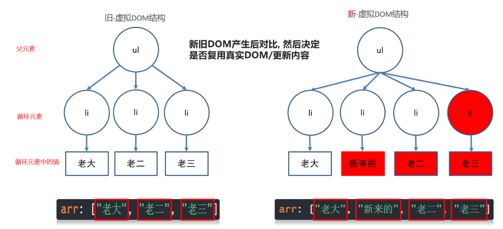
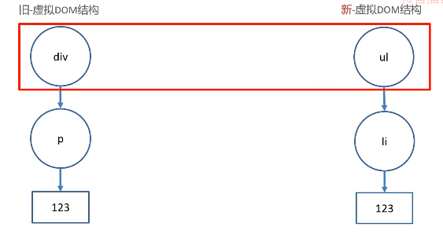
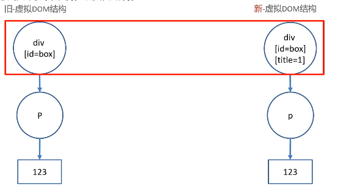
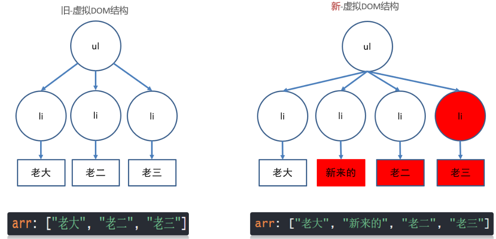
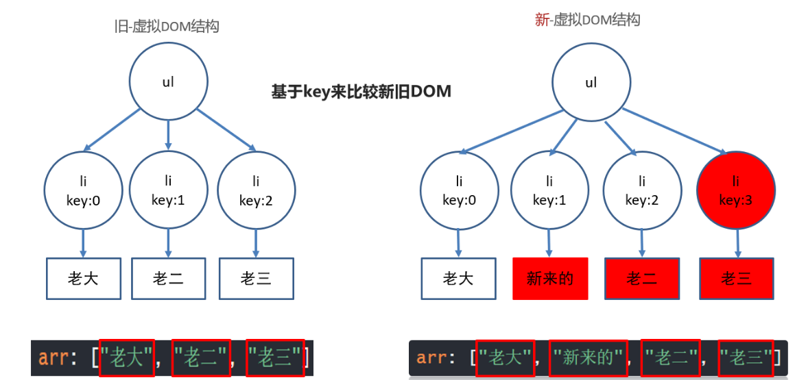
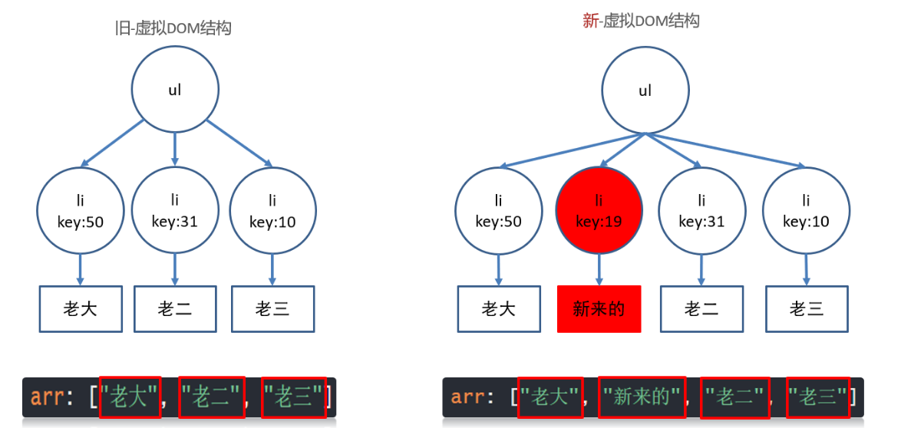
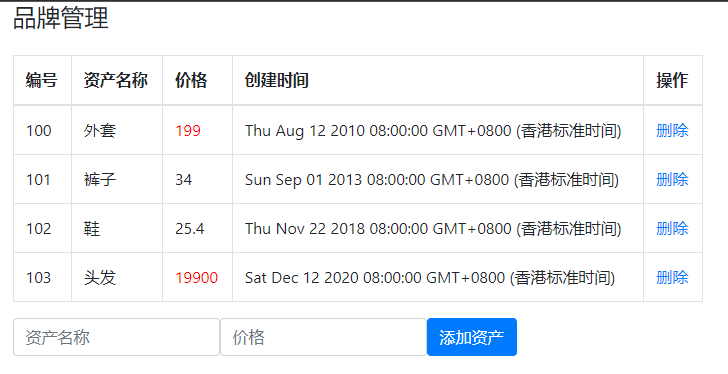
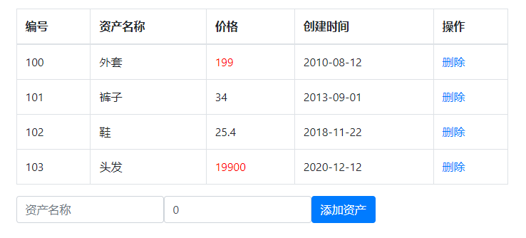
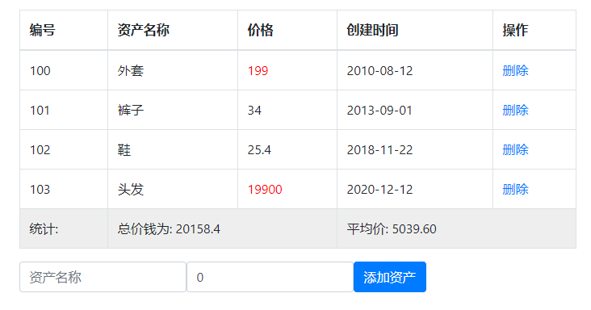

# VUE第三天 (理论背诵)

# 一. 知识点自测

- [ ] 会自己定义数据结构

```js
"红色","red", "蓝色","blue", 
// 上面的数据结构, 要用1个变量来装这4个值, 用什么数据结构呢?(数组还是对象) - 对象(可映射key->value)
    
"小明", "小蓝", "小赵"
// 上面的结构用数组比较合适
```

- [ ] 马上能反应过来循环遍历是什么, 索引(下角标)是什么

```js
let arr = [10, 32, 99];
// 索引就是数字, 标记每个值对应的序号, 从0开始
// 索引是0, 1, 2
// 数组需要用索引来换取值, 固定格式 arr[索引]
// 遍历就是挨个取出来
```

- [ ] 数组的filter方法使用

```js
let arr = [19, 29, 27, 20, 31, 32, 35];
let newArr = arr.filter((val) => {return val >= 30})
// 数组调用.filter()方法 - 传入一个函数体 (固定格式)
// 运行过程: filter会遍历数组里的每一项, 对每一项执行一次函数体(会把每个值传给形参)
// 作用: 每次遍历如果val值符合return的条件, 就会被filter收集起来
// 返回值: 当filter遍历结束以后, 返回收集到的符合条件的那些值形成的新数组
console.log(newArr);
```

- [ ] 重绘与回流(重排)的概念

```bash
回流(重排): 当浏览器必须重新处理和绘制部分或全部页面时，回流就会发生

重绘: 不影响布局, 只是标签页面发生变化, 重新绘制

注意: 回流(重排)必引发重绘, 重绘不一定引发回流(重排)
```

- [ ] localStorage浏览器本地存储语法使用

```bash
localStorage.setItem("key名", 值) - 把值存在浏览器本地叫key的对应位置上

localStorage.getItem("key名") - 把叫key的对应值, 从浏览器本地取出来

==值只能是字符串类型, 如果不是请用JSON.stringify转, 取出后用JSON.parse转==
```

- [ ] JSON的方法使用

```bash
JSON.stringify(JS数据) - 把JS数据序列化成JSON格式字符串

JSON.parse(JSON字符串)  - 把JSON格式化字符串, 再转回成JS数据
```

# 今日目标

1. <font color='red'>能够了解key作用, 虚拟DOM, diff算法</font>
2. 能够掌握设置动态样式
3. 能够掌握<font color='red'>过滤器, 计算属性, 侦听器</font>
4. 能够完成品牌管理案例

# 一. VUE （★★★★★）

## 1.1 v-for更新监测

> 原因: 当v-for遍历的目标结构改变, `Vue`触发v-for的更新

场景：

1. 数组翻转

   ```vue
   <template>
     <div>
       <ul>
         <li v-for="(val, index) in arr" :key="index">
           {{ val }}
         </li>
       </ul>
       <button @click="revBtn()">数组翻转</button>
     </div>
   </template>

   <script>
       export default {
           data(){
               return {
                   arr: [5, 3, 9, 2, 1]
               }
           },
           methods: {
               revBtn(){
                   // 1. 数组翻转可以让v-for更新
                   this.arr.reverse()
               }
           }
       }
   </script>
   ```

2. 数组截取

   *截取操作要想让页面做改变，就必须改变原数组*

   ```vue
   <template>
     <div>
       <ul>
         <li v-for="(val, index) in arr" :key="index">
           {{ val }}
         </li>
       </ul>
       <button @click="sliceBtn">截取前3个</button>
     </div>
   </template>

   <script>
       export default {
           data(){
               return {
                   arr: [5, 3, 9, 2, 1]
               }
           },
           methods: {
               sliceBtn(){
                   // 2. 数组slice方法不会造成v-for更新
                   // slice不会改变原始数组
                   // this.arr.slice(0, 3)

                   // 解决v-for更新 - 覆盖原始数组
                   let newArr = this.arr.slice(0, 3)
                   this.arr = newArr

                   // 或者使用splice截取
                   this.arr.splice(3, 5)
               }
           }
       }
   </script>
   ```

3. 更新值

   *让页面同时更改引用类型时，若发现数据改变了，但页面上没有变化，则考虑使用`this.$set()`*

   ```vue
   <template>
     <div>
       <ul>
         <li v-for="(val, index) in arr" :key="index">
           {{ val }}
         </li>
       </ul>
       <button @click="updateBtn">更新第一个元素值</button>
     </div>
   </template>

   <script>
       export default {
           data(){
               return {
                   arr: [5, 3, 9, 2, 1]
               }
           },
           methods: {
               updateBtn(){
                   // 3. 更新某个值的时候, v-for是监测不到的
                   this.arr[0] = 1000;

                   // 解决-this.$set()
                   // 参数1: 更新目标结构
                   // 参数2: 更新位置
                   // 参数3: 更新值
                   this.$set(this.arr, 0, 1000)
               }
           }
   </script>
   ```

**口诀：**

- 数组变更方法, 就会导致v-for更新, 页面更新

- 数组非变更方法, 返回新数组, 就不会导致v-for更新, 可采用覆盖数组或this.$set()


**归纳：**

1. 这些方法会触发数组改变, v-for会监测到并更新页面

   - `push()`

   - `pop()`
   - `shift()`
   - `unshift()`
   - `splice()`
   - `sort()`
   - `reverse()`

2. 这些方法不会触发v-for更新

   - `slice()`

   * `filter()`
   * `concat()` 

> 改变原数组的方法才能让v-for更新

## 1.2 v-for 立即更新

>  `v-for` 的默认行为会尝试原地修改元素而不是移动它们。
>
>  简单来说就是不删除原来的dom元素，而是尽量去修改各循环元素内部的值



**CODE**

```VUE
<template>
  <div>
    <ul>
      <li v-for="(val, ind) in arr" :key="ind">
        {{ val }}
      </li>
    </ul>
    <button @click="btn">下标1位置插入新来的</button>
  </div>
</template>

<script>
    export default {
        data(){
            return {
                arr: ['老大', "老二", '老三']
            }
        },
        methods: {
            btn(){
                // 索引为1的位置插入一个元素
                this.arr.splice(1, 0, '新来的')
            }
        }
    }
</script>
```

## 1.3 虚拟dom （面试必背）

概念：.vue文件中的template里写的标签, 都是模板, 都要被vue处理成虚拟DOM对象, 才会渲染显示到真实DOM页面上

1. 内存中生成一样的虚拟DOM结构 (==本质是个JS对象==)

   因为真实的DOM属性过多, 没办法快速的知道哪个属性改变了

   比如template里标签结构

   ```vue
   <template>
       <div id="box">
           <p class="my_p">123</p>
       </div>
   </template>
   ```

   对应的虚拟DOM结构

   ```js
   const dom = {
       type: 'div',
       attributes: [{id: 'box'}],
       children: {
           type: 'p',
           attributes: [{class: 'my_p'}],
           text: '123'
       }
   }
   ```

2. vue数据更新

   * 生成新的虚拟DOM结构
   * 和旧的虚拟DOM结构对比
   * 利用diff算法, 找不不同, 只更新变化的部分(重绘/回流)到页面

**虚拟DOM优势：**虚拟DOM保存在内存中, 只记录dom关键信息, 配合diff算法提高DOM更新的性能

### 面试背点01：

**问：你对虚拟DOM的理解？**

**答：**`虚拟DOM`本质上是`JavaScript`对象，是对`真实DOM`的抽象表现。状态变更时，记录新树和旧树的差异，最后把差异更新到真正的`dom`中**render函数**

1. 根据`tagName`生成父标签，读取props，设置属性， `如果有content`，设置`innerHtml或innerText`；
2. 如果存在子元素，遍历子元素递归调用render方法，将生成的子元素依次添加到父元素中，并返回根目录；


## 1.4 diff算法 - 同级比较（面试必背）

> vue用diff算法, 新虚拟dom, 和旧的虚拟dom比较

### 1.4.1 场景1: 根元素变了 =》 删除重建 

旧虚拟DOM

```vue
<div id="box">
    <p class="my_p">123</p>
</div>
```

新虚拟DOM

```vue
<ul id="box">
    <li class="my_p">123</li>
</ul>
```



### 1.4.2 场景2: 根元素没变, 属性改变 =》 元素复用, 只更新属性

旧虚拟DOM

```vue
<div id="box">
    <p class="my_p">123</p>
</div>
```

新虚拟DOM

```vue
<div id="myBox" title="标题">
    <p class="my_p">123</p>
</div>
```



**问题：**

1. diff算法如何比较新旧虚拟DOM?
2. 根元素变化?
3. 根元素未变, 属性改变?

> 思考： 如果标签内子标签/内容改变，diff的算法是如何对应改变的？

## 1.5 diff算法 - 属性key

**场景3：根元素没变, 子元素没变, 元素内容改变**

### 1.5.1 没有key =》 就地更新

​		v-for不会移动DOM, 而是尝试复用, 就地更新，如果需要v-for移动DOM, 你需要用特殊 attribute `key` 来提供一个排序提示

```vue
<template>
  <div>
    <ul>
      <li v-for="obj in arr">
        {{ obj.name }}
        <input type="text">
      </li>
    </ul>
    <button @click="btn">下标1位置插入新来的</button>
  </div>
</template>

<script>
export default {
  data() {
    return {
      arr: [
        {name: '老大',id: 50},
        {name: '老二',id: 31},
        {name: '老三',id: 10}
      ],
    };
  },
  methods: {
    btn(){
      this.arr.splice(1, 0, {
        id: 19, 
        name: '新来的'
      })
    }
  }
};
</script>
```


旧 - 虚拟DOM结构  和  新 - 虚拟DOM结构 对比过程



### 1.5.2 有key - 值为索引 => 就地更新

​		因为新旧虚拟DOM对比, key存在就复用此标签更新内容, 如果不存在就直接建立一个新的

key为索引-图解过程 (又就地往后更新了)



1. v-for先循环产生新的DOM结构, key是连续的, 和数据对应

2. 然后比较新旧DOM结构, 找到区别, 打补丁到页面上

   最后补一个li, 然后从第二个往后, 都要更新内容

### 1.5.3 有key - 值为id(不重复的值) => 移动更新

> <font color='red'>key的值只能是唯一不重复的, 字符串或数值</font>

v-for不会移动DOM, 而是尝试复用, 就地更新，如果需要v-for移动DOM, 你需要用特殊 attribute(属性) `key` 来提供一个排序提示

新DOM里数据的key存在, 去旧的虚拟DOM结构里找到key标记的标签, **复用标签**

新DOM里数据的key存在, 去旧的虚拟DOM结构里没有找到key标签的标签, **创建/插入**

旧DOM结构的key, 在新的DOM结构里没有了, 则 **移除key所在的标签**


```vue
<template>
  <div>
    <ul>
      <li v-for="obj in arr" :key="obj.id">
        {{ obj.name }}
        <input type="text">
      </li>
    </ul>
    <button @click="btn">下标1位置插入新来的</button>
  </div>
</template>
```



> 总结: 不用key也不影响功能(就地更新), 添加key可以提高更新的性能

### 面试背点02：

**问：如何理解Vue中的diff算法？**

**答：**

​		在js中，渲染真是`DOM`的开销是非常大的，比如我们修改了某个数据，如果直接渲染到真实`DOM` ,会引起整个`DOM`树重绘和重排。那么有没有可能实现只更新我们修改的那一小块`DOM`二不要更新整个`DOM`呢?此时我们就需要先根据真实`DOM`生成虚拟`DOM`，当虚拟`DOM`某个节点的数据改变后会生成有一个新的`VNode`，然后新的`VNode`和旧的`VNode`作比较，发现有不一样的地方就直接修改在真实DOM上，然后旧的`VNode`的值为新的`VNode`；

​		**diff**的过程就是调用`patch`函数，比较新旧节点，一边比较一边给真实的`DOM`打补丁，在采用`diff`算法比较新旧节点的时候，比较自会在同层级进行。


**问：什么是patch函数**

**答：**

​		在`patch`方法中，首先进行树级别的比较`new Vnode`不存在就删除`old VNode`，`old VNode`不存在就增加新的`VNode`都存在就执行`diff`更新，当确定需要执行`diff`算法时，比较两个`VNode`，包括三种类型操作：属性更新，文本更新，子节点更新，新老节点均有子节点，则对子节点进行`diff`操作，调用`updatechidren`如果老节点没有子节点，先清空老节点的文本内容，然后为其新增子节点，如果新节点没有子节点，而老节点有子节点的时候，则移除该节点的所有子节点，老节点都没有子节点的时候，进行文本的替换。

## 1.6 阶段小结

1. v-for什么时候会更新页面呢?

   数组采用更新方法, 才导致v-for更新页面

2. vue是如何提高更新性能的?

   采用虚拟DOM+diff算法提高更新性能

3. 虚拟DOM是什么?

   本质是保存dom关键信息的JS对象

4. diff算法如何比较新旧虚拟DOM?

   根元素改变 => 删除当前DOM树重新建

   根元素未变, 属性改变 => 更新属性

   根元素未变, 子元素/内容改变 => 无key – 就地更新 / 有key – 按key比较


## 1.7 动态class

> 目标: 用v-bind给标签class设置动态的值

语法:

* :class="{类名: 布尔值}"
* :class="[类名]"

```vue
<template>
  <div>
    <!-- 语法1:
      :class="{类名: 布尔值}"
      使用场景: vue变量控制标签是否应该有类名
     -->
    <p :class="{red_str: bool}">动态class</p>
    <button @click="bool = !bool">切换red_str</button>
    <!-- 语法2:
      :class="[类名]"
     -->
     <p :class="[className]">动态class2</p>
     <button @click="changeClass">切换className</button>
  </div>
</template>

<script>
export default {
  data(){
    return {
      bool: true,
      className: 'red_str'
    }
  },

  methods: {
    changeClass () {
      this.className = 'green_str'
    }
  }
}
</script>

<style scoped>
  .red_str{
    color: red;
  }

  .green_str {
    color: green;
  }
</style>
```

> 总结: 就是把类名保存在vue变量中赋予给标签

1.8 动态style

语法

* :style="{css属性: 值}"
* :style="[带有属性键对值的对象]"

```vue
<template>
  <div>
    <!-- 动态style语法1
      :style="{css属性名: 值}"
     -->
    <p :style="{backgroundColor: colorStr}">动态style</p>
        <!-- 动态style语法2
      :style="[css属性名: 值]"
     -->
    <p :style="[bgStyle]">动态style</p>
  </div>
</template>

<script>
export default {
  data(){
    return {
      colorStr: 'red',
      bgStyle: {
        backgroundColor: 'red'
      }
    }
  }
}
</script>
```


## 1.8 案例-品牌管理

### 1.8.1 铺设



* 需求1: 把默认数据显示到表格上
* 需求2: 注意资产超过100的, 都用红色字体标记出来

细节:

​	① 先铺设静态页面 --- 去.md文档里, 复制数据和标签模板

​	② 此案例使用bootstrap, 需要下载, 并导入到工程main.js中

​	③ 用v-for配合默认数据, 把数据默认铺设到表格上显示

​	④ 直接在标签上, 大于100价格, 动态设置red类名

1. 因为是用bootstrap来做的页面样式，那么先引入依赖

   ```bash

   npm i bootstrap
   ```

2. 在main.js中引入

   ```js
   import "bootstrap/dist/css/bootstrap.css"
   ```

3. 复制案例模板

   ```vue
   <template>
     <div id="app">
       <div class="container">
         <!-- 顶部框模块 -->
         <div class="form-group">
           <div class="input-group">
             <h4>品牌管理</h4>
           </div>
         </div>

         <!-- 数据表格 -->
         <table class="table table-bordered table-hover mt-2">
           <thead>
             <tr>
               <th>编号</th>
               <th>资产名称</th>
               <th>价格</th>
               <th>创建时间</th>
               <th>操作</th>
             </tr>
           </thead>
           <tbody>
             <tr >
               <td></td>
               <td></td>

               <!-- 如果价格超过100，就有red这个类 -->
               <td class="red"></td>
               <td></td>
               <td><a href="#" >删除</a></td>
             </tr>
           </tbody>
             <!-- 
           <tfoot >
             <tr>
               <td colspan="5" style="text-align: center">暂无数据</td>
             </tr>
           </tfoot>
               -->
         </table>

         <!-- 添加资产 -->
         <form class="form-inline">
           <div class="form-group">
             <div class="input-group">
               <input
                 type="text"
                 class="form-control"
                 placeholder="资产名称"
               />
             </div>
           </div>
           &nbsp;&nbsp;&nbsp;&nbsp;
           <div class="form-group">
             <div class="input-group">
               <input
                 type="text"
                 class="form-control"
                 placeholder="价格"
               />
             </div>
           </div>
           &nbsp;&nbsp;&nbsp;&nbsp;
           <!-- 阻止表单提交 -->
           <button class="btn btn-primary">添加资产</button>
         </form>
       </div>
     </div>
   </template>

   <script>
   // 1. 明确需求
   // 2. 标签+样式+默认数据
   // 3. 下载bootstrap, main.js引入bootstrap.css
   // 4. 把list数组 - 铺设表格
   // 5. 修改价格颜色
   export default {
     data() {
       return {
         form: {
             name: '', // 名称
             price: 0 // 价格
         }，
         list: [
           { id: 100, name: "外套", price: 199, time: new Date('2010-08-12')},
           { id: 101, name: "裤子", price: 34, time: new Date('2013-09-01') },
           { id: 102, name: "鞋", price: 25.4, time: new Date('2018-11-22') },
           { id: 103, name: "头发", price: 19900, time: new Date('2020-12-12') }
         ]
       }
     }
   }
   </script>

   <style >
   .red{
     color: red;
   }
   </style>
   ```

4. 使用v-for把数据渲染到表格中

   ```vue
   <tbody>
       <!-- 遍历list数组，将每个元素的id作为key -->
       <tr v-for="obj in list" :key="obj.id">
           <td>{{ obj.id }}</td>
           <td>{{ obj.name }}</td>

           <!-- 如果价格超过100，就有red这个类 -->
           <td>{{ obj.price }}</td>
           <td>{{ obj.time }}</td>
           <td><a href="#" >删除</a></td>
       </tr>
   </tbody>
   ```

5. 利用动态class动态判断价格给红色类名

   ```vue
   <tbody>
       <!-- 遍历list数组，将每个元素的id作为key -->
       <tr v-for="obj in list" :key="obj.id">
           <td>{{ obj.id }}</td>
           <td>{{ obj.name }}</td>

           <!-- 如果价格超过100，就有red这个类 -->
           <td :class="{red: obj.price > 100}">{{ obj.price }}</td>
           <td>{{ obj.time }}</td>
           <td><a href="#" >删除</a></td>
       </tr>
   </tbody>
   ```

### 1.8.2 新增

> 目标: 数据新增

* 需求1: 实现表单数据新增进表格功能

* 需求2: 判断用户输入是否为空给提示

* 分析

  ① 添加资产按钮 – 绑定点击事件

  ② 给表单v-model绑定vue变量收集用户输入内容

  ③ 添加数组到数组中

  ④ 判断用户内容是否符合规定


1. 给添加资产按钮 – 绑定点击事件

   **TEMPLATE**

   ```vue
   <!-- 4. 阻止表单默认提交 -->
   <button class="btn btn-primary" @click.prevent="addFn()">添加资产</button>
   ```

   **JS**

   ```VUE
   <script>
       export default {
           methods: {
               addFn(){
   				// todo
               }
           }
       }
   </script>
   ```

2. 给表单v-model绑定vue变量收集用户输入内容

   **TEMPLATE**

   ```html
   <!-- 添加资产 -->
   <form class="form-inline">
       <div class="form-group">
           <div class="input-group">
               <input
                      type="text"
                      class="form-control"
                      placeholder="资产名称"
                      v-model="form.name"
                      />
           </div>
       </div>
       &nbsp;&nbsp;&nbsp;&nbsp;
       <div class="form-group">
           <div class="input-group">
               <input
                      type="text"
                      class="form-control"
                      placeholder="价格"
                      v-model.number="form.price"
                      />
           </div>
       </div>
       &nbsp;&nbsp;&nbsp;&nbsp;
       <!-- 4. 阻止表单提交(刷新网页数据又回去了) -->
       <button class="btn btn-primary" @click.prevent="addFn">添加资产</button>
   </form>
   ```

3. 添加数组到数组中

   1. 判断表单参数不能为空
   2. 插入到数组list的最后
   3. 插入之前需要找到当前数组最后一个元素的id，在此基础上+1

   **JS**

   ```JS
   addFn(){
       // 把值以对象形式-插入list
       this.list.push({
           // 当前数组最后一个对象的id+1作为新对象id值
           id: this.list[this.list.length - 1].id + 1,
           name: this.form.name,
           price: this.form.price,
           time: new Date()
       })
   }
   ```

4. 判断用户内容是否有填写

   ```js
   addFn() {
       // 5. 判断是否为空
       if (this.form.name.trim().length === 0 || this.form.price === 0) {
           alert("不能为空")
           return
       }

       // 3. 把值以对象形式-插入list
       this.list.push({
           // 当前数组最后一个对象的id+1作为新对象id值
           id: this.list[this.list.length - 1].id + 1,
           name: this.form.name,
           price: this.form.price,
           time: new Date()
       })
   }
   ```

1.8.3 删除

> 目标: 数据删除

* 需求1: 点击删除的a标签, 删除数据

* 需求2: 删除没数据了要提示暂无数据的tfoot

* 分析

  ① a标签绑定点击事件

  ② 给事件方法传id

  ③ 通过id, 找到对应数据删除

  ④ 删除光了要让tfoot显示

  ⑤ 删除光了再新增, 有bug(id值问题)需要修复

1. 给删除按钮绑定点击事件

   **TEMPLATE**

   ```html
   <td><a href="#" @click="delFn()">删除</a></td>
   ```

   **JS**

   ```JS
   delFn(){
       // TODO
   }
   ```

2. 给事件方法传id

   **TEMPLATE**

   ```html
   <td><a href="#" @click="delFn(obj.id)">删除</a></td>
   ```

   **JS**

   ```JS
   delFn(id){
       // TODO
       console.log(id)
   }
   ```

3. 通过id, 找到对应数据删除

   ```JS
   delFn(id){
       // 通过id找到这条数据在数组中下标
       let index = this.list.findIndex(obj => obj.id === id)
       this.list.splice(index, 1)
   }
   ```

4. 全部删除完成后要展示tfoot

   ```html
   <tfoot v-show="list.length === 0">
       <tr>
           <td colspan="5" style="text-align: center">暂无数据</td>
       </tr>
   </tfoot>
   ```

5. 当列表为空时, 添加id会出现问题，因为找不到前一条的id

   ```js
   addFn(){
       if (this.form.name.trim().length === 0 || this.form.price === 0) {
           alert("不能为空")
           return
       }

       // 解决bug: 无数组新增-list没有数据, id需要给一个固定值(以后id都是后台生成, 现在是模拟给一个id)
       let id = this.list.length > 0 ? this.list[this.list.length - 1].id + 1 : 100

       this.list.push({
           // 当前数组最后一个对象的id+1作为新对象id值
           id: id,
           name: this.form.name,
           price: this.form.price,
           time: new Date()
       })
   }
   ```

# 二. VUE  过滤器filter（★★★★★）

## 2.1 定义使用

> 目的: 转换格式, 过滤器就是一个**函数**, 传入值返回处理后的值
>
> 简单理解就是在数据渲染到页面之前的过程中，进行一次包装处理

<font color='red'>注意：过滤器只能用在, 插值表达式和v-bind表达式</font>

**Vue中的过滤器场景：**

* 字母转大写, 输入"hello", 输出"HELLO"
* 字符串翻转, "输入hello, world", 输出"dlrow ,olleh"

**语法:** 

* Vue.filter("过滤器名", (值) => {return "返回处理后的值"})
* filters: {过滤器名字: (值) => {return "返回处理后的值"}

<font color='red'>注意：一定要有返回值</font>

例子:

* 全局定义字母都大写的过滤器
* 局部定义字符串翻转的过滤器

```vue
<template>
  <div>
    <p>原来的样子: {{ msg }}</p>
    <!-- 2. 过滤器使用
      语法: {{ 值 | 过滤器名字 }}
     -->
    <p>使用翻转过滤器: {{ msg | reverse }}</p>
    <p>{{ msg | toUp }}</p>
  </div>
</template>

<script>
export default {
  data(){
    return {
      msg: 'Hello, Vue'
    }
  },
  // 方式2: 局部 - 过滤器
  // 只能在当前vue文件内使用
  /*
     语法: 
     filters: {
       过滤器名字 (val) {
         return 处理后的值
       }
     }
  */
  filters: {
    toUp (val) {
      return val.toUpperCase()
    }
  }
}
</script>
```

**main.js**

```js
// 过滤器接参数
Vue.filter("reverse", (val, s) => {
    return val.split("").reverse().join(s || '')
})
```

**小结：**

1. Vue中过滤器作用?
   1. 传入一个值, 处理后返回另外一个值
2. 过滤器的两种定义方法
   1. main.js – Vue.filter('过滤器名字', 函数体)
   2. 某.vue文件 – filters: {'过滤器名字': 函数体}
3. 如何使用过滤器?
   1. Vue变量 | 过滤器名字
4. 过滤器注意事项?
   1. 插值表达式 / 动态属性

## 2.2 传参和多过滤器

> 可同时使用多个过滤器, 或者给过滤器传参
>
> 从左往右依次过滤

* 语法:
  * 过滤器传参:   vue变量 | 过滤器(实参) 
  * 多个过滤器:   vue变量 | 过滤器1 | 过滤器2

```vue
<template>
  <div>
    <p>原来的样子: {{ msg }}</p>
    <!-- 1.
      给过滤器传值
      语法: vue变量 | 过滤器名(值)
     -->
    <p>使用翻转过滤器: {{ msg | reverse('|') }}</p>
    <!-- 2.
      多个过滤利使用
      语法: vue变量 | 过滤器1 | 过滤器2
     -->
    <p>{{ msg | toUp | reverse('|') }}</p>
  </div>
</template>
```

## 2.3 案例-品牌管理(时间格式化）

> 目标: 复制上个案例, 在此基础上, 把表格里的时间用过滤器+moment模块, 格式化成YYYY-MM-DD 格式



1. 下载moment处理日期的第三方工具模块

   moment官网文档: http://momentjs.cn/docs/#/displaying/

   ```bash
   npm install moment -D
   ```

2. 定义过滤器, 把时间用moment模块格式化, 返回我们想要的格式

   **TEMPLATE**

   ```HTML
   <!-- 3. 使用过滤器 -->
   <td>{{ obj.time | formatDate }}</td>
   ```

   **JS**

   ```js
   // 目标: 处理时间
   // 1. 下载moment模块
   import moment from 'moment'

   // 2. 定义过滤器, 编写内部代码
   filters: { 
       formatDate (val){
           return moment(val).format('YYYY-MM-DD')
       }
   }
   ```

# 三. VUE计算属性 - `computed`

> 场景： 页面上某一个变量是有其他两个或多个变量通过一定逻辑后运算得到的时候，可以用到计算属性进行简化

## 3.1 基础语法

语法:

```js
computed: {
    "计算属性名" () {
        return "值"
    }
}
```

需求：求2个数的和显示到页面上

```vue
<template>
  <div>
    <p>{{ num }}</p>
  </div>
</template>

<script>
export default {
  data(){
    return {
      a: 10,
      b: 20
    }
  },
  // 计算属性:
  // 场景: 一个变量的值, 需要用另外变量计算而得来
  /*
    语法:
    computed: {
      计算属性名 () {
        return 值
      }
    }
  */
 // 注意: 计算属性和data属性都是变量-不能重名
 // 注意2: 函数内变量变化, 会自动重新计算结果返回
  computed: {
    num(){
      return this.a + this.b
    }
  }
}
</script>
```

**小结：**

1. 使用场景： 当变量的值, 需要通过别人计算而得来
2. 特点：函数内使用的变量改变, 重新计算结果返回
3. 注意事项：计算属性名和data里名字不能重复

## 3.2 `computed`缓存 (面试必背)

> 目标: 计算属性是基于它们的依赖项的值结果进行缓存的，只要依赖的变量不变, 都直接从缓存取结果
>
> 以上也是计算属性和方法的区别

场景： 通过函数与计算属性做对比

```vue
<template>
  <div>
    <p>{{ reverseMessage }}</p>
    <p>{{ reverseMessage }}</p>
    <p>{{ reverseMessage }}</p>
    <p>{{ getMessage() }}</p>
    <p>{{ getMessage() }}</p>
    <p>{{ getMessage() }}</p>
  </div>
</template>

<script>
export default {
  data(){
    return {
      msg: "Hello, Vue"
    }
  },
  // 计算属性优势:
  // 带缓存
  // 计算属性对应函数执行后, 会把return值缓存起来
  // 依赖项不变, 多次调用都是从缓存取值
  // 依赖项值-变化, 函数会"自动"重新执行-并缓存新的值
  computed: {
    reverseMessage(){
      console.log("计算属性执行了");
      return this.msg.split("").reverse().join("")
    }
  },
  methods: {
    getMessage(){
      console.log("函数执行了");
      return this.msg.split("").reverse().join("")
    }
  }
}
</script>
```

**小结：**

1.  计算属性优势：
    1. 带缓存 
    2. 依赖项不变, 直接从缓存取
    3. 依赖项改变, 函数自动执行并重新缓存
2.  因为要消耗内存，所以也是计算属性的缺点


### 面试背点03

**问： 说一下computed 和 watch 的区别**

**答：（1/2）**

​		**computed计算属性**该属性的结果会被缓存，当`computed`中的函数所依赖的属性没有发生改变的时候，那么调用当前函数的时候结果会从缓存中读取。除非依赖的响应式属性变化时才会重新计算，主要当做属性来使用`computed`中的函数必须用`return`返回最终的结果，`computed`更高效，优先使用

## 3.3 案例-品牌管理(总价和均价)

> 目标: 基于之前的案例, 完成总价和均价的计算效果



分析： 总价和平均价放在计算属性中更为合适

**TEMPLATE**

```HTML
<tr style="background-color: #EEE">
     <td>统计:</td>
     <td colspan="2">总价钱为: {{ allPrice }}</td>
     <td colspan="2">平均价: {{ svgPrice }}</td>
</tr>
```

**JS**

```JS
// 目标: 总价和均价显示
// 1. 末尾补tr - 显示总价和均价
export default {
    // ...源代码省略
    // 2. 计算属性
    computed: {
        allPrice(){
            // 3. 求总价
            return this.list.reduce((sum, obj) => sum += obj.price, 0)
        },
        avgPrice(){
            // 4. 求均价 - 保留2位小数
            return (this.allPrice / this.list.length).toFixed(2)
        }
    }
}
```

## 3.4 computed的完整写法

> 计算属性也是变量, 如果想要直接赋值, 需要使用完整写法
>
> 场景： 当计算属性变量作为表单的值时

语法：

```js
computed: {
    "属性名": {
        set(值){
            
        },
        get() {
            return "值"
        }
    }
}
```

需求：让计算属性给v-model使用

**TEMPLATE**

```vue
<div>
    <span>姓名:</span>
    <input type="text" v-model="full">
</div>
```

**JS**

```JS
computed: {
    data () {
        return {
            num1: 10,
            num2: 20，
            num3: 0
        }
    },
    full: {
        // 给full赋值触发set方法
        set(val){
            this.num3 = val
        },
        // 使用full的值触发get方法
        get(){
            return this.num1 + this.num2
        }
    }
}
```

**小结：**

1. 当需要给计算属性赋值时，会用到计算属性，但这种情况非常少。
2. set函数和get函数的执行时机
   1. set接收要赋予的值
   2. get里要返回给这个计算属性具体值

## 3.5 案例

### 3.5.1 小选影响全选

> 目标: 小选框都选中(手选), 全选自动选中

* 需求: 小选框都选中(手选), 全选自动选中

分析:

① 先静态后动态, 从.md拿到静态标签和数据

② 循环生成复选框和文字, 对象的c属性和小选框的选中状态, 用v-model双向绑定

③ 定义isAll计算属性, 值通过小选框们统计c属性状态得来

图示:


模板代码：

```vue
<template>
  <div>
    <span>全选:</span>
    <input type="checkbox"/>
    <button>反选</button>
    <ul>
      <li>
        <input type="checkbox"/>
        <span>任务名</span>
      </li>
    </ul>
  </div>
</template>

<script>
export default {
  data() {
    return {
      arr: [
        {
          name: "猪八戒",
          c: false,
        },
        {
          name: "孙悟空",
          c: false,
        },
        {
          name: "唐僧",
          c: false,
        },
        {
          name: "白龙马",
          c: false,
        },
      ],
    };
  }
};
</script>
```

1. 把数据循环展示到页面上

   ```html
   <ul>
       <li v-for="(obj, index) in arr" :key="index">
           <input type="checkbox"/>
           <span>{{ obj.name }}</span>
       </li>
   </ul>
   ```

2. 让列表中每个元素中的c属性关联复选框的选中状态

   ```vue
   <ul>
       <li v-for="(obj, index) in arr" :key="index">
           <!-- 3. 对象.c - 关联 选中状态 -->
           <input type="checkbox" v-model="obj.c"/>
           <span>{{ obj.name }}</span>
       </li>
   </ul>
   ```

3. 通过v-model关联全选选中状态

   ```vue
   <div>
       <span>全选:</span>
       <!-- 4. v-model 关联全选 - 选中状态 -->
       <input type="checkbox" v-model="isAll"/>
       <button>反选</button>
       <ul>
           <li v-for="(obj, index) in arr" :key="index">
               <!-- 3. 对象.c - 关联 选中状态 -->
               <input type="checkbox" v-model="obj.c"/>
               <span>{{ obj.name }}</span>
           </li>
       </ul>
   </div>
   ```

   **JS**

   ```JS
   // 5. 计算属性-isAll
   computed: {
       isAll () {
           // 6. 统计小选框状态 ->  全选状态
           // every口诀: 查找数组里"不符合"条件, 直接原地返回false
           return this.arr.every(obj => obj.c === true)
       }
   }
   ```

> 回顾：小选框是如何影响全选框的？

### 3.5.2 全选框影响小选

* 需求1: 获取到全选状态 – 改装isAll计算属性
* 需求2: 全选状态同步给所有小选框

分析:

①: isAll改成完整写法, set里获取到全选框, 勾选的状态值

②: 遍历数据数组, 赋给所有小选框v-model关联的属性

图示:


```js
	isAll: {
        set(val){
            // 7. 全选框 - 选中状态(true/false)
            this.arr.forEach(obj => obj.c = val)
        },
        get(){
            // 6. 统计小选框状态 ->  全选状态
            // every口诀: 查找数组里"不符合"条件, 直接原地返回false
            return this.arr.every(obj => obj.c === true)
        }
	}
```

### 3.5.3 反选

* 需求: 点击反选, 让所有小选框, 各自取相反勾选状态

分析:

①: 小选框的勾选状态, 在对象的c属性

②: 遍历所有对象, 把对象的c属性取相反值赋予回去即可

图示:


1. 给反选按钮添加点击事件

   ```html
   <button @click="btn">反选</button>
   ```

2. 通过btn方法，将列表中所有的c取反

   ```js
   methods: {
       btn(){
           // 8. 让数组里对象的c属性取反再赋予回去
           this.arr.forEach(obj => obj.c = !obj.c)
       }
   }
   ```

# 四. 侦听器 - `watch`

> 可以侦听data/computed属性值改变

​		一个对象，键是需要观察的表达式，值是对应回调函数。值也可以是方法名，或者包含选项的对象。Vue 实例将会在实例化时调用 `$watch()`，遍历 watch 对象的每一个 property。

## 4.1 基本语法

语法：

```js
watch: {
    "被侦听的属性名" (newVal, oldVal){
        
    }
}
```

例子：

```vue
<template>
  <div>
    <input type="text" v-model="name">
    <input type="text" v-model="obj.name">
  </div>
</template>

<script>
export default {
  data(){
    return {
      name: "",
      obj: {
        name: ''
      }
    }
  },
  // 目标: 侦听到name值的改变
  /*
  语法:
    watch: {
      变量名 (newVal, oldVal){
        // 变量名对应值改变这里自动触发
      }
    }
  */
  watch: {
    // newVal: 当前最新值
    // oldVal: 上一刻值
    name(newVal, oldVal){
      console.log(newVal, oldVal);
    },
    // 监听引用类型
    obj(newVal, oldVal) {
      console.log(newVal, oldVal)
    }
  }
}
</script>
```

> 发现，引用类型的对象无法监听到，该怎么办

## 4.2 深度侦听和立即执行 

> 侦听引用数据类型, 或者立即执行侦听函数

语法：

```js
watch: {
    "要侦听的属性名": {
        immediate: true, // 立即执行
        deep: true, // 深度侦听复杂类型内变化
        handler (newVal, oldVal) {
            
        }
    }
}
```

例子：

```html
<template>
  <div>
    <input type="text" v-model="user.name">
    <input type="text" v-model="user.age">
  </div>
</template>

<script>
export default {
  data(){
    return {
      user: {
        name: "",
        age: 0
      }
    }
  },
  // 目标: 侦听对象
  /*
  语法:
    watch: {
      变量名 (newVal, oldVal){
        // 变量名对应值改变这里自动触发
      },
      变量名: {
        handler(newVal, oldVal){

        },
        deep: true, // 深度侦听(对象里面层的值改变)
        immediate: true // 立即侦听(网页打开handler执行一次)
      }
    }
  */
  watch: {
    user: {
      handler(newVal, oldVal){
        // user里的对象
        console.log(newVal, oldVal);
      },
      deep: true,
      immediate: true
    }
  }
}
</script>
```

> 总结: immediate立即侦听, deep深度侦听, handler固定方法触发

### 补充： 另一种监听对象特定属性的方式

​		通过设置key为对象属性的索引，value为监听回调方法的形式

```js
 watch: {
    'user.name': (newVal, oldVal) => {
      console.log(newVal, oldVal)
    }
  }
```

### 面试背点03

**问： 说一下computed 和 watch 的区别**

**答：（2/2）**

​		**watch属性监听**是一个对象，键是需要观察的属性，值是对应回调函数，主要用来监听某些特定数据的变化，从而进行某些具体的业务逻辑操作，监听属性的变化，需要在数据变化时执行异步或开销较大的操作使用。

​		**使用场景：**`computed`当一个属性受多个属性影响的时候使用，例：购物车结算功能； `watch`当一条数据影响多条数据的时候使用，例：搜索数据。


## 4.3 案例-品牌管理(数据缓存)

> 目标: 侦听list变化, 同步到浏览器本地

* 需求: 把品牌管理的数据实时同步到本地缓存

分析:

​	① 在watch侦听list变化的时候, 把最新的数组list转成JSON字符串存入到localStorage本地

​	② data里默认把list变量从本地取值, 如果取不到给个默认的空数组

效果:

​	新增/删除 – 刷新页面 – 数据还在

在之前的案例代码基础上接着写

```js
import moment from "moment";
export default {
  data() {
    return {
      name: "", // 名称
      price: 0, // 价格
      // 本地取出缓存list
      list: JSON.parse(localStorage.getItem('pList')) || [],
    };
  },
  // ...其他代码省略
  watch: {
    list: {
      handler(){
        // 存入本地
        localStorage.setItem('pList', JSON.stringify(this.list))
      },
      deep: true
    }
  }
};
```

**发现如果进来没数据会直接报错，如何解决**

原因： list.length作为除数，当等于0是计算属性avgPrice会出现问题

```html
<!-- 4. 统计得有数据才显示 -->
<tr v-if="list.length !== 0" style="background-color: #eee">
    <td>统计:</td>
    <td colspan="2">总价钱为: {{ allPrice }}</td>
    <td colspan="2">平均价: {{ avgPrice }}</td>
</tr>
```

# 今日总结

- [ ] v-for能监测到哪些数组方法变化, 更新页面
- [ ] key的作用是什么
- [ ] 虚拟dom好处, diff算法效果
- [ ] 动态设置class或style
- [ ] vue过滤器作用和分类
- [ ] vue计算属性作用
- [ ] vue侦听器的作用


## 面试背点04

**问： 请简述浏览器渲染机制、重绘、重排（回流）**

**答：**

**网页生成过程**

- `HTML`被HTML解析器解析成`DOM`树
- `css`则被css解析器解析成`CSSOM`树
- 结合`DOM`树和`CSSOM`树
- 生成布局（`flow`）, 即将所有渲染树的所有结点进行平面结合
- 将布局重回（`paint`）在屏幕上

**重排（回流）**

​		当`DOM`的变化影响了元素的几何信息（`DOM`对象的位置和尺寸大小），浏览器需要重新计算元素的几何属性，将其安放在界面正确的位置，这个过程叫做回流。触发条件：

1. 添加或者删除可见DOM元素
2. 元素尺寸改变 ----边距、填充、边框、宽度和高度

**重绘**

​		当一个元素的外观发生改变，但没有改变布局，重新把元素外观绘制出来的过程，叫重绘。

- 改变元素的 `color`、`background`、`box-shadow` 等属性

重排优化建议：

1. 分离读取操作
2. 样式集中修改
3. 缓存需要修改的`DOM`元素
4. 尽量只修改`position: absolute`或`fixed`元素， 对其他元素影像不大
5. 动画开始`GPU`加速， `translate` 使用 `3D`变化

`transform`不重绘，不回流，是因为`transform`属于合成属性，对合成属性进行`transition/animate`动画时，将会创建一个合成层。这使得动画元素在一个独立的层中进行渲染。当元素的内容没有发生改变，就没有必要进行重绘。浏览器会通过重新复合来创建Netflix动画帧。


## 面试题

### 1. Vue 中怎么自定义过滤器

​    Vue.js允许自定义过滤器，可被用于一些常见的文本格式化。过滤器可以用在两个地方：双花括号插值和v-bind表达式

​	全局的用Vue.filter()

​	局部的用filters属性

### 2. Vue中:key作用, 为什么不能用索引

​	:key是给v-for循环生成标签颁发唯一标识的, 用于性能的优化

​	因为v-for数据项的顺序改变，Vue 也不会移动 DOM 元素来匹配数据项的顺序，而是就地更新每个元素

​	:key如果是索引, 因为索引是连续的, 如果删除其中某一个, 会导致最后一个被删除

​	当我们再删除的时候, :key再根据数据来把新旧的dom对比时, 删除:key不存在的对应的标签(添加也是一样的插入到指定位置, 别的都不会动)

### 3. 数组更新有的时候v-for不渲染

​	因为vue内部只能监测到数组顺序/位置的改变/数量的改变, 但是值被重新赋予监测不到变更, 可以用 Vue.set() / vm.$set()

## 附加练习_1.买点书练习

> 目标: 把数据铺设到页面上, 当用户点击买书按钮, 书籍数量增加1, 并且要计算累计的和

演示:


标签结构和数据(==复制接着写==): 

```vue
<template>
  <div>
    <p>请选择你要购买的书籍</p>
    <ul>
    </ul>
    <table border="1" width="500" cellspacing="0">
      <tr>
        <th>序号</th>
        <th>书名</th>
        <th>单价</th>
        <th>数量</th>
        <th>合计</th>
      </tr>
    </table>
    <p>总价格为: </p>
  </div>
</template>

<script>
export default {
  data() {
    return {
      arr: [
        {
          name: "水浒传",
          price: 107,
          count: 0,
        },
        {
          name: "西游记",
          price: 192,
          count: 0,
        },
        {
          name: "三国演义",
          price: 219,
          count: 0,
        },
        {
          name: "红楼梦",
          price: 178,
          count: 0,
        },
      ],
    };
  }
};
</script>
```

正确答案(==不可复制==)

```vue
<template>
  <div>
    <p>请选择你要购买的书籍</p>
    <ul>
      <li v-for="(item, ind) in arr" :key="ind">
        <span>{{ item["name"] }}</span>
        <button @click="buy(ind)">买书</button>
      </li>
    </ul>
    <table border="1" width="500" cellspacing="0">
      <tr>
        <th>序号</th>
        <th>书名</th>
        <th>单价</th>
        <th>数量</th>
        <th>合计</th>
      </tr>
      <tr v-for="(item, index) in arr" :key="index">
        <td>{{ index + 1 }}</td>
        <td>{{ item["name"] }}</td>
        <td>{{ item["price"] }}</td>
        <td>{{ item["count"] }}</td>
        <td>{{ item["price"] * item["count"] }}</td>
      </tr>
    </table>
    <p>总价格为: {{ allPrice }}</p>
  </div>
</template>

<script>
export default {
  data() {
    return {
      arr: [
        {
          name: "水浒传",
          price: 107,
          count: 0,
        },
        {
          name: "西游记",
          price: 192,
          count: 0,
        },
        {
          name: "三国演义",
          price: 219,
          count: 0,
        },
        {
          name: "红楼梦",
          price: 178,
          count: 0,
        },
      ],
    };
  },
  methods: {
    buy(index) {
      this.arr[index]["count"]++;
    },
  },
  computed: {
    allPrice() {
      // 数组里放的是对象, 而对象是复杂类型, 引用关系, 值改变会触发计算属性重新执行
      return this.arr.reduce((sum, obj) => {
        return (sum += obj["price"] * obj["count"]);
      }, 0);
    },
  },
};
</script>

<style>
</style>
```

## 附加练习_2.选你爱我求和

> 目标: 把用户选中的数字, 累计求和显示

提示: 

* v-model绑定的变量是数组, 可以收集checkbox的value属性呦

演示:


数据(复制):

```js
[9, 15, 19, 25, 29, 31, 48, 57, 62, 79, 87]
```

正确答案:(==先不要看==)

```html
<template>
  <div>
    <!-- 无id时, 可以使用index(反正也是就地更新) -->
    <div
      v-for="(item, index) in arr"
      style="display: inline-block"
      :key="index"
    >
      <input type="checkbox" v-model="checkNumArr" :value="item" />
      <span>{{ item }}</span>
    </div>
    <p>你选中的元素, 累加的值和为: {{ theSum }}</p>
  </div>
</template>

<script>
export default {
  data() {
    return {
      arr: [9, 15, 19, 25, 29, 31, 48, 57, 62, 79, 87],
      checkNumArr: [], //  保存用户选中的数字
    };
  },
  computed: {
    theSum() {
      return this.checkNumArr.reduce((sum, val) => {
        return (sum += val);
      }, 0);
    },
  },
};
</script>

<style>
</style>
```

> 总结, 当计算属性函数里引用的vue变量发生改变, 函数就执行并重新返回结果并缓存起来

## 今日作业

先把课上案例搂一遍

### 移动端-导航切换效果

目标: 切换到移动端画面, 点击导航, 高亮

> 提示: 索引 / 高亮的class样式

图例:


不带vue的标签结构(==可复制接着写==)

```html
<template>
  <div class="wrap">
    <div class="nav_left" id="navLeft">
      <div class="nav_content">
        <span class="active">导航名字</span>
      </div>
    </div>
    <div class="down">
      <i class="iconfont icon-xiajiantoubeifen gray"></i>
    </div>
  </div>
</template>

<script>
export default {
  data() {
    return {
      arr: [
        {
          first_id: "0",
          first_name: "热门"
        },
        {
          first_id: "621",
          first_name: "\u5496\u5561",
        },
        {
          first_id: "627",
          first_name: "\u996e\u98df",
        },
        {
          first_id: "279",
          first_name: "\u7537\u88c5",
        },
        {
          first_id: "294",
          first_name: "\u5973\u88c5",
        },
        {
          first_id: "122",
          first_name: "\u773c\u955c",
        },
        {
          first_id: "339",
          first_name: "\u5185\u8863\u914d\u9970",
        },
        {
          first_id: "391",
          first_name: "\u6bcd\u5a74",
        },
        {
          first_id: "35",
          first_name: "\u978b\u9774",
        },
        {
          first_id: "39",
          first_name: "\u8fd0\u52a8",
        },
        {
          first_id: "153",
          first_name: "\u7bb1\u5305",
        },
        {
          first_id: "119",
          first_name: "\u7f8e\u5986\u4e2a\u62a4",
        },
        {
          first_id: "355",
          first_name: "\u5bb6\u7eba",
        },
        {
          first_id: "51",
          first_name: "\u9910\u53a8",
        },
        {
          first_id: "334",
          first_name: "\u7535\u5668",
        },
        {
          first_id: "369",
          first_name: "\u5bb6\u88c5",
        },
        {
          first_id: "10",
          first_name: "\u5bb6\u5177",
        },
        {
          first_id: "223",
          first_name: "\u6570\u7801",
        },
        {
          first_id: "429",
          first_name: "\u6c7d\u914d",
        },
        {
          first_id: "546",
          first_name: "\u5065\u5eb7\u4fdd\u5065",
        },
        {
          first_id: "433",
          first_name: "\u5b9a\u5236",
        },
      ],
    };
  },

};
</script>

<style>
.wrap {
  width: 100%;
  display: flex;
  margin: 0.2rem 0 0 0;
  position: relative;
}

/*左侧的导航样式*/
.nav_left {
  width: 21.1875rem;
  overflow: scroll;
}

.nav_left::-webkit-scrollbar {
  display: none;
}

.nav_content {
  white-space: nowrap;
  padding: 0 0.7rem;
}

.nav_content span {
  display: inline-block;
  padding: 0.4rem 0.6rem;
  font-size: 0.875rem;
}

.nav_content .active {
  border-bottom: 2px solid #7f4395;
  color: #7f4395;
}

.nav_left,
.down {
  float: left;
}

/*右侧导航部分*/
.down {
  flex: 1;
  display: flex;
  align-items: center;
  justify-content: center;
}

.gray {
  color: gray;
  display: inline-block;
  vertical-align: middle;
}
</style>
```

### 学生信息管理

==如果1个按钮不会写, 用2个按钮写==

目标: 

* 需求1: 铺设页面, 准备初始的数据(自己手写数据结构) - 前面是数组索引+1 *作为序号
* 需求2: 当输入框没有值, 要给用户一个提示, 必须都有值才能增加新数据 (数据驱动页面哦)
* 需求3: 添加功能 - 想好数据结构统一对象的key
* 需求4: 点击编辑功能, 把值赋予到输入框上(不要操作dom, 数据驱动页面)
* 需求5: 用户修改后, 点击相同按钮 - 想想怎么判断怎么是添加还是修改的功能 (提示: 准备一个全局变量, 点过编辑按钮可以让它为true) - 实现编辑后更新页面效果
* 需求6: 点击删除, 删除这行数据


不带vue代码的标签结构(==可复制接着写==)

```vue
<template>
  <div id="app">
    <div>
      <span>姓名:</span>
      <input type="text" />
    </div>
    <div>
      <span>年龄:</span>
      <input type="number" />
    </div>
    <div>
      <span>性别:</span>
      <select >
        <option value="男">男</option>
        <option value="女">女</option>
      </select>
    </div>
    <div>
      <button >添加/修改</button>
    </div>
    <div>
      <table
        border="1"
        cellpadding="10"
        cellspacing="0"
      >
        <tr>
          <th>序号</th>
          <th>姓名</th>
          <th>年龄</th>
          <th>性别</th>
          <th>操作</th>
        </tr>
        <tr >
          <td></td>
          <td></td>
          <td></td>
          <td></td>
          <td>
            <button >删除</button>
            <button >编辑</button>
          </td>
        </tr>
      </table>
    </div>
  </div>
</template>
<script>
export default {
  
}
</script>

```


