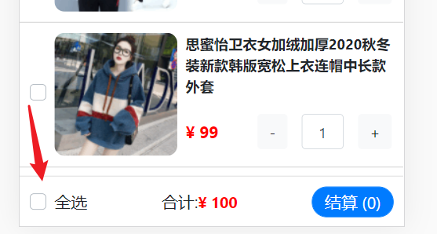

# VUE第5天

# 知识点自测

- [ ] 知道window.onload的作用
- [ ] ajax是什么, XMLHttpRequest的使用步骤
- [ ] jQ的 $.ajax底层是什么?
- [ ] Promise的作用
- [ ] async和await的作用-如何和Promise配合
- [ ] 同步异步的概念, 代码执行顺序
- [ ] 请求和响应, 以及JSON解析能力
- [ ] Vue基础, 组件使用, props传值, 组件通信, 计算属性使用, 对象引用类型使用

# 今日学习目标

1. 能够说出vue组件生命周期（8个方法4个阶段）(★★★★★)
2. 能够掌握axios的使用
3. 能够了解$refs, $nextTick使用和name使用
4. 能够完成购物车案例开发

# 一. vue生命周期(★★★★★)

## 1.1 生命周期

> 一个vue组件从 创建 到 销毁 的整个过程就是生命周期


## 1.2 钩子函数

（真正的生命周期不止这几个，今天主要介绍工作中常用的生命周期，没有介绍的后期再去了解，一般仅局限于面试）

> 目标: **Vue** 框架内置函数，随着组件的生命周期阶段，自动执行

作用: 特定的时间点，执行特定的操作

场景: 组件创建完毕后，可以在created 生命周期函数中发起Ajax 请求，从而初始化 data 数据

分类: 4大阶段8个方法

- 初始化
- 挂载
- 更新
- 销毁

| **阶段** | **方法名**    | **方法名** |
| -------- | ------------- | ---------- |
| 初始化   | beforeCreate  | created    |
| 挂载     | beforeMount   | mounted    |
| 更新     | beforeUpdate  | updated    |
| 销毁     | beforeDestroy | destroyed  |

[官网文档](https://cn.vuejs.org/v2/guide/instance.html#%E7%94%9F%E5%91%BD%E5%91%A8%E6%9C%9F%E5%9B%BE%E7%A4%BA)下图展示了实例的生命周期。你不需要立马弄明白所有的东西，不过随着你的不断学习和使用，它的参考价值会越来越高。


## 1.3 初始化阶段

> 目标: 掌握初始化阶段2个钩子函数作用和执行时机

含义讲解:

1.new Vue() – Vue实例化(组件也是一个小的Vue实例)

2.Init Events & Lifecycle – 初始化事件和生命周期函数

3.beforeCreate – 生命周期钩子函数被执行

4.Init injections&reactivity – Vue内部添加data和methods等

5.created – 生命周期钩子函数被执行, 实例创建

6.接下来是编译模板阶段 –开始分析

> 问： 此时，页面上的html结构构建出来了吗？？？？换句话来说，create初始化阶段可以获取到真是DOM吗？


main.js

```js
import Vue from 'vue'
import App from './App.vue'

Vue.config.productionTip = false

new Vue({
  // el: "#app", // vue实例编译后的模板挂载到index.html的id叫app的标签上
  render: h => h(App),
}).$mount("#app")
```

创建`components/Life.vue`文件，并且在`App.vue`里引入

```vue
<template>
  <div>
    <h1>1. 生命周期</h1>
 	<Life></Life>
  </div>
</template>

<script>
import Life from './components/Life'
export default {
  components: {
    Life
  }
}
</script>
```

设置`components/Life.vue`文件内容

```VUE
<template>
  <div>
      <p>学习生命周期 - 看控制台打印</p>
      <p id="myP">{{ msg }}</p>
  </div>
</template>

<script>
    export default {
        data(){
            return {
                msg: "hello, Vue",
            }
        },
        // 一. 初始化
        // new Vue()以后, vue内部给实例对象添加了一些属性和方法, data和methods初始化"之前"
        beforeCreate(){
            console.log("beforeCreate -- 执行");
            console.log(this.msg); // undefined
        }
        // data和methods初始化以后
        // 场景: 网络请求, 注册全局事件
        created(){
            console.log("created -- 执行");
            console.log(this.msg); // hello, Vue
        }
    }
</script>
```


## 1.4 挂载阶段

> 目标: 掌握挂载阶段2个钩子函数作用和执行时机

1.template选项检查

​	有 - 编译template返回render渲染函数

​	无 – 编译el选项对应标签作为template(要渲染的模板)（非脚手架）

2.虚拟DOM挂载成真实DOM之前

3.beforeMount – 生命周期钩子函数被执行

4.Create … – 把虚拟DOM和渲染的数据一并挂到真实DOM上

5.真实DOM挂载完毕

6.mounted – 生命周期钩子函数被执行


components/Life.vue 中设置beforeMount和mounted

```vue
<template>
  <div>
      <p>学习生命周期 - 看控制台打印</p>
      <p id="myP">{{ msg }}</p>
  </div>
</template>

<script>
export default {
    // ...省略其他代码
    
    // 二. 挂载
    // 真实DOM挂载之前
    // 场景: 预处理data, 不会触发updated钩子函数
    beforeMount(){
        console.log("beforeMount -- 执行");
        console.log(document.getElementById("myP")); // null

        this.msg = "重新值"
    },
    // 真实DOM挂载以后
    // 场景: 挂载后真实DOM
    mounted(){
        console.log("mounted -- 执行");
        console.log(document.getElementById("myP")); // p
    }
}
</script>
```


**注意：**

1. 一般工作中主要会用到created和mounted这两个生命周期。
   1. 可以在created中修改data中的数据，以及注册全局事件，**不可以去查询DOM元素**
   2. 可以在mounted中做所有created中可以执行的事件，也可以在这个时期去查询DOM元素
   3. 以上 - 可以直接只用mounted确保万无一失

## 1.5 更新阶段

> 目标: 掌握更新阶段2个钩子函数作用和执行时机

含义讲解:

1.当data里数据改变, 更新DOM之前

2.beforeUpdate – 生命周期钩子函数被执行

3.Virtual DOM…… – 虚拟DOM重新渲染, 打补丁到真实DOM

4.updated – 生命周期钩子函数被执行

5.当有data数据改变 – 重复这个循环


components/Life.vue 中设置beforeUpdate和updated

准备ul+li循环, 按钮添加元素, 触发data改变->导致更新周期开始

```vue
<template>
  <div>
      <p>学习生命周期 - 看控制台打印</p>
      <p id="myP">{{ msg }}</p>
      <ul id="myUL">
          <li v-for="(val, index) in arr" :key="index">
              {{ val }}
          </li>
      </ul>
      <button @click="arr.push(1000)">点击末尾加值</button>
  </div>
</template>

<script>
export default {
    data(){
        return {
            msg: "hello, Vue",
            arr: [5, 8, 2, 1]
        }
    },
    // ...省略其他代码

  
}
</script>
```


**问：**

1. 什么时候执行updated钩子函数?

   当数据发生变化并更新页面后

2. 在哪可以获取更新后的DOM?

   在updated钩子函数里


**注意：**

1. 更新阶段有这样一种情景：如果在update更新阶段时对数据做了新的处理，可能又会触发update更新阶段，以此往复会出现修改一次数据触发多次更新阶段逻辑的过程，这样会出现项目代码执行效率低下，**在开发过程中，尽量不要去使用update的两个生命周期，如果需要监听某个值的改变应该用到watch！**

## 1.6 销毁阶段

> 目标: 掌握销毁阶段2个钩子函数作用和执行时机

含义讲解:

1.当$destroy()被调用 – 比如组件DOM被移除(例v-if)

2.beforeDestroy – 生命周期钩子函数被执行

3.拆卸数据监视器、子组件和事件侦听器

4.实例销毁后, 最后触发一个钩子函数

5.destroyed – 生命周期钩子函数被执行


components/Life.vue - 准备生命周期方法(Life组件即将要被删除)

```vue
<script>
export default {
    // ...省略其他代码
    created() {
        // ...省略其他代码
        this.timer = setInterval(() => {
            console.log("哈哈哈");
        }, 1000)
    },
    
    // 四. 销毁
    // 前提: v-if="false" 销毁Vue实例
    // 场景: 移除全局事件, 移除当前组件, 计时器, 定时器
    beforeDestroy(){
        // console.log('beforeDestroy -- 执行');
        clearInterval(this.timer)
    },
    destroyed(){
        // console.log("destroyed -- 执行");
    }
}
</script>
```

App.vue - 点击按钮让Life组件从DOM上移除 -> 导致Life组件进入销毁阶段

```vue
<template>
  <div>
    <h1>1. 生命周期</h1>
    <Life v-if="show"></Life>
    <button @click="show = false">销毁组件</button>
  </div>
</template>

<script>
    import Life from './components/Life'
    export default {
        data(){
            return {
                show: true
            }
        },
    }
</script>
```

**注意：**

1. 销毁阶段一般是拿来销毁一些全局事件, 移除当前组件, 计时器, 定时器，特别注意！如果子组件中涉及到定时器`setInterval`时，一定注意当组件销毁时这个定时器是否关闭`clearInterval`


# 二. axios(★★★★★)

## 2.1 axios基本使用

> axios是基于原神ajax+Promise技术封装通用于前后端的请求库
>
> 其原理为： 浏览器window接口的XMLHttpRequest
>
> [axios文档](http://www.axios-js.com/)

**特点**

* 支持客户端发送Ajax请求
* 支持服务端Node.js发送请求
* 支持Promise相关用法
* 支持请求和响应的拦截器功能
* 自动转换JSON数据

**axios 底层还是原生js实现, 内部通过Promise封装的**


**axios的基本使用**

```js
axios({
  method: '请求方式', // get post delete put
  url: '请求地址',
  data: {    // 拼接到请求体的参数,  post请求的参数
    xxx: xxx,
  },
  params: {  // 拼接到请求行的参数, get请求的参数
   	xxx: xxx 
  }
}).then(res => {
  console.log(res.data) // 后台返回的结果
}).catch(err => {
  console.log(err) // 后台报错返回
})
```

## 2.2 获取数据 - get

> 目标: 调用文档最后_获取所有图书信息接口

功能: 点击调用后台接口, 拿到所有数据 – 打印到控制台

接口:  `http://123.57.109.30:3006/api/getbooks`

引入: 下载axios, 引入后才能使用

效果：


步骤：

1. 创建`components/UseAxios.vue`并设置基本结构

   ```vue
   <template>
     <div>
       <p>1. 获取所有图书信息</p>
       <button>点击-查看控制台</button>
     </div>
   </template>
   
   <script>
   export default {
   
   };
   </script>
   ```

2. 在App.vue中引入该组件

   ```vue
   <template>
   <div>
       <h1>1. 生命周期</h1>
       <Life v-if="show"></Life>
       <button @click="show = false">销毁组件</button>
       <hr>
       <h1>2. axios使用</h1>
       <UseAxios></UseAxios>
   </div>
   </template>
   
   <script>
       import UseAxios from './components/UseAxios'
       export default {
           components: {
               UseAxios
           }
       }
   </script>
   ```

3. 下载axios

   ```bash
   npm i axios
   ```

4. 引入axios

   components/UseAxios.vue

   ```vue
   <script>
   import axios from "axios";
   export default {
   
   };
   </script>
   ```

5. 发起axios请求

   全局配置rul：避免前缀写上基础地址, 暴露在逻辑页面里, 统一设置

   ```vue
   <template>
     <div>
       <p>1. 获取所有图书信息</p>
       <button @click="getAllFn">点击-查看控制台</button>
     </div>
   </template>
   
   <script>
       import axios from "axios";
       // 4. 全局配置
       axios.defaults.baseURL = "http://123.57.109.30:3006"
       export default {
           methods: {
               getAllFn() {
                   axios({
                       method: "GET", // 默认就是GET方式请求, 但不准省略
                       url: "/api/getbooks"
                   }).then((res) => { // axios()-原地得到Promise对象
                       console.log(res)
                   }). catch((err) => {
                       console.log(err)
                   })
               }
           }
       };
   </script>
   ```

## 2.3 获取数据 - get传参

> 问：ajax如何给后台传参?
>
> 1. 在url?拼接–查询字符串
> 2. 在url路径上–需要后端特殊处理
> 3. 在请求体/ 请求头传参给后台


> 目标: 调用接口-获取某本书籍信息

功能: 点击调用后台接口, 查询用户想要的书籍信息 – 打印到控制台

接口: `/api/getbooks`

效果:


步骤：

1. 在`components/UseAxios.vue`并设置基本结构

   ```vue
   <template>
   <div>
       <p>1. 获取所有图书信息</p>
       <button>点击-查看控制台</button>
       <p>2. 查询某本书籍信息</p>
       <input type="text" placeholder="请输入要查询 的书名" v-model="bName" />
       <button>查询</button>
   </div>
   </template>
   
   <script>
       export default {
           data() {
               return {
                   bName: ""
               }
           }
       }
   </script>
   ```

2. 发起axios请求

   ```vue
   <template>
   <div>
       <p>1. 获取所有图书信息</p>
       <button @click="getAllFn">点击-查看控制台</button>
       <p>2. 查询某本书籍信息</p>
       <input type="text" placeholder="请输入要查询 的书名" v-model="bName" />
       <button@click="findFn">查询</button>
   </div>
   </template>
   
   <script>
       import axios from "axios";
       axios.defaults.baseURL = "http://123.57.109.30:3006"
       export default {
           methods: {
               findFn() {
                   axios({
                       url: "/api/getbooks",
                       method: "GET",
                       params: { // 都会axios最终拼接到url?后面
                           bookname: this.bName
                       }
                   }).then(res => {
                       console.log(res);
                   }). catch((err) => {
                       console.log(err)
                   })
               },
           }
       };
   </script>
   ```


**注意： get 方法传参必须写在params中！**

## 2.4 新增书籍 - post

> 目标: 完成发布书籍功能

功能: 点击新增按钮, 把用户输入的书籍信息, 传递给后台 – 把结果打印在控制台

接口: `/api/addbook`

效果:


步骤：

1. 在`components/UseAxios.vue`并设置基本结构

   ```vue
   <template>
   <div>
       <p>3. 新增图书信息</p>
       <div>
           <input type="text" placeholder="书名" v-model="bookObj.bookname">
       </div>
       <div>
           <input type="text" placeholder="作者" v-model="bookObj.author">
       </div>
       <div>
           <input type="text" placeholder="出版社" v-model="bookObj.publisher">
       </div>
       <button>发布</button>
   </div>
   </template>
   
   <script>
       export default {
           data() {
               return {
                   bookObj: { // 参数名提前和后台的参数名对上-发送请求就不用再次修改
                       bookname: "",
                       author: "",
                       publisher: ""
                   }
               }
           }
       }
   </script>
   ```

2. 发起axios请求

   ```vue
   <template>
   <div>
       <p>3. 新增图书信息</p>
       <div>
           <input type="text" placeholder="书名" v-model="bookObj.bookname">
       </div>
       <div>
           <input type="text" placeholder="作者" v-model="bookObj.author">
       </div>
       <div>
           <input type="text" placeholder="出版社" v-model="bookObj.publisher">
       </div>
       <button @click="sendFn">发布</button>
       </div>
   </template>
   
   <script>
       import axios from "axios";
       axios.defaults.baseURL = "http://123.57.109.30:3006"
       export default {
           methods: {
               sendFn(){
                   axios({
                       url: "/api/addbook",
                       method: "POST",
                       data: {
                           appkey: "7250d3eb-18e1-41bc-8bb2-11483665535a",
                           ...this.bookObj
                           //等同于下面
                           //    bookname: this.bookObj.bookname,
                           //    author: this.bookObj.author,
                           //    publisher: this.bookObj.publisher
                       }
                   }).then((res) => {
                       alert('添加图书成功')
                   })
               }
           }
       };
   </script>
   ```

**注意：**

1. axios 默认为后台发送的请求数据格式为json字符串

   

2. post请求参数写在data中，get请求参数写在params中

# 三. VUE实例的方法

## 3.1 `$refs` - 获取DOM元素

> 目标: 利用 ref 和 $refs 可以用于获取 dom 元素

步骤：

1. 创建`components/More.vue`,设置基本结构

   ```vue
   <template>
     <div>
         <p>1. 获取原生DOM元素</p>
         <h1 id="h">我是一个孤独可怜又能吃的h1</h1>
     </div>
   </template>
   
   <script>
   // 目标: 获取组件对象
   export default {
   
   }
   </script>
   ```

2. `App.vue`引入 组件

   ```vue
   <template>
   <div>
       <h1>1. 生命周期</h1>
       <Life v-if="show"></Life>
       <button @click="show = false">销毁组件</button>
       <hr>
       <h1>2. axios使用</h1>
       <UseAxios></UseAxios>
       <hr>
       <h1>3. $refs的使用</h1>
       <More></More>
   </div>
   </template>
   
   <script>
       import More from './components/More'
       export default {
           components: {
               More
           }
       }
   </script>
   ```

3. 给标签设置ref属性

   ```vue
   <template>
     <div>
         <p>1. 获取原生DOM元素</p>
         <h1 id="h" ref="myH">我是一个孤独可怜又能吃的h1</h1>
     </div>
   </template>
   
   <script>
   	// 目标: 获取组件对象
       // 组件起别名ref
       export default {
       }
   </script>
   ```

4. 获取组件对象

   ```vue
   <template>
     <div>
         <p>1. 获取原生DOM元素</p>
         <h1 id="h" ref="myH">我是一个孤独可怜又能吃的h1</h1>
     </div>
   </template>
   
   <script>
       // 目标: 获取组件对象
       // 组件起别名ref
       // 恰当时机, 获取组件对象 - mounted
       export default {
           mounted(){
               console.log(document.getElementById("h")); // h1
               console.log(this.$refs.myH); // h1
           },
       }
   </script>
   ```

   

   > 总结: 通过id / ref, 都可以获取原生DOM标签

## 3.2 `$refs` - 获取组件对象

> 通过$refs 可以获取整个组件对象，并且使用该组件中的数据与方法

步骤：

1. 创建`components/Child/Demo.vue`，组件

   ```vue
   <template>
     <div>
         <p>我是Demo组件</p>
     </div>
   </template>
   
   <script>
   export default {
       methods: {
           fn(){
               console.log("demo组件内的方法被调用了");
           }
       }
   }
   </script>
   ```

2. 在More.vue中 - 获取组件对象并设置ref属性

   ```vue
   <template>
     <div>
         <p>1. 获取原生DOM元素</p>
         <h1 id="h" ref="myH">我是一个孤独可怜又能吃的h1</h1>
         <p>2. 获取组件对象 - 可调用组件内一切</p>
         <Demo ref="de"></Demo>
     </div>
   </template>
   
   <script>
   // 目标: 获取组件对象
   // 1. 创建组件/引入组件/注册组件/使用组件
   // 2. 组件起别名ref
   // 3. 恰当时机, 获取组件对象
   import Demo from './Child/Demo'
   export default {
       mounted(){
           console.log(document.getElementById("h")); // h1
           console.log(this.$refs.myH); // h1
       },
       components: {
           Demo
       }
   }
   </script>
   ```

3. 使用$refs调用组件中的方法

   ```vue
   <script>
   // 目标: 获取组件对象
   // 1. 创建组件/引入组件/注册组件/使用组件
   // 2. 组件起别名ref
   // 3. 恰当时机, 获取组件对象
   import Demo from './Child/Demo'
   export default {
       mounted(){
           console.log(document.getElementById("h")); // h1
           console.log(this.$refs.myH); // h1
   
           let demoObj = this.$refs.de;
           demoObj.fn()
       },
       components: {
           Demo
       }
   }
   </script>
   ```

   

>  总结: ref定义值, 通过$refs.值 来获取组件对象, 就能继续调用组件内的变量
>
> 思考：如何获取中的某些属性或方法？


## 3.3 `$nextTick`使用

> Vue更新DOM-异步的!（数据与页面有延时）

> 案例：点击count++, 马上通过"原生DOM"拿标签内容, 无法拿到新值

步骤：

1. 在 `components/Move.vue` 中添加以下代码

   ```vue
   <template>
     <div>
         <p>3. vue更新DOM是异步的</p>
         <p ref="myP">{{ count }}</p>
         <button @click="btn">点击count+1, 马上提取p标签内容</button>
     </div>
   </template>
   
   <script>
   import Demo from './Child/Demo'
   export default {
       methods: {
           btn(){
               this.count++; // vue监测数据更新, 开启一个DOM更新队列(异步任务)
               console.log(this.$refs.myP.innerHTML); // 0
           }
       }
   }
   </script>
   ```

   发现： 页面数据更改了，但从页面上拿到的dom元素中的值还是更改前的数据

2. 使用`$nextTick()`

   等DOM更新后，触发`$nextTick()`的函数体执行

   ```vue
   <template>
     <div>
         <p>3. vue更新DOM是异步的</p>
         <p ref="myP">{{ count }}</p>
         <button @click="btn">点击count+1, 马上提取p标签内容</button>
     </div>
   </template>
   
   <script>
   import Demo from './Child/Demo'
   export default {
       methods: {
           btn(){
               this.count++; // vue监测数据更新, 开启一个DOM更新队列(异步任务)
               // console.log(this.$refs.myP.innerHTML); // 0
   
               // 原因: Vue更新DOM异步
               // 解决: this.$nextTick()
               // 过程: DOM更新完会挨个触发$nextTick里的函数体
               this.$nextTick(() => {
                   console.log(this.$refs.myP.innerHTML); // 1
               })
           }
       }
   }
   </script>
   ```

### 面试背点01 - nextTick实现原理

1. `nextTick`是`Vue`提供的一个全局`API`，是下次`DOM`更新循环结束之后执行延时回调，在修改之后使用`$nextTick`，则可以再回调中获取更新后的`DOM`
2. vue在更新DOM时是异步执行的。只要侦听到数据变化，`vue`将开启1个队列，并缓冲在同一事件循环中发生的所有数据变更。如果同一个`watcher`被多次触发，只会推入到队列中1次。这种在缓冲时去除重复数据对于避免不必要的计算和`DOM`操作非常重要的。`nextTick`方法会在队列中加入一个回调函数，确保该函数在前面的`DOM`操作完成后才调用。

## 3.4 $nextTick使用案例

> 目标: 点击搜索按钮, 弹出聚焦的输入框, 按钮消失


步骤：

1. 创建`components/Tick.vue`, 设置基本结构

   ```vue
   <template>
     <div>
         <input ref="myInp" type="text" placeholder="这是一个输入框" v-if="isShow">
         <button v-else @click="btn">点击我进行搜索</button>
     </div>
   </template>
   
   <script>
   // 目标: 点按钮(消失) - 输入框出现并聚焦
   // 1. 获取到输入框
   // 2. 输入框调用事件方法focus()达到聚焦行为
   export default {
       data(){
           return {
               isShow: false
           }
       },
       methods: {
           btn(){
               this.isShow = true;
           }
       }
   }
   </script>
   ```

2. App.vue 中引入该组件

   ```vue
   <template>
   <div>
       <h1>1. 生命周期</h1>
       <Life v-if="show"></Life>
       <button @click="show = false">销毁组件</button>
       <hr>
       <h1>2. axios使用</h1>
       <UseAxios></UseAxios>
       <hr>
       <h1>3. $refs的使用</h1>
       <More></More>
       <hr>
       <h1>4. $nextTick使用场景</h1>
       <Tick></Tick>
   </div>
   </template>
   
   <script>
       import Tick from './components/Tick'
       export default {
           components: {
               Tick
           }
       }
   </script>
   ```

3. 希望在切换输入框时聚焦

   ```vue
   <template>
     <div>
         <input ref="myInp" type="text" placeholder="这是一个输入框" v-if="isShow">
         <button v-else @click="btn">点击我进行搜索</button>
     </div>
   </template>
   
   <script>
   // 目标: 点按钮(消失) - 输入框出现并聚焦
   // 1. 获取到输入框
   // 2. 输入框调用事件方法focus()达到聚焦行为
   export default {
       data(){
           return {
               isShow: false
           }
       },
       methods: {
           btn(){
               this.isShow = true;
               this.$refs.myInp.focus() // 无法获取到该元素
           }
       }
   }
   </script>
   ```

   

4. 使用$nextTick()

   ```vue
   <script>
   // 目标: 点按钮(消失) - 输入框出现并聚焦
   // 1. 获取到输入框
   // 2. 输入框调用事件方法focus()达到聚焦行为
   export default {
       data(){
           return {
               isShow: false
           }
       },
       methods: {
           btn(){
               this.isShow = true;
               // this.$refs.myInp.focus()
               // 原因: data变化更新DOM是异步的
               // 输入框还没有挂载到真实DOM上
               // 解决:
               this.$nextTick(() => {
                   this.$refs.myInp.focus()
               })
           }
       }
   }
   </script>
   ```

5. 扩展，也可以使用ES6的`async await`来实现异步语句同步化

   ```vue
   <script>
   export default {
       data(){
           return {
               isShow: false
           }
       },
       methods: {
           btn(){
               this.isShow = true;
               // this.$refs.myInp.focus()
               // 原因: data变化更新DOM是异步的
               // 输入框还没有挂载到真实DOM上
               // 解决:
               // this.$nextTick(() => {
               //     this.$refs.myInp.focus()
               // })
               // 扩展: await取代回调函数
               // $nextTick()原地返回Promise对象
               await this.$nextTick()
               this.$refs.myInp.focus()
           }
       }
   }
   </script>
   ```

## 3.5 组件中的name属性作用 - （以下仅做了解，严重影响代码可读性不建议使用）

> 目标: 可以用组件的name属性值, 来注册组件名字

问题: 组件名不是可以随便写的?

答案: 我们封装的组件-可以自己定义name属性组件名-让使用者有个统一的前缀风格

步骤:

1. 创建`components/Com.vue`

   ```vue
   <template>
     <div>
         <p>我是一个Com组件</p>
     </div>
   </template>
   
   <script>
   export default {
       name: "ComNameHaHa" // 注册时可以定义自己的名字
   }
   </script>
   ```

2. App.vue - 注册和使用

   ```vue
   <template>
     <div>
       <h1>1. 生命周期</h1>
       <Life v-if="show"></Life>
       <button @click="show = false">销毁组件</button>
       <hr>
       <h1>2. axios使用</h1>
       <UseAxios></UseAxios>
       <hr>
       <h1>3. $refs的使用</h1>
       <More></More>
       <hr>
       <h1>4. $nextTick使用场景</h1>
       <Tick></Tick>
       <hr>
       <h1>5. 组件对象里name属性</h1>
       <ComNameHaHa></ComNameHaHa>
     </div>
   </template>
   
   <script>
   import Life from './components/Life'
   import UseAxios from './components/UseAxios'
   import More from './components/More'
   import Tick from './components/Tick'
   import Com from './components/Com'
   export default {
     data(){
       return {
         show: true
       }
     },
     components: {
       Life,
       UseAxios,
       More,
       Tick,
       [Com.name]: Com // 对象里的key是变量的话[]属性名表达式
       // "ComNameHaHa": Com
     }
   }
   </script>
   ```

# 四. 案例 - 购物车


## 4.1 案例-购物车-项目初始化

> 目标: 初始化新项目, 清空不要的东西, 下载bootstrap库, 下载less模块

```bash
vue create shopcar
yarn add bootstrap
yarn add less less-loader@5.0.0 -D
```

案例组件划分：


1. 在main.js中引入bootStrap库

   ```js
   import "bootstrap/dist/css/bootstrap.css" // 引入第三方包里的某个css文件
   ```

2. 按照需求, 把项目页面拆分成几个组件, 在components下创建

   * MyHeader组件

     ```vue
     <template>
       <div class="my-header">购物车案例</div>
     </template>
     
     <script>
     export default {
     
     }
     </script>
     
     <style lang="less" scoped>
       .my-header {
         height: 45px;
         line-height: 45px;
         text-align: center;
         background-color: #1d7bff;
         color: #fff;
         position: fixed;
         top: 0;
         left: 0;
         width: 100%;
         z-index: 2;
       }
     </style>
     ```

   * MyFooter组件

     ```vue
     <template>
       <!-- 底部 -->
       <div class="my-footer">
         <!-- 全选 -->
         <div class="custom-control custom-checkbox">
           <input type="checkbox" class="custom-control-input" id="footerCheck">
           <label class="custom-control-label" for="footerCheck">全选</label>
         </div>
         <!-- 合计 -->
         <div>
           <span>合计:</span>
           <span class="price">¥ 0</span>
         </div>
         <!-- 按钮 -->
         <button type="button" class="footer-btn btn btn-primary">结算 ( 0 )</button>
       </div>
     </template>
     
     <script>
     export default {
     
     }
     </script>
     
     <style lang="less" scoped>
     .my-footer {
       position: fixed;
       z-index: 2;
       bottom: 0;
       width: 100%;
       height: 50px;
       border-top: 1px solid #ccc;
       display: flex;
       justify-content: space-between;
       align-items: center;
       padding: 0 10px;
       background: #fff;
     
       .price {
         color: red;
         font-weight: bold;
         font-size: 15px;
       }
     
       .footer-btn {
         min-width: 80px;
         height: 30px;
         line-height: 30px;
         border-radius: 25px;
         padding: 0;
       }
     }
     </style>
     ```

   * MyGoods组件 - 商品

     ```vue
     <template>
       <div class="my-goods-item">
         <div class="left">
           <div class="custom-control custom-checkbox">
             <input type="checkbox" class="custom-control-input" id="input"
             >
             <label class="custom-control-label" for="input">
               
             </label>
           </div>
         </div>
         <div class="right">
           <div class="top">商品名字</div>
           <div class="bottom">
             <span class="price">¥ 100</span>
             <span>
                 数量组件
             </span>
           </div>
         </div>
       </div>
     </template>
     
     <script>
     export default {
     
     }
     </script>
     
     <style lang="less" scoped>
     .my-goods-item {
       display: flex;
       padding: 10px;
       border-bottom: 1px solid #ccc;
       .left {
         img {
           width: 120px;
           height: 120px;
           margin-right: 8px;
           border-radius: 10px;
         }
         .custom-control-label::before,
         .custom-control-label::after {
           top: 50px;
         }
       }
       .right {
         flex: 1;
         display: flex;
         flex-direction: column;
         justify-content: space-between;
         .top{
             font-size: 14px;
             font-weight: 700;
         }
         .bottom {
           display: flex;
           justify-content: space-between;
           padding: 5px 0;
           align-items: center;
           .price {
             color: red;
             font-weight: bold;
           }
         }
       }
     }
     
     </style>
     ```

   * MyCount组件

     ```vue
     <template>
       <div class="my-counter">
         <button type="button" class="btn btn-light">-</button>
         <input type="number" class="form-control inp" v-model="num">
         <button type="button" class="btn btn-light">+</button>
       </div>
     </template>
     
     <script>
     export default {
       data() {
         return {
           num: 1
         }
       },
     }
     
     <style lang="less" scoped>
     .my-counter {
       display: flex;
     
       .inp {
         width: 45px;
         text-align: center;
         margin: 0 10px;
       }
     
       .btn,
       .inp {
         transform: scale(0.9);
       }
     }
     </style>
     ```

3. 依次引入到App.vue中

   ```vue
   <template>
     <div>
       <MyHeader></MyHeader>
         <MyGoods></MyGoods>
       <MyFooter></MyFooter>
     </div>
   </template>
   
   <script>
   // 目标: 项目初始化 - 静态页面
   // 1. 创建项目, 下包, 引入bs样式
   // 2. 拆分需求组件, 创建 - 分别标签+样式
   // 3. App.vue上显示, 微调样式(上下内边距)
   import MyHeader from './components/MyHeader'
   import MyGoods from './components/MyGoods'
   import MyFooter from './components/MyFooter'
   export default {
     components: {
       MyHeader,
       MyGoods,
       MyFooter
     },
   }
   </script>
   
   <style>
   </style>
   ```

4. MyGoods.vue中需要插入MyCount.vue数量组件

   ```vue
   <span>
       <!-- 插入数量组件 -->
       <MyCount></MyCount>
   </span>
   
   <script>
   import MyCount from './MyCount.vue'
   export default {
     components: {
       MyCount
     }
   }
   </script>
   ```

5. 微调样式

   发现页面会脱离文档流， 需要在App.vue里设置一个盒子包裹整个内容部分

   

   ```vue
   <template>
     <div>
       <MyHeader></MyHeader>
       <div class="main">
         <MyGoods></MyGoods>
       </div>
       <MyFooter></MyFooter>
     </div>
   </template>
   
   <style scoped>
       .main {
         padding-top: 45px;
         padding-bottom: 50px;
       }
   </style>
   ```

总结：拿到项目需求需要以下分析

1. 新建项目-下载需要的包
2. 分析, 拆分, 创建组件
3. 准备静态标签
4. 组件使用到页面

## 4.2 头部自定义

> 目的: 头部的标题, 颜色, 背景色可以随便修改, props类型的校验
>
> 简单来说就是使用父组件提供的参数来改变头部的样式


**思路：**

1. 在MyHeader.vue中准备props里变量, 然后使用
2. 在使用MyHeader.vue组件时, 传入相应的值 (color和backgroundColor)
   - 其中文字颜色color设置默认值
3. 传入标题文字内容定义
   - 文字要求为必传项

**MyHeader.vue**

```vue
<template>
  <div class="my-header" :style="{ backgroundColor: background, color }">{{ title }}</div>
</template>

<script>
export default {
  props: {
    background: String, // 外部插入此变量的值, 必须是字符串类型, 否则报错
    color: {
      type: String, // 约束color值的类型
      default: "#fff" // color变量默认值(外部不给 我color传值, 使用默认值)
    },
    title: {
      type: String,
      required: true // 必须传入此变量的值
    }
  }
}
</script>
```

App.vue传入相应自定义的值

```vue
<MyHeader title="购物车案例"></MyHeader>
```

>总结:  
>
>props: [] - 只能声明变量和接收, 不能类型校验
>
>props: {} - 声明变量和校验类型规则 - 外部传入值不对则报错

## 4.3 请求数据

> 目标: 使用axios把数据请求回来

数据地址: https://www.escook.cn/api/cart  (get方式)

分析：

①：下载axios，在main.js中引入

②：配置基础地质： https://www.escook.cn

③：axios挂载到Vue原型上，作为全局属性

④：App.vue的created中使用全局属性axios


步骤:

1. 下载axios

   ```bash
   yarn add axios
   ```

2. main.js - 原型上挂载

   ```js
   import Vue from 'vue'
   import App from './App.vue'
   import "bootstrap/dist/css/bootstrap.css" // 引入第三方包里的某个css文件
   
   Vue.config.productionTip = false
   
   // 目标: 请求数据 - 打印
   // 1. 下载axios库, main.js - 全局绑定属性 (确保任意.vue文件可以都访问到这个axios方法)
   import axios from 'axios'
   // 2. 基础地址
   axios.defaults.baseURL = "https://www.escook.cn"
   // 3. axios方法添加到Vue的原型上
   Vue.prototype.$axios = axios
   
   new Vue({
     render: h => h(App),
   }).$mount('#app')
   ```

3. App.vue中使用请求

   ```vue
   <script>
   export default {
     components: {
       MyHeader,
       MyGoods,
       MyFooter
     },
     data() {
       return {
         list: [] // 商品所有数据
       }
     },
   
     created() {
       // 获取购物车数据列表
       this.getList()
     },
   
     methods: {
       // 获取购物车数据列表
       getList() {
         this.$axios({
           methods: 'GET',
           url: "/api/cart"
         }).then(res => {
           console.log(res);
           this.list = res.data.list
           console.log(this.list)
         })
       }
     },
   }
   </script>
   ```

>  总结: 可以将axios配置到全局, 这样调用接口时可以省去每次都去引用axios，减少无用代码量


## 4.4 数据渲染

> 目标: 把上面请求的数据, 铺设到页面上

步骤：

1. App.vue 上通过列表数据，遍历组件

   ```vue
   <template>
     <div>
       <MyHeader title="购物车案例"></MyHeader>
       <div class="main">
         <MyGoods v-for="obj in list" :key="obj.id" :dataList="obj"></MyGoods>
       </div>
       <MyFooter></MyFooter>
     </div>
   </template>
   ```

2. MyGoods.vue 中将数据动态配置到对应标签中

   ```vue
   <template>
     <div class="my-goods-item">
       <div class="left">
         <div class="custom-control custom-checkbox">
           <!-- *重要:
             每个对象和组件都是独立的
             对象里的goods_state关联自己对应商品的复选框
            -->
           <input type="checkbox" class="custom-control-input" :id="goodsData.id" v-model="goodsData.goods_state">
           <label class="custom-control-label">
             
           </label>
         </div>
       </div>
       <div class="right">
         <div class="top">{{ goodsData.goods_name }}</div>
         <div class="bottom">
           <span class="price">¥ {{ goodsData.goods_price }}</span>
           <span>
             <MyCount :obj="goodsData"></MyCount>
           </span>
         </div>
       </div>
     </div>
   </template>
   
   <script>
   import MyCount from './MyCount.vue'
   export default {
     components: {
       MyCount
     },
     props: {
       goodsData: {
         typeof: Object,
         default: () => ({})
       }
     },
   }
   </script>
   ```

3. 将数据传给MyCount.vue组件，让数据驱动数量选择

   ```vue
   <template>
     <div class="my-counter">
       <button type="button" class="btn btn-light">-</button>
       <input type="number" class="form-control inp" v-model.number="goodsData.goods_count">
       <button type="button" class="btn btn-light">+</button>
     </div>
   </template>
   
   <script>
   export default {
     props: {
       goodsData: {
         typeof: Object,
         default: () => ({})
       }
     }
   }
   </script>
   ```

## 4.5 商品选中

> 给label设置for属性

```VUE
<input type="checkbox" class="custom-control-input" :id="goodsData.id"
       v-model="goodsData.goods_state"
       >
<label class="custom-control-label" :for="goodsData.id">
    
</label>
```

## 4.6 数量控制

> 目标: 点击+和-或者直接修改输入框的值影响商品购买的数量
>
> 注意： 数量不可以小于0

分析：

①：给MyCount组件传入数据对象关联

②：输入框v-model关联对象里数量属性

③：增加或减少修改对象数量属性

④：控制商品最少一件

```vue
<template>
  <div class="my-counter">
    <!-- 1. 减少到1时，禁用减少按钮，点击事件也要做限制 -->
    <button type="button" class="btn btn-light" :disabled="goodsData.goods_count === 1"
      @click="goodsData.goods_count > 1 && goodsData.goods_count--">-</button>
    <input type="number" class="form-control inp" v-model.number="goodsData.goods_count">
    <!-- 2. 点击增加，数量加一 -->
    <button type="button" class="btn btn-light" @click="goodsData.goods_count++">+</button>
  </div>
</template>

<script>
export default {
  props: {
    goodsData: {
      typeof: Object,
      default: () => ({})
    }
  },

  // 通过数据监听，如果手动输入小鱼1的数字时，强制修改为1
  watch: {
    goodsData: {
      deep: true,
      immediate: true,
      handler() { // 拿到商品数量, 判断小于1, 强制修改成1
        if (this.goodsData.goods_count < 1) {
          this.goodsData.goods_count = 1
        }
      }
    }
  }
}
</script>
```

④：App.vue的created中使用全局属性axios

**总结：**

1. 通过watch事件，监听控制输入框值的合法性，强制覆盖为正确的值
2. 对象传参会引用相同的堆内存

## 4.7 全选功能

> 目标: 在底部组件上, 完成全选功能



分析：

1. 通过计算属性，关联数据列表和全选框状态
2. 在set方法中获取到全选关系
3. 根据小选框的选择数量改变全选框状态
4. 根据全选框修改小选框状态

步骤：

1. 在MyFooter.vue中配置计算属性

2. 根据小选框的选择数量改变全选框状态

   ```vue
   <template>
     <!-- 底部 -->
     <div class="my-footer">
       <!-- 全选 -->
       <div class="custom-control custom-checkbox">
         <input type="checkbox" class="custom-control-input" id="footerCheck" v-model="isAll">
         <label class="custom-control-label" for="footerCheck">全选</label>
       </div>
       <!-- 合计 -->
       <div>
         <span>合计:</span>
         <span class="price">¥ 0</span>
       </div>
       <!-- 按钮 -->
       <button type="button" class="footer-btn btn btn-primary">结算 ( 0 )</button>
     </div>
   </template>
   
   <script>
       // 目标: 全选
       // 1. v-model关联全选-复选框(v-model后变量计算属性)
       // 2. 页面(视频层)v(true) -> 数据层(变量-) 计算属性(完整写法)
   
       // 小选  -> 全选
       // App.vue里list数组 -> MyFooter.vue
       // isAll的get方法里, 统计状态影响全选框
       export default {
           props: {
               arr: {
                   type: Array,
                   default: () => []
               }
           },
           computed: {
               isAll: {
                   set(val) { // val就是关联表单的值(true/false)
                       console.log(val)
                   },
                   get() {
                       // 查找小选框关联的属性有没有不符合勾选的条件
                       // 直接原地false
                       return this.arr.every(obj => obj.goods_state === true)
                   }
               },
           }
       }
   </script>
   ```

3. 根据全选框状态修改小选框状态

   App.vue

   ```vue
       <MyFooter @changeAll="allFn" :arr="list"></MyFooter>
   ```

   MyFooter.vue

   ```vue
   <script>
   // 目标: 全选
   // 1. v-model关联全选-复选框(v-model后变量计算属性)
   // 2. 页面(视频层)v(true) -> 数据层(变量-) 计算属性(完整写法)
   // 3. 把全选 true/false同步给所有小选框选中状态上
   
   // 小选  -> 全选
   // App.vue里list数组 -> MyFooter.vue
   // isAll的get方法里, 统计状态影响全选框
   export default {
     props: {
       arr: {
         type: Array,
         default: () => []
       }
     },
     computed: {
       isAll: {
         set(val) { // val就是关联表单的值(true/false)
           this.$emit('changeAll', val)
         },
         get() {
           // 查找小选框关联的属性有没有不符合勾选的条件
           // 直接原地false
           return this.arr.every(obj => obj.goods_state === true)
         }
       },
     }
   }
   </script>
   ```


## 4.8 总数量

> 目标: 完成底部组件, 显示选中的商品的总数量

设置计算属性，来汇总列表list中的所有选中商品个数

```vue
<template>
  <!-- 底部 -->
  <div class="my-footer">
    <!-- 合计 -->
    <div>
      <span>合计:</span>
      <span class="price">{{ allCount }}</span>
    </div>
  </div>
</template>

<script>
// 目标: 全选
// 1. v-model关联全选-复选框(v-model后变量计算属性)
// 2. 页面(视频层)v(true) -> 数据层(变量-) 计算属性(完整写法)
// 3. 把全选 true/false同步给所有小选框选中状态上

// 小选  -> 全选
// App.vue里list数组 -> MyFooter.vue
// isAll的get方法里, 统计状态影响全选框

// 目标: 总数量统计
// 1. allCount计算属性用 数组reduce+判断统计数量并返回
export default {
  props: {
    arr: {
      type: Array,
      default: () => []
    }
  },
  computed: {
    allCount() {
      return this.arr.reduce((sum, obj) => {
        if (obj.goods_state === true) { // 选中商品才累加数量
          sum += obj.goods_count
        }
        return sum
      }, 0)
    },
  }
}
</script>
```


## 4.9 总价

> 目标: 完成选中商品计算价格

设置计算属性，来汇总列表list中的所有选中商品的价格

```vue
<template>
  <!-- 底部 -->
  <div class="my-footer">
    <!-- 按钮 -->
    <button type="button" class="footer-btn btn btn-primary">结算 ( {{ allPrice }} )</button>
  </div>
</template>

<script>
// 目标: 全选
// 1. v-model关联全选-复选框(v-model后变量计算属性)
// 2. 页面(视频层)v(true) -> 数据层(变量-) 计算属性(完整写法)
// 3. 把全选 true/false同步给所有小选框选中状态上

// 小选  -> 全选
// App.vue里list数组 -> MyFooter.vue
// isAll的get方法里, 统计状态影响全选框

// 目标: 总数量统计
// 1. allCount计算属性用 数组reduce+判断统计数量并返回

// 目标: 总价
// allPrice计算属性, 数组reduce+单价*数量, 判断选中, 才累加后返回
export default {
  props: {
    arr: {
      type: Array,
      default: () => []
    }
  },
  computed: {
    allPrice() {
      return this.arr.reduce((sum, obj) => {
        if (obj.goods_state) {
          sum += obj.goods_count * obj.goods_price
        }
        return sum;
      }, 0)
    }
  }
}
</script>
```


# 今日总结

1. vue的生命周期哪4个阶段, 哪8个方法

2. axios是什么, 底层是什么, 具体如何使用

3. axios如何接收结果

4. 知道ref和$refs使用和作用以及场景

5. 知道$nextTick的作用

6. 跟着老师完成购物车案例


## 面试题

### 1、Vue 的 nextTick 的原理是什么? （高薪常问）

​    \1. 为什么需要 nextTick ，Vue 是异步修改 DOM 的并且不鼓励开发者直接接触 DOM，但有时候业务需要必须对数据更改--刷新后的 DOM 做相应的处理，这时候就可以使用 Vue.nextTick(callback)这个 api 了。

​    \2. 理解原理前的准备 首先需要知道事件循环中宏任务和微任务这两个概念,常见的宏任务有 script, setTimeout, setInterval, setImmediate, I/O, UI rendering 常见的微任务有 process.nextTick(Nodejs),Promise.then(), MutationObserver;

​    \3. 理解 nextTick 的原理正是 vue 通过异步队列控制 DOM 更新和 nextTick 回调函数先后执行的方式。如果大家看过这部分的源码，会发现其中做了很多 isNative()的判断，因为这里还存在兼容性优雅降级的问题。可见 Vue 开发团队的深思熟虑，对性能的良苦用心。

### 2、vue生命周期总共分为几个阶段？（必会）

   Vue 实例从创建到销毁的过程，就是生命周期。也就是从开始创建、初始化数据、编译模板、挂载Dom→渲染、更新→渲染、卸载等一系列过程，我们称这是 Vue 的生命周期。

**1****）beforeCreate**

​    在实例初始化之后，数据观测 (data observer) 和 event/watcher 事件配置之前被调用。

**2****）created**

​    在实例创建完成后被立即调用。在这一步，实例已完成以下的配置：数据观测 (data observer)， 属性和方法的运算，watch/event 事件回调。然而，挂载阶段还没开始，$el 属性目前不可见。

**3****）beforeMount**

​    在挂载开始之前被调用：相关的 render 函数首次被调用。

**4****）mounted**

​    el 被新创建的 vm.$el 替换，并挂载到实例上去之后调用该钩子。如果 root 实例挂载了一个文档内元素，当 mounted 被调用时 vm.$el 也在文档内。

**5****）beforeUpdate**

​    数据更新时调用，发生在虚拟 DOM 打补丁之前。这里适合在更新之前访问现有的 DOM，比如手动移除已添加的事件监听器。该钩子在服务器端渲染期间不被调用，因为只有初次渲染会在服务端进行。

**6****）updated**

​    由于数据更改导致的虚拟 DOM 重新渲染和打补丁，在这之后会调用该钩子。

**7****）activated**

​    keep-alive 组件激活时调用。该钩子在服务器端渲染期间不被调用。

**8****）deactivated**

​    keep-alive 组件停用时调用。该钩子在服务器端渲染期间不被调用。

**9****）beforeDestroy**

​    实例销毁之前调用。在这一步，实例仍然完全可用。该钩子在服务器端渲染期间不被调用。

**10****）destroyed**

​    Vue 实例销毁后调用。调用后，Vue 实例指示的所有东西都会解绑定，所有的事件监听器会被移除，所有的子实例也会被销毁。该钩子在服务器端渲染期间不被调用。

**11****）errorCaptured（2.5.0+ 新增）**

​    当捕获一个来自子孙组件的错误时被调用。此钩子会收到三个参数：错误对象、发生错误的组件实例以及一个包含错误来源信息的字符串。此钩子可以返回 false 以阻止该错误继续向上传播。

### 3、第一次加载页面会触发哪几个钩子函数？（必会）

   当页面第一次页面加载时会触发 beforeCreate, created, beforeMount, mounted 这几个钩子函数


## 今日作业

把课上购物车再来一遍

## 接口文档

> axios请求接口使用

根域名: http://123.57.109.30:3006

### 案例 - 图书相关

#### 获取

* 请求方式:  GET
* 请求地址: 根域名/api/getbooks
* 请求参数: 

不传参获取所有默认书籍, 也可以选择传递下面任意1-多个参数, 获取指定的相关书籍信息

| 参数名称  | 参数类型 | 是否必选 | 参数说明 |
| --------- | -------- | -------- | -------- |
| id        | Number   | 否       | 图书Id   |
| bookname  | String   | 否       | 图书名称 |
| author    | String   | 否       | 作者     |
| publisher | String   | 否       | 出版社   |
| appkey    | String   | 否       | 个人ID   |

* 返回示例:

```json
{
  "status": 200, // 状态码200都代表完全成功 - 无任何意义随便写, 只是方便前端写判断条件
  "msg": "获取图书列表成功", // 后台返回的提示消息, 随便写, 只是方便前端直接打印提示消息
  "data": [ // 后台返回的数据
    { "id": 1, "bookname": "西游记", "author": "吴承恩", "publisher": "北京图书出版社" },
    { "id": 2, "bookname": "红楼梦", "author": "曹雪芹", "publisher": "上海图书出版社" },
    { "id": 3, "bookname": "三国演义", "author": "罗贯中", "publisher": "北京图书出版社" }
  ]
}

```

#### 添加

* 请求方式: POST
* 请求地址: 根域名/api/addbook
* 请求参数:

| 参数名称  | 参数类型 | 是否必选 | 参数说明                                          |
| --------- | -------- | -------- | ------------------------------------------------- |
| bookname  | String   | 是       | 图书名称                                          |
| author    | String   | 是       | 作者                                              |
| publisher | String   | 是       | 出版社                                            |
| appkey    | String   | 是       | 个人ID - 用'7250d3eb-18e1-41bc-8bb2-11483665535a' |

* 返回示例:

```js
{
    "status": 201, // 后台返回数据逻辑层的状态码, 201代表后台已经新增加了一个资源
    "data": {
        "author": "施大神"
        "bookname": "水浒传2"
        "id": 41
        "publisher": "未来出版社"
    }
    "msg": "添加图书成功"
}
```


