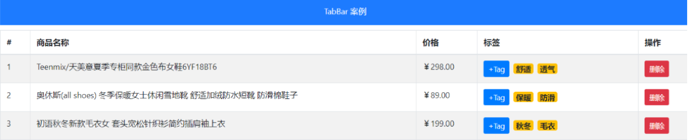

# VUE第6天

# 知识点自测

- [ ] ==组件创建, 注册和使用 - 伸手就来特别熟练==
- [ ] 指令的作用

# 今日学习目标

1. 能够了解组件进阶知识（插槽）
2. 能够掌握自定义指令创建和使用
3. 能够完成tabbar案例的开发

# 一. 组件进阶

## 1.1 动态组件（很不错的思路）

> 目标: 多个组件使用同一个挂载点，并动态切换，这就是动态组件

需求: 完成一个注册功能页面, 2个按钮切换, 一个填写注册信息, 一个填写用户简介信息

效果如下:


1. 准备被切换的 - UserName.vue(账号密码) / UserInfo.vue(个人信息) 2个组件

   UserName.vue

   ```vue
   <template>
     <div>
         <div>
             <span>人生格言:</span>
             <input type="text">
         </div>
         <div>
             <span>个人简介:</span>
             <textarea></textarea>
         </div>
     </div>
   </template>
   
   <script>
   export default {}
   </script>
   ```

    UserInfo.vue

   ```vue
   <template>
     <div>
         <div>
             <span>用户名:</span>
             <input type="text">
         </div>
         <div>
             <span>密码:</span>
             <input type="password">
         </div>
     </div>
   </template>
   
   <script>
   export default {}
   </script>
   ```

2. 引入到UseDynamic.vue注册

   

3. 在App.vue里引入01_UseDynamic.vue并使用显示

   ```vue
   <template>
     <div>
       <h1>1. 动态dynamic组件使用</h1>
       <UseDynamic></UseDynamic>
     </div>
   </template>
   
   <script>
   import UseDynamic from './views/01_UseDynamic'
   export default {
     components: {
       UseDynamic,
     }
   }
   </script>
   ```

4. 准备变量来承载要显示的"组件名"

   ```VUE
   <template>
     <div>
         <button>账号密码填写</button>
         <button>个人信息填写</button>
   
         <p>下面显示注册组件-动态切换:</p>
         <div style="border: 1px solid red;">
   			// 写组件
         </div>
     </div>
   </template>
   
   <script>
   // 目标: 动态组件 - 切换组件显示
   // 场景: 同一个挂载点要切换 不同组件 显示
   import UserName from '../components/01/UserName'
   import UserInfo from '../components/01/UserInfo'
   export default {
       data(){
           return {
           }
       },
       components: {
           UserName,
           UserInfo
       }
   }
   </script>
   ```

5. 设置挂载点`<component>`, 使用is属性来设置要显示哪个组件

   >  设置初始化时默认展示的组件

   ```vue
   <template>
     <div>
         <button>账号密码填写</button>
         <button>个人信息填写</button>
   
         <p>下面显示注册组件-动态切换:</p>
         <div style="border: 1px solid red;">
             <component :is="comName"></component>
         </div>
     </div>
   </template>
   
   <script>
   // 目标: 动态组件 - 切换组件显示
   // 场景: 同一个挂载点要切换 不同组件 显示
   // 1. 创建要被切换的组件 - 标签+样式
   // 2. 引入到要展示的vue文件内, 注册
   // 3. 变量-承载要显示的组件名
   // 4. 设置挂载点<component :is="变量"></component>
   // 5. 点击按钮-切换comName的值为要显示的组件名
   
   import UserName from '../components/01/UserName'
   import UserInfo from '../components/01/UserInfo'
   export default {
       data(){
           return {
               comName: "UserName" // 这个值一定要是我们的组件名
           }
       },
       components: {
           UserName,
           UserInfo
       }
   }
   </script>
   ```

6. 点击按钮 – 修改comName变量里的"组件名"

   ```VUE
   <button @click="comName = 'UserName'">账号密码填写</button>
   <button @click="comName = 'UserInfo'">个人信息填写</button>
   ```

**总结：**vue内置component组件，配合is属性，设置要显示的组件名称

## 1.2  组件缓存

> 目标: 组件切换会导致组件被频繁销毁和重新创建, 性能不高

使用Vue内置的keep-alive组件, 可以让包裹的组件保存在内存中不被销毁


**演示1:**  可以先给UserName.vue和UserInfo.vue 注册created和destroyed生命周期事件, 观察创建和销毁过程

**每一次切换，都会创建A，并销毁B**

App.vue

```vue
<hr>
<h1>2. 组件缓存</h1>
<UseDynamic2></UseDynamic2>
```

UserName.vue

```vue
<script>
export default {
    created(){
        console.log("02-UserName-创建");
    },
    destroyed(){
        console.log("02-UserName-销毁");
    },
}
</script>
```


**演示2:** 使用keep-alive内置的vue组件, 让动态组件缓存而不是销毁

**除了第一次开启组件时会创建，切换的过程当中不会重复创建和销毁的过程**

语法:

​		Vue内置的keep-alive组件 包起来要频繁切换的组件

02_UseDynamic.vue

```vue
<div style="border: 1px solid red;">
    <!-- Vue内置keep-alive组件, 把包起来的组件缓存起来 -->
    <keep-alive>
        <component :is="comName"></component>
    </keep-alive>
</div>
```


## 1.3 keep-alive相关钩子函数

> 目标: 被缓存的组件不再创建和销毁, 而是激活和非激活

**补充生命周期:**

* activated - 激活
* deactivated - 失去激活状态

> 总结: keep-alive可以提高组件的性能, 内部包裹的标签不会被销毁和重新创建, 触发激活和非激活的生命周期方法

UserName.vue

```vue
<script>
export default {
    created(){
        console.log("02-UserName-创建");
    },
    destroyed(){
        console.log("02-UserName-销毁");
    },
    // 组件缓存下 - 多了2个钩子函数
    activated(){
        console.log("02-UserName-激活");
    },
    deactivated(){
        console.log("02-UserName-失去激活");
    }
}
</script>
```

## 1.4 组件插槽（面试加分）

> 问：给组件传递动态的参数时，可以使用props，那如果给组件传递动态的标签结构呢？

### 1.4.1 基本用法

> 目标: 用于实现组件的内容分发, 通过 slot 标签, 可以接收到写在组件标签内的内容

vue提供组件插槽能力, 允许开发者在封装组件时，把不确定的部分定义为插槽


**插槽例子：**以下时而是图片，时而是文字，单纯传参数好像比较难实现


需求: 以前折叠面板案例, 想要实现不同**内容显示**, 我们把折叠面板里的Pannel组件, 添加组件插槽方式


语法口诀: 

1. 组件内用`<slot></slot>`占位
2. 使用组件时`<Pannel></Pannel>`夹着的地方, 传入标签替换slot

03/Pannel.vue - 组件(直接复制)

```vue
<template>
  <div>
    <!-- 按钮标题 -->
    <div class="title">
      <h4>芙蓉楼送辛渐</h4>
      <span class="btn" @click="isShow = !isShow">
        {{ isShow ? "收起" : "展开" }}
      </span>
    </div>
    <!-- 下拉内容 -->
    <div class="container" v-show="isShow">
          <p>寒雨连江夜入吴,</p>
          <p>平明送客楚山孤。</p>
          <p>洛阳亲友如相问，</p>
          <p>一片冰心在玉壶。</p>
    </div>
  </div>
</template>

<script>
export default {
  data() {
    return {
      isShow: false,
    };
  },
};
</script>

<style scoped>
h3 {
  text-align: center;
}

.title {
  display: flex;
  justify-content: space-between;
  align-items: center;
  border: 1px solid #ccc;
  padding: 0 1em;
}

.title h4 {
  line-height: 2;
  margin: 0;
}

.container {
  border: 1px solid #ccc;
  padding: 0 1em;
}

.btn {
  /* 鼠标改成手的形状 */
  cursor: pointer;
}

img {
  width: 50%;
}
</style>
```

步骤：

1. 在 `views/03_UserSlot.vue` 中使用组件（直接复制）

   03_UserSlot.vue

   ```vue
   <template>
     <div id="container">
       <div id="app">
         <h3>案例：折叠面板</h3>
         <Pannel></Pannel>
         <Pannel></Pannel>
         <Pannel></Pannel>
       </div>
     </div>
   </template>
   
   <script>
   import Pannel from "../components/03/Pannel";
   export default {
     components: {
       Pannel,
     },
   };
   </script>
   
   <style>
   #app {
     width: 400px;
     margin: 20px auto;
     background-color: #fff;
     border: 4px solid blueviolet;
     border-radius: 1em;
     box-shadow: 3px 3px 3px rgba(0, 0, 0, 0.5);
     padding: 1em 2em 2em;
   }
   </style>
   ```

2. 给Pannel.vue设置插槽

   ```vue
   <template>
     <div>
       <!-- 按钮标题 -->
       <div class="title">
         <h4>芙蓉楼送辛渐</h4>
         <span class="btn" @click="isShow = !isShow">
           {{ isShow ? "收起" : "展开" }}
         </span>
       </div>
       <!-- 下拉内容 -->
       <div class="container" v-show="isShow">
         <!-- 插槽设置位置，这里可以插入html结构 -->
         <slot></slot>
       </div>
     </div>
   </template>
   ```

3. ```vue
   <template>
     <div id="container">
       <div id="app">
         <h3>案例：折叠面板</h3>
         <Pannel>
           
           <span>我是内容</span>
         </Pannel>
         <Pannel>
           <p>寒雨连江夜入吴,</p>
           <p>平明送客楚山孤。</p>
           <p>洛阳亲友如相问，</p>
           <p>一片冰心在玉壶。</p>
         </Pannel>
         <Pannel></Pannel>
       </div>
     </div>
   </template>
   ```

### 1.4.2 插槽默认内容

> 目标: 如果外面不给传, 想给个默认显示内容

口诀:  `<slot>`夹着内容默认显示内容, 如果不给插槽slot传东西, 则使用`<slot>`夹着的内容在原地显示

Pannel.vue

```vue
<template>
  <div>
    <!-- 按钮标题 -->
    <div class="title">
      <h4>芙蓉楼送辛渐</h4>
      <span class="btn" @click="isShow = !isShow">
        {{ isShow ? "收起" : "展开" }}
      </span>
    </div>
    <!-- 下拉内容 -->
    <div class="container" v-show="isShow">
      <!-- 插槽设置位置，这里可以插入html结构 -->
      <slot>默认显示的内容</slot>
    </div>
  </div>
</template>
```

**思考：**如果有两个同地方都需要插入HTML结构呢？该怎么办？


### 1.4.3 具名插槽

> 目标: 当一个组件内有2处以上需要外部传入标签的地方，传入的标签可以分别派发给不同的slot位置

**语法：**

1. slot使用name属性区分插槽名称

   Pannel.vue

   ```vue
   <template>
     <div>
       <!-- 按钮标题 -->
       <div class="title">
         <slot name="title"></slot>
         <span class="btn" @click="isShow = !isShow">
           {{ isShow ? "收起" : "展开" }}
         </span>
       </div>
       <!-- 下拉内容 -->
       <div class="container" v-show="isShow">
        <slot name="content"></slot>
       </div>
     </div>
   </template>
   ```

2. template配合`v-slot:` 来分别对应插槽标签

   **注意：**

   1. `v-slot`一般用跟template标签使用 (template是html5新出标签内容模板元素, 不会渲染到页面上, 一般被vue解析内部标签)
   2. `v-slot`的简写是#

   views/04_UseSlot.vue使用

   ```vue
   <template>
     <div id="container">
       <div id="app">
         <h3>案例：折叠面板</h3>
         <Pannel>
           <!-- v-slot插槽名称 -->
           <template v-slot:title>
             <h4>芙蓉楼送辛渐</h4>
           </template>
           <template v-slot:content>
             
             <span>我是内容</span>
           </template>
         </Pannel>
   
         <Pannel>
           <!-- 简写方式 -->
           <template #title>
             <span style="color: red;">我是标题</span>
           </template>
           <template #content>
             <p>寒雨连江夜入吴,</p>
             <p>平明送客楚山孤。</p>
             <p>洛阳亲友如相问，</p>
             <p>一片冰心在玉壶。</p>
           </template>
         </Pannel>
       </div>
     </div>
   </template>
   
   <script>
   import Pannel from "../components/04/Pannel";
   export default {
     components: {
       Pannel,
     },
   };
   </script>
   ```

**思考：**在使用插槽时，是否可以使用子组件中的变量呢？


### 1.4.4 作用域插槽 - 接收 prop 的具名插槽

> 目标: 子组件里值, 在给插槽赋值时在父组件环境下使用

**口诀:** 

1. 子组件, 在slot上绑定属性和子组件内的值
2. 使用组件, 传入自定义标签, 用template和v-slot="自定义变量名" 
3. scope变量名自动绑定slot上所有属性和值


场景： 插槽有显示默认内容，但使用时，不使用外部传参，只用组件本身的内容去修改页面内容

需求：在该组件内，不改动代码的基础上，能否使用`defaultTwo`替换插值中的默认值

components/05/Pannel.vue 

```vue
<template>
  <div>
    <!-- 按钮标题 -->
    <div class="title">
      <h4>芙蓉楼送辛渐</h4>
      <span class="btn" @click="isShow = !isShow">
        {{ isShow ? "收起" : "展开" }}
      </span>
    </div>
    <!-- 下拉内容 -->
    <div class="container" v-show="isShow">
     <!-- 这里!!!!!!!!!!!! --> 
     <slot :row="defaultObj" name="pannel">{{ defaultObj.defaultOne }}</slot>
    </div>
  </div>
</template>

<script>
// 目标: 作用域插槽
// 场景: 使用插槽, 使用组件内的变量
// 1. slot标签, 自定义属性和内变量关联
// 2. 使用组件, template配合v-slot="变量名"
// 变量名会收集slot身上属性和值形成对象
export default {
  data() {
    return {
      isShow: false,
      defaultObj: {
        defaultOne: "无名氏",
        defaultTwo: "咕咕"
      }
    };
  },
};
</script>
```

在调用子组件处`05_UseSlot.vue`引用子组件中`solt`上的设置的属性


```vue
<template>
  <div id="container">
    <div id="app">
      <h3>案例：折叠面板</h3>
      <Pannel>
        <!-- 需求: 插槽时, 使用组件内变量 -->
        <!-- scope变量: {row: defaultObj} -->
        <template v-slot:pannel="scope">
          <p>{{ scope.row.defaultTwo }}</p>
        </template>
      </Pannel>
    </div>
  </div>
</template>

<script>
import Pannel from "../components/05/Pannel";
export default {
  components: {
    Pannel,
  },
};
</script>
```

> 总结: 组件内变量绑定在slot上, 然后使用组件v-slot="变量"  变量上就会绑定slot身上属性和值


### 1.4.5 作用域插槽使用场景 - 当需要使用组件内的变量时

> 目标: 了解作用域插槽使用场景, 自定义组件内标签+**内容**

案例: 封装一个表格组件, 在表格组件内循环产生单元格


步骤：

1. 准备MyTable.vue组件 – 内置表格

   components/06/MyTable.vue - 模板(==直接复制==)

   ```vue
   <template>
     <div>
         <table border="1">
             <thead>
                 <tr>
                     <th>序号</th>
                     <th>姓名</th>
                     <th>年龄</th>
                     <th>头像</th>
                 </tr>
             </thead>
             <thead>
                 <tr>
                     <td></td>
                     <td></td>
                     <td></td>
                     <td></td>
                 </tr>
             </thead>
         </table>
     </div>
   </template>
   
   <script>
   export default {
   
   }
   </script>
   ```

2. 准备UseTable.vue – 准备数据传入给MyTable.vue使用

   ```vue
   <template>
     <div>
       <MyTable :arr="list"></MyTable>
       <MyTable :arr="list"></MyTable>
       <MyTable :arr="list"></MyTable>
     </div>
   </template>
   
   <script>
   import MyTable from "../components/06/MyTable";
   export default {
     components: {
       MyTable,
     },
     data() {
       return {
         list: [
           {
             name: "小传同学",
             age: 18,
             headImgUrl:
               "http://yun.itheima.com/Upload/./Images/20210303/603f2d2153241.jpg",
           },
           {
             name: "小黑同学",
             age: 25,
             headImgUrl:
               "http://yun.itheima.com/Upload/./Images/20210304/6040b101a18ef.jpg",
           },
           {
             name: "智慧同学",
             age: 21,
             headImgUrl:
               "http://yun.itheima.com/Upload/./Images/20210302/603e0142e535f.jpg",
           },
         ],
       };
     },
   };
   </script>
   ```

3. MyTable.vue组件，传入数组循环铺设页面, 把对象每个内容显示在单元格里

   ```vue
   <template>
     <div>
         <table border="1">
             <thead>
                 <tr>
                     <th>序号</th>
                     <th>姓名</th>
                     <th>年龄</th>
                     <th>头像</th>
                 </tr>
             </thead>
             <tbody>
                 <tr v-for="(obj, index) in arr" :key="index">
                     <td>{{ index + 1 }}</td>
                     <td>{{ obj.name }}</td>
                     <td>{{ obj.age }}</td>
                     <td>{{ obj.headImgUrl}}</td>
                 </tr>
             </tbody>
         </table>
     </div>
   </template>
   
   <script>
   export default {
       props: {
           arr: Array
       }
   }
   </script>
   ```

4. 给td内展示图标或者链接设置插槽

   

   

   MyTable.vue

   ```vue
             <tbody>
                 <tr v-for="(obj, index) in arr" :key="index">
                     <td>{{ index + 1 }}</td>
                     <td>{{ obj.name }}</td>
                     <td>{{ obj.age }}</td>
                     <td>
                         <slot :row="obj" name="img">
                             <!-- 默认值给上,如果使用组件不自定义标签显示默认文字 -->
                             {{ obj.headImgUrl}}
                         </slot>
                     </td>
                 </tr>
             </tbody>
   ```

5. 在UseTable使用MyTable的时候, template上v-slot绑定变量, 传入img组件设置图片地址

   UseTable.vue

   ```vue
   <template>
     <div>
       <MyTable :arr="list"></MyTable>
       <MyTable :arr="list">
           <!-- scope: {row: obj} -->
          <template v-slot:img="scope">
               <a :href="scope.row.headImgUrl">{{ scope.row.headImgUrl }}</a>
          </template>
       </MyTable>
       <MyTable :arr="list">
          <template v-slot:img="scope">
               
          </template>
       </MyTable>
     </div>
   </template>
   ```

>  总结: 插槽可以自定义标签, 作用域插槽可以把组件内的值取出来自定义内容


**插槽使用规律:**

1. 先找v-slot后面有无name， 根据对应名称去找子组件的插槽位置
2. 再找插槽是否有变量，自定义命名再使用
3. 最后在template中编辑自定义标签，对应转换至子组件插槽位置
4. 子组件构建完成，展示页面

# 二. 自定义指令（了解）

> 自定义指令的目的是为标签添加额外的功能

[自定义指令文档](https://v3.cn.vuejs.org/guide/custom-directive.html#%E7%AE%80%E4%BB%8B)

除了核心功能默认内置的指令 (`v-model` 和 `v-show`)，Vue 也允许注册自定义指令。 `v-xxx`  

html+css的复用的主要形式是组件

你需要对普通 DOM 元素进行底层操作，这时候就会用到自定义指令

## 2.1 注册

> 目标: 获取标签, 扩展额外的功能

### 2.1.1 全局注册

在main.js用 Vue.directive()方法来进行注册, 以后随便哪个.vue文件里都可以直接用v-gfocus指令

```js
// 全局指令 - 到处"直接"使用
Vue.directive("gfocus", {
  inserted(el) { // 当绑定元素插入到父元素时调用
    el.focus() // 触发标签的事件方法
  },
  update(el) { // 值或模板更新时，触发此函数
  }
})
```

### 2.1.2 局部注册

只能在当前组件.vue文件中使用

```vue
<script>
// 目标: 创建 "自定义指令", 让输入框自动聚焦
// 1. 创建自定义指令
// 全局 / 局部
// 2. 在标签上使用自定义指令  v-指令名
export default {
    directives: {
        focus: {
            inserted(el){ // 当绑定元素插入到父元素时调用
                el.focus()
            }
        }
    }
}
</script>
```

### 2.1.3 实际使用

>  目标: 创建 "自定义指令", 让输入框自动聚焦

自定义指令的两个事件：

1. inserted方法 - 指令所在标签, 被插入到网页上触发(一次)
2. update方法 - 指令对应数据/标签更新时, 此方法执行

07_UseDirective.vue

```vue
<template>
  <div>
      <!-- <input type="text" v-gfocus> -->
      <input type="text" v-focus>
      
  </div>
</template>

<script>
// 目标: 创建 "自定义指令", 让输入框自动聚焦
// 1. 创建自定义指令
// 全局 / 局部
// 2. 在标签上使用自定义指令  v-指令名
// 注意:
// inserted方法 - 指令所在标签, 被插入到网页上触发(一次)
// update方法 - 指令对应数据/标签更新时, 此方法执行
export default {
    data(){
        return {
            colorStr: 'red'
        }
    },
    directives: {
        focus: {
            inserted(el){
                el.focus()
            }
        }
    }
}
</script>
```

## 2.2 自定义指令传参

> 目标: 使用自定义指令, 传入一个值

语法：

```js
// 目标: 自定义指令传值
Vue.directive('自定义指令名', {
  inserted(el, binding) { // 当绑定元素插入到父元素时调用
  },
  update(el, binding) { // 值或模板更新时，触发此函数
  }
})
```

需求: 定义color指令-传入一个颜色, 给标签设置文字颜色

main.js定义处修改一下

```vue
// 目标: 自定义指令传值
Vue.directive('color', {
  inserted(el, binding) {
    el.style.color = binding.value
  },
  update(el, binding) {
    el.style.color = binding.value
  }
})
```

UserDirect.vue处更改一下

```vue
<p v-color="colorStr" @click="changeColor">修改文字颜色</p>

<script>
  data() {
    return {
      colorStr: "red",
    };
  },
  methods: {
    changeColor() {
      this.colorStr = 'blue';
    },
  },
</script>
```


# 四. 案例-tabbar


知识点:

- 组件封装
- 动态组件
- keep-alive
- 作用域插槽
- 自定义指令

## 3.1 初始化项目

> 创建项目，打造初始化项目结构

组件分析:

* 组件拆分:
  * MyHeader.vue – 复用之前的
  * MyTabBar.vue – 底部导航
  * MyTable.vue – 封装表格

* 三个页面
  * -MyGoodsList.vue – 商品页
  * MyGoodsSearch.vue – 搜索页
  * -MyUserInfo.vue – 用户信息页


1. 将基本结构构建完成

   

2. 复用昨日的MyHeader.vue，以及

   ```vue
   <template>
     <div class="my-header"
       :style="{backgroundColor: background, color: fontColor}"
     >{{ title }}</div>
   </template>
   
   <script>
   // 目标: 让组件支持不同的项目情况
   // 1. 需要关心哪些特性需要变化 (背景色, 文字颜色, 文字内容)
   // 2. props等待使用者给我传具体的值
   export default {
     props: {
       background: String, // 变量名: 类型校验 (因为外部使用者不知道应该传什么类型, 所以最好给一个检验规则)
       fontColor: {
         type: String, // 修饰变量值的类型必须是字符串类型
         default: "#fff" // 当外部不给fontColor变量赋值, 使用默认值
       },
       title: {
         type: String,
         required: true // 这个变量使用者必须传入值
       }
     }
   }
   </script>
   
   <style lang="less" scoped>
     .my-header {
       height: 45px;
       line-height: 45px;
       text-align: center;
       background-color: #1d7bff;
       color: #fff;
       position: fixed;
       top: 0;
       left: 0;
       width: 100%;
       z-index: 2;
     }
   </style>
   ```

3. 在main.js中引入bootStrap.css和字体图标样式

   ```js
   import "./assets/fonts/iconfont.css" // 引入字体图标css文件
   import "bootstrap/dist/css/bootstrap.css"
   ```

4. 在App.vue中引入基本页面组件结构

   **注意：**CSS部分一定要用`scoped`属性

   ```vue
   <template>
     <div>
       <MyHeader :background="'blue'" :fontColor="'white'" title="TabBar案例"></MyHeader>
       <div class="main">
         内容
       </div>
       <MyTabBar></MyTabBar>
     </div>
   </template>
   
   <script>
   import MyHeader from "./components/MyHeader";
   import MyTabBar from './components/MyTabBar'
   export default {
     components: {
       MyHeader,
       MyTabBar,
       // MyGoodsList,
       // MyGoodsSearch,
       // MyUserInfo
     },
   }
   </script>
   
   <style scoped>
   .main{
     padding-top: 45px;
     padding-bottom: 51px;
   }
   </style>
   ```


## 3.2 底部封装

> 目标: 实现MyTabBar.vue组件


分析：

​	①: 基本标签+样式(md里复制)

​	②: 为tabbar组件指定数据源

​	③: 数据源最少2个, 最多5个(validator)

​	④: 从App.vue给MyTabBar.vue传入底部导航的数据

​	⑤: MyTabBar.vue中循环展示

**步骤：**

1. 在App.vue中设置底部导航的列表信息，通过数据驱动导航栏

   App.vue

   ```vue
   <template>
       <MyTabBar :arr="tabList"></MyTabBar>
   </template>
   
   <script>
   // 目标: 完成底部封装
   // 1. MyTabBar.vue 组件标签+样式 准备
   // 2. 字体图标引入
   // 3. 准备底部数据
   // 4. 使用MyTabBar组件, 传入数据(父->子), 循环产生底部导航
   // 5. 子组件内props自定义检验规则(2-5项)
   // 6. 子组件内循环产生底部导航
   import MyTabBar from './components/MyTabBar'
   export default {
    data() {
       return {
         comName: "MyGoodsList", // 默认显示的组件
         tabList: [ // 底部导航的数据
           {
             iconText: "icon-shangpinliebiao",
             text: "商品列表",
             componentName: "MyGoodsList",
           },
           {
             iconText: "icon-sousuo",
             text: "商品搜索",
             componentName: "MyGoodsSearch",
           },
           {
             iconText: "icon-user",
             text: "我的信息",
             componentName: "MyUserInfo",
           },
         ],
       };
     },
   }
   </script>
   ```

2. 配置底部导航基础模板（复制）

   MyTabBar.vue

   ```vue
   <template>
     <div class="my-tab-bar">
     	<div class="tab-item">
         <!-- 图标 -->
         <span class="iconfont"></span>
         <!-- 文字 -->
         <span></span>
       </div>
     </div>
   </template>
   
   <script>
   export default {
     
   }
   </script>
   
   <style lang="less" scoped>
   .my-tab-bar {
     position: fixed;
     left: 0;
     bottom: 0;
     width: 100%;
     height: 50px;
     border-top: 1px solid #ccc;
     display: flex;
     justify-content: space-around;
     align-items: center;
     background-color: white;
     .tab-item {
       display: flex;
       flex-direction: column;
       align-items: center;
     }
   }
       
   .current {
     color: #1d7bff;
   }
   </style>
   ```

3. 在MyTabBar.vue底部导航中获取列表数据，并设置参数规则（了解）

   MyTabBar.vue

   ```vue
   <script>
   export default {
     props: {
       arr: {
         type: Array,
         default: () => [],
         // 自定义校验规则
         validator(value) {
           // value就是接到数组
           if (value.length >= 2 && value.length <= 5) {
             return true; // 符合条件就return true
           } else {
             console.error("数据源必须在2-5项");
             return false;
           }
         },
       }
     }
   }
   </script>
   ```

4. 将数据遍历到页面标签中

   ```vue
   <template>
     <div class="my-tab-bar">
       <div
         class="tab-item"
         v-for="(obj, index) in arr"
         :key="index"
       >
         <!-- 图标 -->
         <span class="iconfont" :class="obj.iconText"></span>
         <!-- 文字 -->
         <span>{{ obj.text }}</span>
       </div>
     </div>
   </template>
   ```

## 3.3 底部高亮

> 目标: 点击底部导航实现高亮效果

* 需求: 点击底部实现高亮效果

效果演示:


分析：

​	①: 绑定点击事件, 获取点击的索引

​	②: 循环的标签设置动态class, 遍历的索引, 和点击保存的索引比较, 相同则高亮

**步骤：**

1. 通过索引号设置默认高亮

   ```vue
   <template>
     <div class="my-tab-bar">
       <div
         class="tab-item" 
         v-for="(obj, index) in arr" 
         :key="index" 
         :class="{current: activeIndex === index}"
       >
       </div>
     </div>
   </template>
   
   <script>
   export default {
     data() {
       return {
         activeIndex: 0 // 高亮元素下标
       }
     },
   }
   </script>
   ```

2. 通过点击事件切换高亮状态

   ```vue
   <template>
     <div class="my-tab-bar">
       <div
         class="tab-item" 
         v-for="(obj, index) in arr" 
         :key="index" 
         @click="checkTab(index)"
         :class="{current: activeIndex === index}"
       >
       </div>
     </div>
   </template>
   
   <script>
   export default {
     data() {
       return {
         activeIndex: 0 // 高亮元素下标
       }
     },
   
     methods: {
       checkTab(index) {
         this.activeIndex = index; // 点谁, 就把谁的索引值保存起来
       },
     },
   }
   </script>
   ```

## 3.4 内容组件切换

> 目的: 点击底部导航, 切换页面组件显示

需求: 点击底部切换组件

效果演示:


分析：

​	①: 底部导航传出动态组件名字符串到App.vue

​	②: 切换动态组件is属性的值为要显示的组件名

补充: 给内容div.app - 设置上下内边距

**步骤：**

1. 在 App.vue 中配置动态内容组件， 并配置切换方法

   ```vue
   <template>
     <div>
       <MyHeader :background="'blue'" :fontColor="'white'" title="TabBar案例"></MyHeader>
       <div class="main">
   	  <component :is="comName"></component>
       </div>
       <MyTabBar :arr="tabList" @changeCom="changeComFn"></MyTabBar>
     </div>
   </template>
   
   <script>
   // 目标: 切换组件显示
   // 1. 创建组件 - 编写内容
   // 2. 引入App.vue注册
   // 3. 挂载点设置is
   // 4. 切换comName的值(重要)
   // 5. 底部导航点击- MyTabBar.vue里
   // 子 -> 父技术 (传要切换的组件名出来)
   import MyGoodsList from './views/MyGoodsList'
   import MyGoodsSearch from './views/MyGoodsSearch'
   import MyUserInfo from './views/MyUserInfo'
   export default {
     components: {
       MyGoodsList,
       MyGoodsSearch,
       MyUserInfo
     },
     methods: {
       changeComFn(cName) {
         this.comName = cName; // MyTabBar里选出来的组件名赋予给is属性的comName
         // 导致组件的切换
       }
     }
   }
   </script>
   ```

2. MyTabBar.vue - 点击tab传递切换组件

   ```vue
   <template>
     <div class="my-tab-bar">
       <div
         class="tab-item" 
         v-for="(obj, index) in arr" 
         :key="index" 
         @click="checkTab(index, obj)"
         :class="{current: activeIndex === index}"
       >
         <!-- 图标 -->
         <span class="iconfont" :class="obj.iconText"></span>
         <!-- 文字 -->
         <span>{{ obj.text }}</span>
       </div>
     </div>
   </template>
   
   <script>
   export default {
     props: {
       arr: {
         type: Array,
         default: () => [],
         // 自定义校验规则
         validator(value) {
           // value就是接到数组
           if (value.length >= 2 && value.length <= 5) {
             return true; // 符合条件就return true
           } else {
             console.error("数据源必须在2-5项");
             return false;
           }
         },
       }
     },
   
     data() {
       return {
         activeIndex: 0 // 高亮元素下标
       }
     },
   
     methods: {
       checkTab(index, obj) {
         this.activeIndex = index; // 点谁, 就把谁的索引值保存起来
         this.$emit("changeCom", obj.componentName); // 要切换的组件名传App.vue
       },
     },
   }
   </script>
   ```

## 3.5 内容页 

### 3.5.1 商品列表

> 目标: 为MyGoodsList页面, 准备表格组件MyTable.vue-铺设展示数据 

* 需求: 商品列表铺设页面

效果演示:


分析：

​	①: 封装MyTable.vue – 准备标签和样式

​	②: axios在MyGoodsList.vue请求数据回来

​	③: 请求地址: https://www.escook.cn/api/goods

​	④: 传入MyTable.vue中循环数据显示

​	⑤: 给删除按钮添加bootstrap的样式: btn btn-danger btn-sm

**步骤：**

1. 为MyTable.vue - 准备table整个表格标签和样式（复制模板）

   ```vue
   <template>
     <table class="table table-bordered table-stripped">
       <!-- 表格标题区域 -->
       <thead>
         <tr>
           <th>#</th>
           <th>商品名称</th>
           <th>价格</th>
           <th>标签</th>
           <th>操作</th>
         </tr>
       </thead>
       <!-- 表格主体区域 -->
       <tbody>
         <tr >
           <td>1</td>
           <td>商品</td>
           <td>998</td>
           <td>xxx</td>
           <td>xxx</td>
         </tr>
       </tbody>
     </table>
   </template>
   
   <script>
   export default {
     name: 'MyTable'
   }
   </script>
   
   
   <style scoped lang="less">
   .my-goods-list {
     .badge {
       margin-right: 5px;
     }
   }
   </style>
   ```

2. main.js 中注册axios配置地址

   ```js
   import axios from "axios";
   axios.defaults.baseURL = "https://applet-base-api-t.itheima.net";
   Vue.prototype.$axios = axios
   ```

3. 在MyGoodsList.vue中引入MyTable.vue，并使用axios请求数据, 把数据传入给MyTable.vue

   ```vue
   <template>
     <div>
       <MyTable :arr="list"></MyTable>
     </div>
   </template>
   
   <script>
   import MyTable from "../components/MyTable";
   
   export default {
     components: {
       MyTable
     },
      data() {
       return {
         list: [] // 所有数据
       };
     },
     created() {
       // 请求接口获取列表
       this.getList()
     },
     methods: {
       getList() {
         this.$axios({
           url: "/api/goods",
           method: 'GET',
         }).then((res) => {
           console.log(res);
           this.list = res.data.data;
         });
       }
     },
   }
   </script>
   ```

4. 在MyTable.vue中整理数据，并渲染到页面上

   ```vue
   <template>
     <table class="table table-bordered table-stripped">
       <!-- 表格标题区域 -->
       <thead>
         <tr>
           <th>#</th>
           <th>商品名称</th>
           <th>价格</th>
           <th>标签</th>
           <th>操作</th>
         </tr>
       </thead>
       <!-- 表格主体区域 -->
       <tbody>
         <tr v-for="obj in arr" :key="obj.id">
           <td>{{ obj.id }}</td>
           <td>{{ obj.goods_name }}</td>
           <td>{{ obj.goods_price }}</td>
           <td>{{ obj.tags }}</td>
           <td>
             <button class="btn btn-danger btn-sm">删除</button>
           </td>
         </tr>
       </tbody>
     </table>
   </template>
   
   <script>
   export default {
     name: 'MyTable',
       props: {
         arr: {
           type: Array,
           default: () => []
         }
     }
   }
   </script>
   ```

### 3.5.2 插槽使用

> 目标: 使用插槽技术, 和作用域插槽技术, 给MyTable.vue组件, 自定义列标题, 自定义表格内容

* 需求: 允许用户自定义表格头和表格单元格内容



分析：

​	①: 把MyTable.vue里准备slot

​	②: 使用MyTable组件时传入具体标签

**步骤：**

1. 吧表格列表`thead`部分预留`<slot>`标签，设置name属性

   MyTable.vue

   ```vue
   <!-- 表格标题区域 -->
   <thead>
       <tr>
           <!-- <th>#</th>
           <th>商品名称</th>
           <th>价格</th>
           <th>标签</th>
           <th>操作</th> -->
           <slot name="header"></slot>
       </tr>
   </thead>
   ```

2. 使用MyTable.vue时, 传入列标题标签

   MyGoodsList.vue

   ```vue
   <template>
     <div>
       <MyTable :arr="list">
         <template #header>
           <th>#</th>
           <th>商品名称</th>
           <th>价格</th>
           <th>标签</th>
           <th>操作</th>
         </template>
       </MyTable>
     </div>
   </template>
   ```

3. 表格内容td部分也可以让组件使用者自定义, 也给tbody下tr内留好`<slot>`标签和name属性名

   ```vue
   <tbody>
       <tr v-for="obj in arr" :key="obj.id">
           <!-- <td>{{ obj.id }}</td>
           <td>{{ obj.goods_name }}</td>
           <td>{{ obj.goods_price }}</td>
           <td>{{ obj.tags }}</td>
           <td>
           <button class="btn btn-danger btn-sm">删除</button>
           </td> -->
           <slot name="body" :row="obj"></slot>
       </tr>
   </tbody>
   ```

4. 使用插槽需要用到插槽内的obj对象上的数据, 使用作用域插槽技术

   ```vue
   <template>
     <div>
       <MyTable :arr="list">
         <template #header>
           <th>#</th>
           <th>商品名称</th>
           <th>价格</th>
           <th>标签</th>
           <th>操作</th>
         </template>
   
         <!-- scope的值: {row: obj, index: 索引值} -->
         <template #body="scope">
           <td>{{ scope.row.id }}</td>
           <td>{{ scope.row.goods_name }}</td>
           <td>{{ scope.row.goods_price }}</td>
           <td>
             {{ scope.row.tags }}
           </td>
           <td>
             <button class="btn btn-danger btn-sm">删除</button>
           </td>
         </template>
       </MyTable>
     </div>
   </template>
   ```

### 3.5.3 tags微标

> 目标: 把单元格里的标签, tags徽章铺设下

* 需求: 标签列自定义显示

效果展示


分析：

​	①: 插槽里传入的td单元格

​	②: 自定义span标签的循环展示-给予样式

bootstrap徽章: https://v4.bootcss.com/docs/components/badge/

**步骤：**

1. 添加样式表

   MyGoodsList.vue

   ```vue
   <style lang="less" scoped>
   .my-goods-list {
     .badge {
       margin-right: 5px;
     }
   }
   </style>
   ```

2. 为标签所在单元格添加徽标

   ```vue
   <!-- scope的值: {row: obj, index: 索引值} -->
   <template #body="scope">
       <td>{{ scope.row.id }}</td>
       <td>{{ scope.row.goods_name }}</td>
       <td>{{ scope.row.goods_price }}</td>
       <td>
           <span v-for="(str, ind) in scope.row.tags" :key="ind" class="badge badge-warning">
               {{ str }}
           </span>
       </td>
       <td>
           <button class="btn btn-danger btn-sm">删除</button>
       </td>
   </template>
   ```

3.5.4 删除功能

> 目标: 点击删除对应这条数据

* 需求: 点击删除按钮删除数据

效果演示


分析：

​	①: 删除按钮绑定点击事件

​	②: 作用域插槽绑定id值出来

​	③: 传给删除方法, 删除MyGoodsList.vue里数组里数据

提示: 虽然id在MyTable.vue里, 但是MyGoodsList.vue里要使用, 而且在插槽位置, 使用作用域插槽已经把整个obj对象(包含id)带出来了

**步骤：**

1. 为MyGoodsList.vue的删除按钮 - 注册点击事件，根据id删除

   ```vue
   <!-- scope的值: {row: obj, index: 索引值} -->
   <template #body="scope">
       <td>{{ scope.row.id }}</td>
       <td>{{ scope.row.goods_name }}</td>
       <td>{{ scope.row.goods_price }}</td>
       <td>
           <span v-for="(str, ind) in scope.row.tags" :key="ind" class="badge badge-warning">
               {{ str }}
           </span>
           </td>
       <td>
           <button
                   class="btn btn-danger btn-sm"
                   @click="removeBtn(scope.row.id)"
                   >删除</button>
       </td>
   </template>
   
   <script>
   export default {
     methods: {
       // 根据id删除当前列
       removeBtn(id) {
         let index = this.list.findIndex(obj => obj.id === id)
         this.list.splice(index, 1)
       },
     },
   }
   </script>
   ```


## 3.6 添加tab标签

> 目标: 实现点击tab按钮, 出现输入框自动获取焦点, 失去焦点关闭input, 回车新增tag, esc清空内容

效果目标: 


* 需求1: 点击Tab, 按钮消失, 输入框出现

  MyGoodsList.vue - 标签位置添加

  注意: 每个tab按钮和input都是独立变量控制, 那么直接在row身上的属性控制即可

  ```vue
  <!-- tab标签单元格 -->
  <td>
      <input type="text"
             class="tag-input form-control"
             style="width: 100px;"
             v-if="scope.row.inputVisible"
             />
      <button 
              v-else 
              style="display: block;" 
              class="btn btn-primary btn-sm add-tag"
              @click="scope.row.inputVisible = true"
              >+Tag</button>
      <span v-for="(str, ind) in scope.row.tags" :key="ind" class="badge badge-warning">
          {{ str }}
      </span>
  </td>
  ```

* 需求2: 输入框自动聚焦

  main.js - 定义全局自定义指令

  ```js
  // 全局指令
  Vue.directive("focus", {
    inserted(el){
      el.focus()
    }
  })
  ```

  MyGoodsList.vue - 给输入框设置该自定义功能

  ```vue
  <!-- tab标签单元格 -->
  <td>
      <input type="text"
             class="tag-input form-control"
             style="width: 100px;"
             v-if="scope.row.inputVisible"
             v-focus
             />
      <button 
              v-else 
              style="display: block;" 
              class="btn btn-primary btn-sm add-tag"
              @click="scope.row.inputVisible = true"
              >+Tag</button>
      <span v-for="(str, ind) in scope.row.tags" :key="ind" class="badge badge-warning">
          {{ str }}
      </span>
  </td>
  ```

* 需求3: 失去焦点, 输入框消失, 按钮出

  监听input失去焦点事件, 让input消失（inputVisible属性设为false）

  ```vue
  <!-- tab标签单元格 -->
  <td>
      <input type="text"
             class="tag-input form-control"
             style="width: 100px;"
             v-if="scope.row.inputVisible"
             v-focus
             @blur="scope.row.inputVisible = false"
             />
      <button 
              v-else 
              style="display: block;" 
              class="btn btn-primary btn-sm add-tag"
              @click="scope.row.inputVisible = true"
              >+Tag</button>
      <span v-for="(str, ind) in scope.row.tags" :key="ind" class="badge badge-warning">
          {{ str }}
      </span>
  </td>
  ```

* 需求4: 监测input回车, 无数据拦截

* 需求5: 监测input回车, 有数据添加

  监听input的回车事件, 如果无数据拦截代码

  ```vue
  <!-- tab标签单元格 -->
  <td>
      <input type="text"
             class="tag-input form-control"
             style="width: 100px;"
             v-if="scope.row.inputVisible"
             v-focus
             v-model="scope.row.inputValue"
             @blur="scope.row.inputVisible = false"
             />
      <button 
              v-else 
              style="display: block;" 
              class="btn btn-primary btn-sm add-tag"
              @click="scope.row.inputVisible = true"
              @keydown.enter="enterFn(scope.row)"
              >+Tag</button>
      <span v-for="(str, ind) in scope.row.tags" :key="ind" class="badge badge-warning">
          {{ str }}
      </span>
  </td>
  
  <script>
      export default {
          methods: {
              enterFn(obj){ // 回车关闭弹框
                  // console.log(obj.inputValue);
                  if (obj.inputValue.trim().length === 0) {
                      alert('请输入数据')
                      return
                  }
  
                  obj.tags.push(obj.inputValue) // 表单里的字符串状态tags数组
                  obj.inputValue = ""
              }
          }
      }
  </script>
  ```

* 需求6: 监测input取消, 清空数据

  ```vue
  <td>
      <input type="text"
             class="tag-input form-control"
             style="width: 100px;"
             v-if="scope.row.inputVisible"
             v-focus
             @blur="scope.row.inputVisible = false"
             v-model="scope.row.inputValue"
             @keydown.enter="enterFn(scope.row)"
             @keydown.esc="scope.row.inputValue = ''"
             />
      <button 
              v-else 
              style="display: block;" 
              class="btn btn-primary btn-sm add-tag"
              @click="scope.row.inputVisible = true"
              >+Tag</button>
      <span v-for="(str, ind) in scope.row.tags" :key="ind" class="badge badge-warning">
          {{ str }}
      </span>
  </td>
  ```


# 今日总结

1. 动态组件的使用步骤
2. 组件缓存使用步骤和作用
3. 组件插槽默认使用
4. 插槽默认显示的内容
5. 多个插槽时, 具名插槽如何使用
6. 作用域插槽如何使用以及目的
7. 自定义命令如何使用
8. 跟随视频完成tabbar案例


# 面试题

## 1. vue中solt的使用方式，以及solt作用域插槽的用法

   使用方式：当组件当做标签进行使用的时候，用slot可以用来接受组件标签包裹的内容，当给solt标签添加name属性的 时候，可以调换响应的位置
  (高级用法) 插槽作用域： 当传递的不是单一的标签, 例如需要循环时, 把要循环的标签传入, 组件内使用v-for在slot标签上, 内部可以v-bind:把值传出来, 再外面把值赋予进去, 看示例

```js
<current-user>
  <template v-slot:default="slotProps">
    {{ slotProps.user.firstName }}
  </template>
</current-user>

// current-user组件, user属性和值, 绑定给slotProps上
<span>
  <slot v-bind:user="user">
    {{ user.lastName }}
  </slot>
</span>
```

> 扩展阅读: https://cn.vuejs.org/v2/guide/components-slots.html (了解即可, 一般用不上)

## 2. 跟keep-alive有关的生命周期是哪些？（必会）

​    **1****）前言：**在开发Vue项目的时候，大部分组件是没必要多次渲染的，所以Vue提供了一个内置组件keep-alive来缓存组件内部状态，避免重新渲染，在开发Vue项目的时候，大部分组件是没必要多次渲染的，所以Vue提供了一个内置组件keep-alive来缓存组件内部状态，避免重新渲染

​    **2****）生命周期函数：**在被keep-alive包含的组件/路由中，会多出两个生命周期的钩子:activated 与 deactivated。

​       **1****、activated钩子：**在在组件第一次渲染时会被调用，之后在每次缓存组件被激活时调用。

​       **2****、activated钩子调用时机：** 第一次进入缓存路由/组件，在mounted后面，beforeRouteEnter守卫传给 next 的回调函数之前调用，并且给因为组件被缓存了，再次进入缓存路由、组件时，不会触发这些钩子函数，beforeCreate created beforeMount mounted 都不会触发

​       **1****、deactivated钩子：**组件被停用（离开路由）时调用。

​       **2****、deactivated钩子调用时机**：使用keep-alive就不会调用beforeDestroy(组件销毁前钩子)和destroyed(组件销毁)，因为组件没被销毁，被缓存起来了，这个钩子可以看作beforeDestroy的替代，如果你缓存了组件，要在组件销毁的的时候做一些事情，可以放在这个钩子里，组件内的离开当前路由钩子beforeRouteLeave => 路由前置守卫 beforeEach =>全局后置钩子afterEach => deactivated 离开缓存组件 => activated 进入缓存组件(如果你进入的也是缓存路由)

## 3. 自定义指令(v-check、v-focus)的方法有哪些?它有哪些钩子函数?还有哪些钩子函数参数?（必会）

​    全局定义指令：在vue对象的directive方法里面有两个参数，一个是指令名称，另外一个是函数。组件内定义指令：directives

​    钩子函数：bind(绑定事件触发)、inserted(节点插入的时候触发)、update(组件内相关更新)

​    钩子函数参数：el、binding

## 4. is这个特性你有用过吗？主要用在哪些方面？（高薪常问）

** 1****）动态组件**

​    `<component :is="componentName"></component>`， componentName可以是在本页面已经注册的局部组件名和全局组件名,也可以是一个组件的选项对象。 当控制componentName改变时就可以动态切换选择组件。

**  2****）is的用法**

​    有些HTML元素，诸如`<ul>、<ol>`、`<table>`和`<select>`，对于哪些元素可以出现在其内部是有严格限制的。

​    而有些HTML元素，诸如`<li>、<tr>` 和 `<option>`，只能出现在其它某些特定的元素内部。

​	

```HTML
<ul>
    <card-list></card-list>
</ul>
```

​    所以上面`<card-list></card-list>`会被作为无效的内容提升到外部，并导致最终渲染结果出错。应该这么写：

```HTML
<ul>
    <li is="cardList"></li>
</ul>
```

## 附加练习_1.注册组件复用

目的: 封装一个复用的组件, 可以动态的插入标签, 来作为注册页的一块项

图示:


正确代码:

```html
<div id="app">
    <child-com :title="'姓名'">
        <input type='text'/>
    </child-com>
    <child-com :title="'密码'">
        <input type='password' />
    </child-com>
    <child-com :title="'性别'">
        <input type='radio' name="sex" value="男"/>男
        <input type='radio' name="sex" value="女"/>女
    </child-com>
    <child-com :title="'爱好'">
        <input type='checkbox' value="抽烟" />抽烟
        <input type='checkbox' value="喝酒" />喝酒
        <input type='checkbox' value="烫头" />烫头
    </child-com>
    <child-com :title="'来自于'">
        <select>
            <option value="北京">北京</option>
            <option value="天津">天津</option>
            <option value="南京">南京</option>
        </select>
    </child-com>

</div>
<script src="https://cdn.jsdelivr.net/npm/vue/dist/vue.js"></script>
<script>
    new Vue({
        el: "#app",
        components: {
            childCom: { // 组件名字
                props: {
                    title: {
                        type: String
                    }
                },
                template: `<div style="border: 1px solid black;">
<p>{{title}}</p>
<slot></slot>
    </div>`
            }
        }
    })
</script>
```

# 今日作业

把课上的tabbar再来一遍


