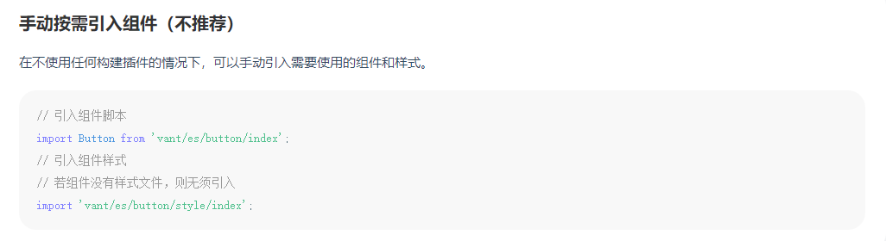

# VUE第7天 - 路由（★★★★★）

# 知识点自测

- [ ] url的组成部分都有哪些, hash值指的什么

  Hash（散列函数），一般翻译做“散列”，也有直接音译为“哈希”的，就是把任意长度的输入（又叫做预映射， pre-image），通过散列算法，变换成固定长度的输出，该输出就是散列值。

# 今日学习目标

1. 能够了解单页面应用概念和优缺点
2. 能够掌握vue-router路由系统使用
3. 能够掌握链接导航和编程式导航用法
4. 能够掌握路由嵌套和路由守卫
5. 能够掌握vant组件库基础使用

# 一. vue路由简介和基础使用

## 1.1 什么是路由

1. 设备和ip的映射关系


2. 接口和服务的映射关系


3. 路径和组件的映射关系


总结：

1. 路由是一对一的映射关系
2. vue中的路由是路径和组件的映射关系，通过路径的不同在页面上展示不同的组件


## 1.2 为什么使用路由

> 目标: 在一个页面里, 切换业务场景，不会刷新

具体使用示例: 网易云音乐 https://music.163.com/

**单页面应用(SPA):**  所有功能在**一个html页面上实现**

前端路由作用: 实现业务场景切换

优点：

* 整体不刷新页面，用户体验更好

* 数据传递容易, 开发效率高

缺点：

* 首次加载会比较慢一点。不利于seo（搜索引擎优化）


**总结：**

1. 单页面应用： 所有业务都在一个页面上编写，只有一个html
2. 通过路由来切换单页面的业务场景

## 1.3 vue-router

### 1.3.1 介绍

> 目标: 如何在Vue项目中集成路由

官网: https://router.vuejs.org/zh/

- vue-router模块包
  - 它和 Vue.js 深度集成
  - 可以定义 - 视图表(映射规则)
- 模块化的

- 提供2个内置全局组件（router-link，router-view）

- 声明式导航自动激活的 CSS class 的链接

### 1.3.2 组件分类

> 目标:  .vue文件分2类, 一个是页面组件, 一个是复用组件

.vue文件本质无区别, 方便大家学习和理解, 总结的一个经验

src/views(或pages) 文件夹 和 src/components文件夹

* 页面组件 - 页面展示 - 配合路由用
* 复用组件 - 展示数据/常用于复用


> 总结: views下的页面组件, 配合路由切换, components下的一般引入到views下的vue中复用展示数据

### 1.3.3 vue-router使用

> 目标: 学会vue官方提供的vue-router路由系统功能模块使用


需求： 通过切换不同的路由链接，来实现内容页面的切换

App.vue - 页面标签和样式准备(==可复制继续写==)

分析：

1. 下载vue-router模块到当前项目
2. 在main.js中引入VueRouter函数
3. 在Vue.use()上，添加全局RouterLink和RouterView组件
4. 创建**路由规则**数组（路由结构） - 保证路径和组件名称一一对应
5. 利用规则生产路由对象
6. 把路由对象注入到new Vue实例中
7. 用router-view作为挂载点，切换不同的路由页面
8. [vue-router文档](https://v3.router.vuejs.org/zh/)

步骤：

1. 安装

   ```bash
   // 1. 下载vue-router
   yarn add vue-router@3.5.1
   npm i vue-router@3.5.1 -D
   ```

2. 在main.js 中导入路由

   ```js
   // 2. 引入
   import VueRouter from 'vue-router'
   ```

3. 使用路由插件

   ```js
   // 在vue中，使用使用vue的插件，都需要调用Vue.use()
   // 3. 注册全局组件
   Vue.use(VueRouter)
   ```

4. 创建路由规则数组

   ```js
   import Find from './views/Find.vue' // @是src的绝对地址
   import My from './views/My.vue'
   import Part from './views/Part.vue'
   // 4. 规则数组
   const routes = [
     {
       path: "/find", // 路由
       component: Find // 组件名称
     },
     {
       path: "/my",
       component: My
     },
     {
       path: "/part",
       component: Part
     }
   ]
   ```

   Find.vue

   ```vue
   <template>
     <div>
       <p>推荐</p>
       <p>排行榜</p>
       <p>歌单</p>
     </div>
   </template>
   ```

   My.vue

   ```vue
   <template>
     <div>
         <p>我的收藏</p>
         <p>我的历史记录</p>
     </div>
   </template>
   ```

   Part.vue

   ```vue
   <template>
     <div>
         <p>关注明星</p>
         <p>发现精彩</p>
         <p>寻找伙伴</p>
         <p>加入我们</p>
     </div>
   </template>
   ```

5. 创建路由对象 -  传入规则

   ```js
   // 5. 生成路由对象（传入配置对象）
   const router = new VueRouter({
     routes,// routes是固定key(传入规则数组)
   })
   ```

6. 关联到vue实例

   ```js
   new Vue({
     router
   })
   ```

7. 设置App.vue引入挂载路由组件

   ```vue
   <template>
     <div>
       <div class="footer_wrap">
         <a href="#/find">发现音乐</a>
         <a href="#/my">我的音乐</a>
         <a href="#/part">朋友</a>
       </div>
       <div class="top">
         <!-- 7. 设置挂载点-当url的hash值路径切换, 显示规则里对应的组件到这 -->
         <router-view></router-view>
       </div>
     </div>
   </template>

   <script>
   export default {};
   </script>

   <style scoped>
   .footer_wrap {
     position: fixed;
     left: 0;
     top: 0;
     display: flex;
     width: 100%;
     text-align: center;
     background-color: #333;
     color: #ccc;
   }
   .footer_wrap a {
     flex: 1;
     text-decoration: none;
     padding: 20px 0;
     line-height: 20px;
     background-color: #333;
     color: #ccc;
     border: 1px solid black;
   }
   .footer_wrap a:hover {
     background-color: #555;
   }
   .top {
     padding-top: 62px;
   }
   </style>
   ```


> 总结: 
>
> 1. 下载路由模块, 编写对应规则注入到vue实例上, 使用router-view挂载点显示切换的路由
>
> 2. 一切都围绕着hash值变化为准,切换url上的hash值，开始匹配规则，对应组件展示到router-view位置

## 1.4 声明式导航（用的不多）

### 1.4.1 基础用法


> 可用全局组件router-link来替代a标签

1.  vue-router提供了一个全局组件 router-link
2.  router-link实质上最终会渲染成a链接 to属性等价于提供 href属性**(to无需#)**
3.  router-link提供了声明式导航高亮的功能(自带类名)


```vue
<template>
  <div>
    <div class="footer_wrap">
      <router-link to="/find">发现音乐</router-link>
      <router-link to="/my">我的音乐</router-link>
      <router-link to="/part">朋友</router-link>
    </div>
    <div class="top">
      <router-view></router-view>
    </div>
  </div>
</template>

<script>
    // 目标: 声明式导航 - 基础使用
    // 本质: vue-router提供的全局组件 "router-link"替代a标签
    // 1. router-link 替代a标签
    // 2. to属性      替代href属性
    // 好处: router-link自带高亮的类名(激活时类名)
    // 3. 对激活的类名做出样式的编写
    export default {};
</script>

<style scoped>
/* 省略了 其他样式 */
.footer_wrap .router-link-active{
  color: white;
  background: black;
}
</style>
```

>  总结: 
>
>  1. router-link是全局组成的组件，本质就是a标签
>  2. 当使用router-link时，必须传入to属性，指定路由路径值
>  3. 自带类名
>
>  router-link没啥大用


### 1.4.2  跳转传参

> 目标: 在跳转路由时, 可以给路由对应的组件内传值

在router-link上的to属性传值, 语法格式如下

* /path?参数名=值
* /path/值 – 需要路由对象提前配置 path: “/path/参数名”


对应页面组件接收传递过来的值

* `$route.query.参数名`
* `$route.params.参数名`


步骤：

1. 路由定义

   ```js
   {
       path: "/part",
       component: Part
   },
   {
       path: "/part/:username", // 有:的路径代表要接收具体的值
       component: Part
   },
   ```

2. 修改`Part.vue`中接受的路由参数

   ```vue
   <template>
     <div>
         <p>关注明星</p>
         <p>发现精彩</p>
         <p>寻找伙伴</p>
         <p>加入我们</p>
         <p>人名: {{ $route.query.name }} -- {{ $route.params.username }}</p>
     </div>
   </template>

   <script>
   // 目标: 声明式导航 - 传值
   // 方式1:
   // to="/path?参数名=值"
   // 接收: $route.query.参数名

   // 方式2:
   // (1): 路由规则path上 定义 /path/:参数名
   // (2): to="/path/值"
   // 接收: $route.params.参数名
   export default {};
   </script>
   ```

3. 导航跳转, 传值给Part.vue组件

   App.vue

   ```vue
   <router-link to="/part?name=小传">朋友-小传</router-link>
   <router-link to="/part/小智">朋友-小智</router-link>
   ```

> 总结: 
>
> 1. ?key=value   用$route.query.key 取值
>
> 2. /值   提前在路由规则/path/:key  用$route.params.key  取值 (可读性很差，建议不要使用)

## 1.5 路由重定向和模式修改

### 1.5.1 重定向

场景：首次进入页面时，没有任何路由的hash值，页面元素会显示空白，如何解决？

> 目标: 匹配path后, 强制切换到目标path上

* 网页打开url默认hash值是/路径
* redirect是设置要重定向到哪个路由路径

```js
const routes = [
  {
    path: "/", // 默认hash值路径
    redirect: "/find" // 重定向到/find
    // 浏览器url中#后的路径被改变成/find-重新匹配数组规则
  }
]
```

> 总结: 强制重定向后, 还会重新来数组里匹配一次规则

**实际作用：**

1. 当某个路由在使用过程中废弃掉之后，将原来路由地址重定向到其他地址
2. 当满足某个条件时（如：登录信息过期），可以重定向到某个指定位置

### 1.5.2 路由 - 404页面

> 目标: 如果路由hash值, 没有和数组里规则匹配

默认给一个404页面


语法: 路由最后, path匹配*(任意路径) – 前面不匹配就命中最后这个, 显示对应组件页面

**步骤：**

1. 创建`NutFound`页面

   ```vue
   <template>
     
   </template>

   <script>
   export default {

   }
   </script>

   <style scoped>
       img{
           width: 100%;
       }
   </style>
   ```

2. 在main.js - 修改路由配置

   ```js
   import NotFound from '@/views/NotFound'

   const routes = [
     // ...省略了其他配置
     // 404在最后(规则是从前往后逐个比较path)
     {
       path: "*",
       component: NotFound
     }
   ]
   ```


> 总结: 如果路由未命中任何规则, 给出一个兜底的404页面


### 1.5.3 路由模式修改

> 目标: 修改路由在地址栏的模式
>
> [模式文档](https://router.vuejs.org/zh/api/#mode)

hash路由例如:  http://localhost:8080/#/home

history路由例如: http://localhost:8080/home  (以后上线需要服务器端支持, 否则找的是文件夹)

```js
const router = new VueRouter({
  routes,
  mode: "history" // 打包上线后需要后台支持, 模式是hash
})
```

> 唯一区别，是路由后缀有无#号

## 1.5 编程式导航 （★★★★★）

> 用JS代码跳转!

### 1.5.1 基础用法

语法：

**path和name二选一！**

```js
this.$router.push({
    path: "路由路径", // 都去 router/index.js定义
    name: "路由名"
})
```

1. main.js - 路由数组里, 给路由起名字

   **代码规范：**一般情况下，path除去`/`以外的部分和name需要保持一致

   ```js
   {
       path: "/find",
       name: "Find",
       component: Find
   },
   {
       path: "/my",
       name: "My",
       component: My
   },
   {
       path: "/part",
       name: "Part",
       component: Part
   },
   ```

2. App.vue - 换成span 配合js的编程式导航跳转

   ```vue
   <template>
     <div>
       <div class="footer_wrap">
         <span @click="btn('/find', 'Find')">发现音乐</span>
         <span @click="btn('/my', 'My')">我的音乐</span>
         <span @click="btn('/part', 'Part')">朋友</span>
       </div>
       <div class="top">
         <router-view></router-view>
       </div>
     </div>
   </template>

   <script>
   // 目标: 编程式导航 - js方式跳转路由
   // 语法:
   // this.$router.push({path: "路由路径"})
   // this.$router.push({name: "路由名"})
   // 注意:
   // 虽然用name跳转, 但是url的hash值还是切换path路径值
   // 场景:
   // 方便修改: name路由名(在页面上看不见随便定义)
   // path可以在url的hash值看到(尽量符合组内规范)
   export default {
     methods: {
       btn(targetPath, targetName){
         // 方式1: path跳转
         this.$router.push({
           // path: targetPath,
           name: targetName
         })
       }
     }
   };
   </script>

   <style scoped>
   .footer_wrap {
     position: fixed;
     left: 0;
     top: 0;
     display: flex;
     width: 100%;
     text-align: center;
     background-color: #333;
     color: #ccc;
   }
   .footer_wrap span {
     flex: 1;
     text-decoration: none;
     padding: 20px 0;
     line-height: 20px;
     background-color: #333;
     color: #ccc;
     border: 1px solid black;
   }
   .footer_wrap span:hover {
     background-color: #555;
   }
   .top {
     padding-top: 62px;
   }

   /*激活时样式 */
   .footer_wrap .router-link-active{
     color: white;
     background: black;
   }
   </style>
   ```

### 1.5.2 跳转传参

> 目标: JS跳转路由, 传参

语法 query / params 任选 一个

```js
this.$router.push({
    path: "路由路径"
    name: "路由名",
    query: {
    	"参数名": 值
    }
    params: {
		"参数名": 值
    }
})

// 方式1:
// params => $route.params.参数名

// 方式2:
// query => $route.query.参数名
```

**格外注意:** 使用path的话，只能和query一起使用，不可以使用params(会自动忽略)

App.vue

```vue
<template>
  <div>
    <div class="footer_wrap">
      <span @click="btn('/find', 'Find')">发现音乐</span>
      <span @click="btn('/my', 'My')">我的音乐</span>
      <span @click="oneBtn">朋友-小传</span>
      <span @click="twoBtn">朋友-小智</span>
    </div>
    <div class="top">
      <router-view></router-view>
    </div>
  </div>
</template>

<script>
// 目标: 编程式导航 - 跳转路由传参
// 方式1:
// params => $route.params.参数名
// 方式2:
// query => $route.query.参数名
// 重要: path会自动忽略params
// 推荐: name+query方式传参
// 注意: 如果当前url上"hash值和?参数"与你要跳转到的"hash值和?参数"一致, 爆出冗余导航的问题, 不会跳转路由
export default {
  methods: {
    btn(targetPath, targetName){
      // 方式1: path跳转
      this.$router.push({
        // path: targetPath,
        name: targetName
      })
    },
    oneBtn(){
      this.$router.push({
        name: 'Part',
        params: {
          username: '小传'
        }
      })
    },
    twoBtn(){
      this.$router.push({
        name: 'Part',
        query: {
          name: '小智'
        }
      })
    }
  }
};
</script>

<style scoped>
.footer_wrap {
  position: fixed;
  left: 0;
  top: 0;
  display: flex;
  width: 100%;
  text-align: center;
  background-color: #333;
  color: #ccc;
}
.footer_wrap span {
  flex: 1;
  text-decoration: none;
  padding: 20px 0;
  line-height: 20px;
  background-color: #333;
  color: #ccc;
  border: 1px solid black;
}
.footer_wrap span:hover {
  background-color: #555;
}
.top {
  padding-top: 62px;
}

/*激活时样式 */
.footer_wrap .router-link-active{
  color: white;
  background: black;
}
</style>
```

## 1.6 路由嵌套

> 目标: 在现有的一级路由下, 再嵌套二级路由

[二级路由示例-网易云音乐-发现音乐下](https://music.163.com/)


router-view嵌套架构图

1. 创建所有组件

   

2. main.js– 继续配置2级路由

   一级路由path从/开始定义

   二级路由往后path直接写名字, 无需/开头

   嵌套路由在上级路由的children数组里编写路由信息对象

   ```js
   import Find from './views/Find.vue' // @是src的绝对地址
   import My from './views/My.vue'
   import Part from './views/Part.vue'
   import NotFound from './views/NotFound.vue'
   import Recommend from './views/Second/Recommend.vue'
   import Ranking from './views/Second/Ranking.vue'
   import SongList from './views/Second/SongList.vue'
   const routes = [
     {
       path: "/", // 默认hash值路径
       redirect: "/find" // 重定向到/find
       // 浏览器url中#后的路径被改变成/find-重新匹配规则
     },
     {
       path: "/find",
       name: "Find",
       component: Find,
       children: [
         {
           path: "recommend",
           component: Recommend
         },
         {
           path: "ranking",
           component: Ranking
         },
         {
           path: "songlist",
           component: SongList
         }
       ]
     }
   ]
   ```

3. 配置router-view

   

   App.vue的router-view负责发现音乐和我的音乐页面, 切换

   ```vue
   <template>
     <div>
       <div class="footer_wrap">
         <router-link to="/find">发现音乐</router-link>
         <router-link to="/my">我的音乐</router-link>
       </div>
       <div class="top">
         <router-view></router-view>
       </div>
     </div>
   </template>
   ```

   Find.vue的的router-view负责发现音乐下的, 三个页面, 切换

   ```vue
   <template>
     <div>
       <p>推荐</p>
       <p>排行榜</p>
       <p>歌单</p>
       <div class="nav_main">
         <router-link to="/find/recommend">推荐</router-link>
         <router-link to="/find/ranking">排行榜</router-link>
         <router-link to="/find/songlist">歌单</router-link>
       </div>

       <div style="1px solid red;">
         <router-view></router-view>
       </div>
     </div>
   </template>
   ```

4. 运行 - 点击导航观察嵌套路由在哪里展示

> 总结: 
>
> 1. 嵌套路由, 找准在哪个页面里写router-view和对应规则里写children
> 2. 页面跳转时，多级路由需要把每个阶段的路由地址拼接起来，如: `/find/songlist`
> 3. 写非一级路由时，path里的内容不能有`/`

## 1.7 声明导航 - 类名区别

> 目标: router-link自带的2个类名的区别是什么

观察路由嵌套导航的样式

* router-link-exact-active  (精确匹配) url中hash值路径, 与href属性值完全相同, 设置此类名

* router-link-active             (模糊匹配) url中hash值,    **包含**href属性值这个路径


## 1.8 全局前置守卫（★★★★★）

### 1.8.1 beforeEach

> 目的: 路由跳转之前, 先执行一次前置守卫函数, 判断是否可以正常跳转

**场景：**在跳转路由前, 判断用户登陆了才能去<我的音乐>页面, 未登录弹窗提示回到发现音乐页面

1. 在路由对象上使用固定方法beforeEach

   ```js
   // 目标: 路由守卫
   // 场景: 当你要对路由权限判断时
   // 语法: router.beforeEach((to, from, next)=>{//路由跳转"之前"先执行这里, 决定是否跳转})
   // 参数1 to: 要跳转到的路由 (路由对象信息)    目标
   // 参数2 from: 从哪里跳转的路由 (路由对象信息)  来源
   // 参数3 next: 函数体 - next()才会让路由正常的跳转切换, next(false)在原地停留, next("强制修改到另一个路由路径上")
   // 注意: 如果不调用next, 页面留在原地

   // 例子: 判断用户是否登录, 是否决定去"我的音乐"/my
   const isLogin = true; // 登录状态(未登录)
   router.beforeEach((to, from, next) => {
     if (to.path === "/my" && isLogin === false) {
       alert("请登录")
       next(false) // 阻止路由跳转
       // next('/part') // 跳转别的地方
     } else {
       next() // 正常放行
     }
   })
   ```


> 总结: 
>
> 1. next()放行
> 2. next(false)留在原地不跳转路由
> 3. next(path路径)强制换成对应path路径跳转


### 1.8.2 扩展：afterEach

> 添加一个导航钩子，在每次导航后执行。返回一个删除注册钩子的函数。

语法：

```js
router.afterEach((to,from)=>{}) 
```

**注意：**该钩子一般用于跳转到某个页面后，调用某个身份验证接口获取权限

### 1.8.3 组件内的独享路由钩子

1. `beforeRouteEnter` - 在进入到该组件之前，触发
2. `beforeRouteUpdate` - 仅是当前组件内部的路由发生变化（主路由地址没有改变）时，触发
3. `beforeRouteLeave` - 离开该组件之前，触发

```vue
<script>
    export default {
        beforeRouteEnter(to, from, next) {
            // 在渲染该组件的对应路由被 confirm 前调用
            // 不！能！获取组件实例 `this`
            // 因为当守卫执行前，组件实例还没被创建
            console.log('进find')
            next()
        },
        beforeRouteUpdate(to, from, next) {
            // 在当前路由改变，但是该组件被复用时调用
            // 举例来说，对于一个带有动态参数的路径 /foo/:id，在 /foo/1 和 /foo/2 之间跳转的时候，
            // 由于会渲染同样的 Foo 组件，因此组件实例会被复用。而这个钩子就会在这个情况下被调用。
            // 可以访问组件实例 `this`
            console.log('被复用')
            next()
        },
        beforeRouteLeave(to, from, next) {
            // 导航离开该组件的对应路由时调用
            // 可以访问组件实例 `this`
            console.log('离开')
            next()
        }
    };
</script>
```


# 二. vant组件库

>  目标: vant是一个轻量、可靠的移动端 Vue 组件库, 开箱即用
>
>  [vant官网](https://vant-contrib.gitee.io/vant/#/zh-CN/)

特点:

* 提供 60 多个高质量组件，覆盖移动端各类场景
* 性能极佳，组件平均体积不到 1kb
* 完善的中英文文档和示例
* 支持 Vue 2 & Vue 3
* 支持按需引入和主题定制

## 2.1 全部引入使用（推荐）

> 目标: 看官网文档, 下载, 引入vant组件库

全部引入, 快速开始:https://vant-contrib.gitee.io/vant/#/zh-CN/quickstart

1.全部引入, 快速开始: [https://vant-contrib.gitee.io/vant/#/zh-CN/quickstart](https://vant-contrib.gitee.io/vant/)

2.下载Vant组件库到当前项目中

3.在main.js中全局导入所有组件,

4.使用按钮组件 – 作为示范的例子


步骤

1. 下载vant组件库到当前项目中

   ```bash
   yarn add vant -D
   npm i vant@latest-v2 -S
   ```

2. 导入所有组件, 在main.js中

   ```js
   import Vue from 'vue';
   import Vant from 'vant';
   import 'vant/lib/index.css';

   Vue.use(Vant);
   ```

3. 使用按钮组件

   https://vant-contrib.gitee.io/vant/#/zh-CN/button

   ```vue
   <templatge>
   	<div>
           <van-button type="primary">主要按钮</van-button>
           <van-button type="info">信息按钮</van-button>
           <van-button type="default">默认按钮</van-button>
           <van-button type="warning">警告按钮</van-button>
           <van-button type="danger">危险按钮</van-button>
       </div>
   </templatge>
   ```

## 2.2 手动按需引入

> 目标: 只引入使用的组件



步骤：

1. 手动单独引入

   在需要使用组件的`.vue`文件中

   ```vue
   <script>
   // 方式2: 手动 按需引入
   import Button from 'vant/lib/button'; // button组件
   import 'vant/lib/button/style'; // button样式
   export default {
   };
   </script>
   ```

2. 注册

   ```vue
   <script>
   // 方式2: 手动 按需引入
   import Button from 'vant/lib/button'; // button组件
   import 'vant/lib/button/style'; // button样式
   export default {
         components: { // 手动注册组件名
         // VanButton: Button
         // 等价的
         [Button.name]: Button
     },
   };
   </script>
   ```

3. 使用

   ```vue
   <van-button type="primary">主要按钮</van-button>
   <van-button type="info">信息按钮</van-button>
   <van-button type="default">默认按钮</van-button>
   <van-button type="warning">警告按钮</van-button>
   <van-button type="danger">危险按钮</van-button>
   ```

## 2.3 自动按需引入（推荐）

> 目标: 按需加载组件


[babel-plugin-import](https://github.com/ant-design/babel-plugin-import) 是一款 babel 插件，它会在编译过程中将 import 的写法自动转换为按需引入的方式。

1. 安装插件

   ```bash
   yarn add babel-plugin-import -D
   ```

2. 在babel配置文件里 (babel.config.js)

   

   ```js
   module.exports = {
     presets: [
       '@vue/cli-plugin-babel/preset'
     ],
     plugins: [
       ['import', {
         libraryName: 'vant',
         libraryDirectory: 'es',
         style: true
       }, 'vant']
     ]
   }
   ```

3. 在main.js中全局注册 - 会自动按需引入

   ```js
   // 全局 - 自动按需引入vant组件
   // (1): 下载 babel-plugin-import
   // (2): babel.config.js - 添加官网说的配置 (一定要重启服务器)
   // (3): main.js 按需引入某个组件, Vue.use全局注册 - 某个.vue文件中直接使用vant组件
   import { Button, Form, Field  } from 'vant';
   Vue.use(Button) // Button组件全局注册, 真正注册的组件名VanButton
   Vue.use(Form);
   Vue.use(Field);
   ```

## 2.4 弹出框使用

> 目标: 使用弹出框组件


```vue
<template>
  <div>
    <van-button type="primary" @click="btn">主要按钮</van-button>
    <van-button type="info">信息按钮</van-button>
    <van-button type="default">默认按钮</van-button>
    <van-button type="warning">警告按钮</van-button>
    <van-button type="danger">危险按钮</van-button>
  </div>
</template>

<script>
// 目标: 使用弹出框
// 1. 找到vant文档
// 2. 引入
// 3. 在恰当时机, 调用此函数 (还可以用组件的用法)
import { Dialog } from "vant";
export default {
  methods: {
    btn() {
      Dialog({ message: "提示", showCancelButton: true }); // 调用执行时, 页面就会出弹出框
    },
  },
};
</script>
```

## 2.5 表单使用

> 目标: 使用vant组件里的表单组件


表单验证规则:


示例代码：

```vue
<van-form @submit="onSubmit">
  <van-cell-group inset>
    <van-field
      v-model="username"
      name="用户名"
      label="用户名"
      placeholder="用户名"
      :rules="[{ required: true, message: '请填写用户名' }]"
    />
    <van-field
      v-model="password"
      type="password"
      name="密码"
      label="密码"
      placeholder="密码"
      :rules="[{ required: true, message: '请填写密码' }]"
    />
  </van-cell-group>
  <div style="margin: 16px;">
    <van-button round block type="primary" native-type="submit">
      提交
    </van-button>
  </div>
</van-form>

<script>
export default {
  data() {
    return {
      username: '',
      password: '',
    };
  },
  methods: {
    onSubmit(values) { // 表单提交事件, values收集表单里的值
      console.log('submit', values);
    }
  },
};
</script>
```


# 今日总结

- [ ] 了解什么是单页面应用, 以及优缺点

- [ ] 了解组件分为哪2类

- [ ] 路由的本质是什么, 就是改变url的hash值, 让js监听到, 根据配置好的映射规则, 显示不同的DOM

- [ ] 声明式导航router-link是vue-router封装注册的全局组件, 比a标签好处是封装了高亮类名等

- [ ] 编程式导航, 用Vue内置的方法改变浏览器url,  this.$router.push() 

- [ ] 路由跳转传参总结

  | 跳转方法                                     | 传参位置            | 路由规则         | 接收                             |
  | ---------------------------------------- | --------------- | ------------ | ------------------------------ |
  | `<router-link to="/path?key=value"></router-link>` | /path?key=value | 无特殊          | $route.query.key               |
  | `<router-link to="/path/值"></router-link>` | /path/值         | /path/:key   | $route.params.key              |
  | `this.$router.push({path: "/path", query: {key: value}})` | query的对象        | 无特殊          | $route.query.key               |
  | `this.$router.push({name: "com", params: {key: value})` | params的对象       | 路由规则需要name属性 | $route.params.key(注意,这种在内存中保存) |

  ==无论哪种格式, 声明式和编程式都是通用的, 保证路径和参数格式正确就ok==

- [ ] 路由重定向, 在配置项上使用redirect到目标路由路径

- [ ] 嵌套路由就是在某个一级页面中, 在嵌套一套路由切换系统

  * 在路由规则里找到一级路由, 写children: []  注意: 除了第一层一级路由path写/, 子的开头都无需/
  * 跳转时, 要去的路由路径从一级开始写
  * 心中要做到 浏览器url 路由值  和路由规则里的path 对上即可

- [ ] 全局路由前置守卫 - 可以在跳转路由前进行一些权限判断

- [ ] vant组件库是封装好的组件, 我们拿来即可使用

## 面试题

### 1. 路由之间是怎么跳转的？有哪些方式

 1、`<router-link to="需要跳转到页面的路径">`

 2、this.$router.push()跳转到指定的url，并在history中添加记录，点击回退返回到上一个页面

 3、this.$router.replace()跳转到指定的url，但是history中不会添加记录，点击回退到上上个页面

 4、this.$touter.go(n)向前或者后跳转n个页面，n可以是正数也可以是负数

### 2. vue-router怎么配置路由

在vue中配置路由分为5个步骤，分别是：

1. 引入vue-router.js
2. 配置路由path和组件, 和生成路由对象
3. 把路由对象配置到new Vue中router选项下
4. 页面使用`<router-view></router-view>` 承载路由
5. `<router-link to="要跳转的路径"></router-link>` 设置路由导航(声明式导航方式/编程式跳转)

### 3. vue-router的钩子函数都有哪些

关于vue-router中的钩子函数主要分为3类

全局钩子函数要包含beforeEach

  beforeEach函数有三个参数,分别是:

​	to:router即将进入的路由对象
​    from:当前导航即将离开的路由
​    next:function,进行管道中的一个钩子，如果执行完了,则导航的状态就是 confirmed （确认的）否则为false,终止导航。

单独路由独享组件

​	beforeEnter,

组件内钩子

   beforeRouterEnter，
   beforeRouterUpdate,
   beforeRouterLeave

### 4. 路由传值的方式有哪几种

Vue-router传参可以分为两大类，分别是编程式的导航 router.push和声明式的导航

router.push

   字符串：直接传递路由地址，但是不能传递参数

​          this.$router.push("home")

​    对象：

​      命名路由  这种方式传递参数，目标页面刷新会报错 - name+params

​               this.$router.push({name:"news",params:{userId:123})

​      查询参数  和path配对的是query

​               this.$router.push({path:"/news',query:{uersId:123}) 

​      接收参数  this.$route.query

声明式导航

​      字符串 `<router-link to:"news"></router-link>`

​      命名路由` <router-link :to:"{name:'news',params:{userid:1111}}"></route-link>`

​	  还可以to="/path/值" - 需要提前在路由 规则里值 /path/:key

​      查询参数 `<router-link :to="{path:'/news',query:{userId:1111}}"></router-link>`

​	   还可以to="/path?key=value

### 5. 怎么定义vue-router的动态路由?怎么获取传过来的动态参数?

   动态路由指的就是path路径上传智, 前提需要路由规则了提前配置/path/:key名, 可以写多个用/隔开, 获取使用$route.params.key名来提取对应用路径传过来的值

### 6. Vue的路由实现模式：hash模式和history模式（必会）

hash模式：在浏览器中符号“#”，#以及#后面的字符称之为hash，用 window.location.hash 读取。特点：hash虽然在URL中，但不被包括在HTTP请求中；用来指导浏览器动作，对服务端安全无用，hash不会重加载页面。

history模式：history采用HTML5的新特性；且提供了两个新方法： pushState()， replaceState()可以对浏览器历史记录栈进行修改，以及popState事件的监听到状态变更

### 7. 请说出路由配置项常用的属性及作用（必会）

​    路由配置参数：  

​      path : 跳转路径
​      component : 路径相对于的组件
​     name:命名路由
​     children:子路由的配置参数(路由嵌套)
​     props:路由解耦
​     redirect : 重定向路由

### 8. 编程式导航使用的方法以及常用的方法（必会）

​    路由跳转 ： this.$router.push()
​    路由替换 : this.$router.replace()
​    后退： this.$router.back()
​    前进 ：this.$router.forward()

### 9. Vue如何去除URL中的#（必会）

​    vue-router 默认使用 hash 模式，所以在路由加载的时候，项目中的 URL 会自带 “#”。如果不想使用 “#”， 可以使用 vue-router 的另一种模式 history：new Router ({ mode : 'history', routes: [ ]})

​    需要注意的是，当我们启用 history 模式的时候，由于我们的项目是一个单页面应用，所以在路由跳转的时候，就会出现访问不到静态资源而出现 “404” 的情况，这时候就需要服务端增加一个覆盖所有情况的候选资源：如果 URL 匹配不到任何静态资源，则应该返回同一个 “index.html” 页面。

### 10. 说一下你在vue中踩过的坑（必会）

​    1、第一个是给对象添加属性的时候，直接通过给data里面的对象添加属性然后赋值，新添加的属性不是响应式的

​    【解决办法】通过Vue.set(对象，属性，值)这种方式就可以达到，对象新添加的属性是响应式的

2、 在created操作dom的时候，是报错的，获取不到dom，这个时候实例vue实例没有挂载

​    【解决办法】通过：Vue.nextTick(回调函数进行获取)

### 11. **$route和$router的区别？**

$route是路由信息对象，包括‘path，hash，query，fullPath，matched，name’等路由信息参数；
$router是路由实例对象，包括了路由的跳转方法，实例对象等

## 附加练习_1.切换页面

> 目的: 点击导航a标签, 实现下面页面内容的切换

建议: 新初始化一个空白的项目来写, 避免新手放到一起, 看的乱

要求: 网页打开默认显示 - 首页部分

规范: 

* views/ 4个页面.vue文件
* router/index.js - 路由配置
* App.vue显示, main.js 注册路由

效果:


## 附加练习_2.二级路由嵌套

> 目标: 完成git演示的路由切换效果

建议: 再新建一个工程来写

图示:


## 附加练习_3-tabbar切换

把之前写的tabbar案例(原来用动态组件实现)

现在请用路由实现相同的切换效果

## 今日作业

### 三级路由嵌套

要求:

* 默认显示第一个UI_Router路由(一级路由) 3个组件
* 第二个组件需要嵌入导航和二级路由 展示区域
* Bob下才需要第三个路由嵌入

提示:

> 点击按钮使用编程式导航, 可以在2级路由导航路径(带2个/的) 先写成一个数组, 随机取1个然后跳转即可

问题:

可能会爆出警告, 编程式导航如果当前已经在这页, 还想跳转当前路由就会出个警告, 无需关心不影响功能


标签内容(有的短自己手写吧)

```html
<div>
    <h3>Welcome to the UI-Router Demo</h3>
    <p>Use the menu above to navigate. Pay attention to the $state and $stateParams values below.</p>
    <p>Click these links—Alice or Bob—to see a url redirect in action.</p>
</div>


<div>
    <h3>UI-Router Resources</h3>
    <ul>
        <li>Source for this Sample</li>
        <li>GitHub Main Page</li>
        <li>Quick Start</li>
        <li>In-Depth Guide</li>
        <li>API Reference</li>
    </ul>
</div>
```

## 额外扩展

### 路由 - 工作原理手写

> 目标: 了解hash改变, 如何显示不同的组件的过程

基本思路:

1. 用户点击了页面上的a链接
2. 导致了 URL 地址栏中的 Hash 值发生了变化
3. 前端js监听了到 Hash 地址的变化
4. 前端js把当前 Hash 地址对应的组件渲染都浏览器中

实现简单的前端路由:

1. src/views/创建并在App.vue里导入和注册组件

   MyHome.vue

   MyMovie.vue

   MyAbout.vue

```html
<script>
import MyHome from '@/views/MyHome.vue'
import MyMovie from '@/views/MyMovie.vue'
import MyAbout from '@/views/MyAbout.vue'
export default {
  components: {
    MyHome,
    MyMovie,
    MyAbout,
  }
}
</script>
```

2. 通过动态组件, 控制要显示的组件

```vue
<template>
  <div>
    <h1>App组件</h1>
    <component :is="comName"></component>
  </div>
</template>

<script>
export default {
  // ...省略其他
  data () {
    return {
      comName: 'MyHome'
    }
  }
}
</script>
```

3. 声明三个导航链接, 点击时修改地址栏的 hash 值

```jsx
<template>
  <div>
    <h1>App组件</h1>
    <a href="#/home">首页</a>&nbsp;
    <a href="#/movie">电影</a>&nbsp;
    <a href="#/about">关于</a>&nbsp;
    <component :is="comName"></component>
  </div>
</template>
```

4. 在 created 中, 监视地址栏 hash 时的变化, 一旦变化, 动态切换展示的组件

```jsx
created () {
  window.onhashchange = () => {
    switch(location.hash) {
      case '#/home':
        this.comName = 'MyHome'
        break
      case '#/movie':
        this.comName = 'MyMovie'
        break
      case '#/about':
        this.comName = 'MyAbout'
        break
    }
  }
},
```

> 总结: 改变浏览器url的hash值, JS监听到hash值改变, 把对应的组件显示到同一个挂载点