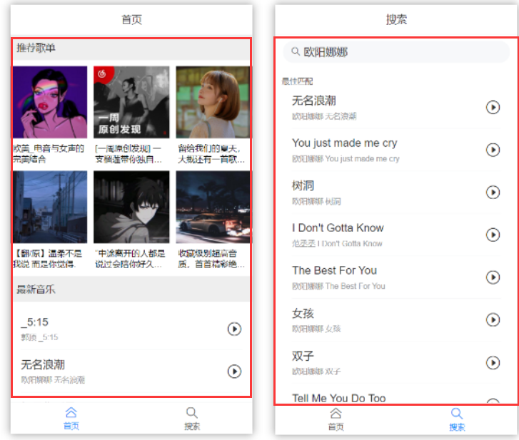

## VUE第八天

# 知识点自测

- [ ] yarn命令的使用
- [ ] 组件名字用name属性方式注册
- [ ] 如何自定义组件库样式

# 铺垫(自学)

> #### 本地接口项目部署

下载网易云音乐node接口项目, 在本地启动, 为我们vue项目提供数据支持（课件里有本地包，可以直接解压使用）

[项目地址](https://binaryify.github.io/NeteaseCloudMusicApi/#/?id=%e5%ae%89%e8%a3%85)

[备用地址](https://github.com/Binaryify/NeteaseCloudMusicApi/tree/master/docs)

下载后, 安装所有依赖, 在本地启动起来, 测试访问此地址是否有数据

http://localhost:3000, 看到如下页面就成功了 - 等着明天上课启动即可


> 总结: 前端请求本地的node项目, node服务器伪装请求去拿网易云音乐服务器数据转发回给自己前端

# 今日学习目标

1. 能够掌握vant组件库的使用
2. 能够掌握vant组件自定义样式能力
3. 能够掌握组件库使用和文档使用能力
4. 能够完成网易云音乐案例

# 一. 案例-网易云音乐

## 面试背点01

1. 什么是跨域

   **同源策略：**一个域下的js脚本未经运行情况下，不能访问另一个域下的内容。通常判断域的依赖是**协议**、**域名**、**端口号**是否相同，不同则跨域。同源策略是对js脚本的一种限制，并不是对浏览器的限制，像img, script脚本请求不会有跨域限制

   **解决跨域通讯的几种方式：**

   1. `jsonp`(利用`script`标签没有跨域限制的漏洞实现。缺点：只支持`GET`请求)
   2. `CORS`(设置`Access-Control-Allow-Origin`：指定可访问资源的域名)
   3. `postMessage`(`message,targetOrigin,[transfer]`)(`HTML5`新增API用于多窗口消息、页面内嵌iframe消息传递)，通过`onmessage`监听传递过来的数据
   4. `Websocket`是HTML5的一个持久化的协议，它实现了浏览器与服务器的全双工通信，同时也是跨域的一种解决方案
   5. `Node`中间件代理
   6. `Nginx`反向代理
   7. 各种嵌套`iframe`的方式，不常用
   8. 日常工作中用的最对的跨域方案是CORS和Nginx反向代理

## 1.1 本地接口

> 目的: 请求网易云音乐服务器API接口-获取数据


> 总结: 反向代理就是用本地开启cors的服务器去转发请求拿到数据

## 1.2本地接口启动

> 目的: 启动本地网易云音乐API服务

在今天的笔记铺垫中, 大家自学下载了一个项目启动即可


## 1.3 前端项目初始化

> 目标: 初始化项目, 下载必备包, 引入初始文件, 配置按需自动引入vant, 创建页面组件
>
> 若创建出现问题，可查阅[解决babel报错](https://blog.csdn.net/qq_58946786/article/details/124595797)

1. 初始化工程

   ```bash
   vue create music-demo
   ```

   **建议使用以往初始化后的项目文件直接拷贝过来**

2. 下载需要的所有第三方依赖包

   ```bash
   yarn add axios vant@latest-v2 vue-router@3.5.1
   ```

3. 引入笔记代码里准备好的reset.css和flexible.js - 实现样式初始化和适配问题 - 引入到main.js、

   ```
   import "./mobile/flexible.js" // 适配
   import "./styles/reset.css" // 初始化样式
   ```

   

4. 本次vant使用**自动按需引入**的方式

   文档: https://vant-contrib.gitee.io/vant/#/zh-CN/quickstart

   ```bash
   yarn add babel-plugin-import  -D
   ```

   在babel.config.js - 添加插件配置

   ```js
   plugins: [
       ['import', {
           libraryName: 'vant',
           libraryDirectory: 'es',
           style: true
       }, 'vant']
   ]
   ```


## 1.4 需求分析

> 1.3 5:23

根据需求, 创建路由所需要的5个页面的组件：

1. Layout 布局页
   1. 顶部导航 Header
   2. 内容（二级路由）
      1. Home 首页
      2. Search 查询
   3. 底部导航 Hooter
2. Play 播放详情页

**注意：**该项目的顶部导航和底部导航不存在其他组件的复用，仅使用在Layout中，所以不做组件拆分


步骤：

1. 在views文件夹中创建4个组件

   

2. 为不同组件添加默认样式

   默认样式众多，以提前准备在空项目文件中，直接复制使用。

## 1.5 路由准备

> 目标: 准备路由配置, 显示不同路由页面



router/index.js - 准备路由 - 以及默认显示Layout, 然后Layout默认显示二级路由的首页


```JS
// 路由-相关模块
import Vue from 'vue'
import VueRouter from 'vue-router'
import Layout from '../views/Layout/layout.vue'
import Home from '../views/Home/home.vue'
import Search from '../views/Search/search.vue'
import Play from '../views/Play/play.vue'

Vue.use(VueRouter)
const routes = [
    {
        path: '/', // 开启项目进入首页，也就是重定向至首页
        redirect: '/layout'
    },
    {
        path: '/layout',
        component: Layout,
        redirect: '/layout/home', // 马上定向到二级路由
        children: [
            {
                path: 'home',
                component: Home,
                meta: { // meta保存路由对象额外信息的
                    title: "首页"
                }
            },
            {
                path: 'search',
                component: Search,
                meta: {
                    title: "搜索"
                }
            }
        ]
    },
    {
        path: '/play',
        component: Play
    }
]

const router = new VueRouter({
    routes
})

export default router
```

步骤：

1. main.js - 引入路由对象, 注册到new Vue中

   ```js
   import router from './router/index.js'
   
   new Vue({
     render: h => h(App),
     router
   }).$mount('#app')
   ```

2. App.vue中留好router-view显示路由页面

   ```vue
   <template>
     <div>
       <router-view></router-view>
     </div>
   </template>
   ```

3. Layout中设置二级路由router-view页面

   ```vue
   <template>
     <div>
       layout
       header
       <router-view></router-view>
       footer
     </div>
   </template>
   ```

## 1.6 底部导航 - Tabbar组件

> 目标: 点击底部导航, 切换路由页面显示
>
> 文档: https://vant-contrib.gitee.io/vant/#/zh-CN/tabbar


步骤：

1. 注册Tabbar组件, 在main.js中

   ```js
   import { Tabbar, TabbarItem  } from 'vant';
   Vue.use(Tabbar);
   Vue.use(TabbarItem);
   ```

2. 在Layout.vue中使用

   ```vue
   <template>
     <div>
       <!-- 二级路由-挂载点 -->
       <div class="main">
         <router-view></router-view>
       </div>
       <van-tabbar v-model="active">
         <van-tabbar-item icon="home-o">标签</van-tabbar-item>
         <van-tabbar-item icon="search">标签</van-tabbar-item>
       </van-tabbar>
     </div>
   </template>
   
   <script>
   export default {
     name: 'layout-index',
     data() {
       return {
         activeTitle: 0
       };
     },
   }
   </script>
   ```

3. 通过tabbar的路由模式实现切换二级页面

   

   ```vue
   <template>
     <div>
       <!-- 二级路由-挂载点 -->
       <div class="main">
         <router-view></router-view>
       </div>
       <van-tabbar route>
         <van-tabbar-item replace to="/layout/home" icon="home-o"
           >首页</van-tabbar-item>
         <van-tabbar-item replace to="/layout/search" icon="search"
           >搜索</van-tabbar-item>
       </van-tabbar>
     </div>
   </template>
   ```

   **注：**开启路由模式 route属性, 和to属性指向要切换的路由路径

## 1.7 头部导航 - NavBar组件

> 目标: 实现顶部标题展示
>
> 文档: https://vant-contrib.gitee.io/vant/#/zh-CN/nav-bar


1. main.js - 注册NavBar组件

   ```js
   import { NavBar } from 'vant';
   
   
   Vue.use(NavBar);
   ```

2. 复制文档里的, 然后删删只留标题

   ```vue
   <van-nav-bar :title="activeTitle" fixed />
   
   <script>
       export default {
           activeTitle: '首页'
       }
   </script>
   ```

## 1.8 标题切换

> 目标: 实现点击底部导航/刷新非第一页面页面, 导航标题正确显示

步骤：

1. 在router/index.js - 给$route里需要导航标题的添加meta(元信息属性)

   ```
               {
                   path: 'home',
                   component: Home,
                   meta: { // meta保存路由对象额外信息的
                       title: "首页"
                   }
               },
               {
                   path: 'search',
                   component: Search,
                   meta: {
                       title: "搜索"
                   }
               }
   ```

2. Layout.vue中监听$route改变: 给导航active的值设置$route里的元信息的标题

   ```js
   export default {
     name: 'layout-index',
     data() {
       return {
         activeTitle: this.$route.meta.title, // "默认"顶部导航要显示的标题 (默认获取当前路由对象里的meta中title值)
       };
     },
     // 路由切换 - 侦听$route对象改变
     watch: {
       $route() {
         this.activeTitle = this.$route.meta.title; // 提取切换后路由信息对象里的title显示
       },
     },
   };
   ```

   > 总结: 点击底部导航和刷新当前网页, 都能保证导航标题的正确显示

## 1.9 网络请求封装

> 目标: 不想把网络请求散落在各个逻辑页面里, 不然以后找起来改起来很麻烦

1. 封装utils/request.js - 基于axios进行二次封装 - 设置基础地址（原来是放在main.js中的）

   ```js
   // 网络请求 - 二次封装
   import axios from 'axios'
   axios.defaults.baseURL = "http://localhost:3000"
   export default axios
   ```

2. 封装src/api/Home.js

   统一封装网络请求方法

   ```js
   // 文件名-尽量和模块页面文件名统一(方便查找)
   import request from '@/utils/request'
   
   // 首页 - 推荐歌单
   export const recommendMusic = params => request({
       url: '/personalized',
       params
       // 将来外面可能传入params的值 {limit: 20}
   })
   ```

3. 在src/api/index.js - 统一导出接口供外部使用

   ```js
   // api文件夹下 各个请求模块js, 都统一来到index.js再向外导出
   import {recommendMusic} from './Home'
   
   export const recommendMusicAPI = recommendMusic // 请求推荐歌单的方法导出
   ```

4. 在main.js - **测试**使用一下.

   ```js
   import { recommendMusicAPI } from './api/index'
   async function myFn(){
     const res = await recommendMusicAPI({limit: 6});
     console.log(res);
   }
   myFn();
   ```

   

> 思考，为什么不直接引用`src/api/Home.js`中的方法，而是要设置`index.js`

> 总结: 封装网络请求方法目的, 方便我们统一管理


## 1.10 首页-推荐歌单 - home.vue

>  接口地址: /personalized


步骤：

1. 布局采用van-row和van-col 

   布局文档https://vant-contrib.gitee.io/vant/#/zh-CN/col

   

2. 使用vant内置的图片组件来显示图片

3. 在main.js注册使用的组件

   ```js
   import { Col, Row } from 'vant';
   
   Vue.use(Col);
   Vue.use(Row);
   ```

4. 设置基本栅格

   ```vue
   <template>
     <div>
       <p class="title"></p>
       <van-row gutter="6">
         <van-col span="8">span: 8</van-col>
         <van-col span="8">span: 8</van-col>
         <van-col span="8">span: 8</van-col>
       </van-row>
     </div>
   </template>
   ```

5. 引入图片组件 - VanImage 

   ```js
   import { Image as VanImage } from 'vant';
   Vue.use(VanImage);
   ```

6. 制作栅格静态内容（上图片下名称）

   

   ```
   <template>
     <div>
       <p class="title">推荐歌单</p>
   
       <van-row gutter="6">
         <van-col span="8">
           <van-image width="100%" height="3rem" fit="cover" src="https://fastly.jsdelivr.net/npm/@vant/assets/cat.jpeg" />
           <p class="song_name">歌单名称</p>
         </van-col>
         <van-col span="8">
           <van-image width="100%" height="3rem" fit="cover" src="https://fastly.jsdelivr.net/npm/@vant/assets/cat.jpeg" />
           <p class="song_name">歌单名称</p>
         </van-col>
         <van-col span="8">
           <van-image width="100%" height="3rem" fit="cover" src="https://fastly.jsdelivr.net/npm/@vant/assets/cat.jpeg" />
           <p class="song_name">歌单名称</p>
         </van-col>
       </van-row>
     </div>
   </template>
   ```

7. 在`api/home.js`下定义推荐歌单的接口方法，并且在`api/index.js`用引出

   home.js

   ```js
   // 首页 - 推荐歌单
   export const recommendMusic = params => request({
     url: '/personalized',
     method: 'GET',
     params
     // 将来外面可能传入params的值 {limit: 20}
   })
   ```

   index.js

   ```js
   import {recommendMusic} from './Home'
   export const recommendMusicAPI = recommendMusic // 请求推荐歌单的方法导出
   ```

8. 把数据请求回来, 用van-image和p标签展示推荐歌单和歌单名字

   ```vue
   <template>
     <div>
       <p class="title">推荐歌单</p>
   
       <van-row gutter="6">
         <van-col span="8" v-for="obj in reList" :key="obj.id">
           <van-image width="100%" height="3rem" fit="cover" :src="obj.picUrl" />
           <p class="song_name">{{ obj.name }}</p>
         </van-col>
         <!-- <van-col span="8">
           <van-image width="100%" height="3rem" fit="cover" src="https://fastly.jsdelivr.net/npm/@vant/assets/cat.jpeg" />
           <p class="song_name">歌单名称</p>
         </van-col> -->
       </van-row>
     </div>
   </template>
   
   <script>
   // 目标: 铺设推荐歌单
   // 1. van-row和van-col来搭建外框布局
   // 2. van-col里内容(van-image和p)
   // 3. 调整间距和属性值
   // 4. 调用封装的api/index.js-推荐歌单api方法
   // 5. 拿到数据保存到data里变量-去上面循环标签
   import { recommendMusicAPI } from '../../api/index'
   export default {
     name: 'home-index',
     data() {
       return {
         reList: [], // 推荐歌单数据
       }
     },
     async created() {
       const res = await recommendMusicAPI({
         limit: 6,
       });
       console.log(res);
       // 保存到data数据中
       this.reList = res.data.result;
     },
   }
   </script>
   ```

## 1.11 首页 - 最新音乐 - home.vue

> 目标: van-cell单元格使用
>
> 请求地址: /personalized/newsong


1. 引入van-cell使用 - 注册组件main.js中 (单行单元格)

   ```
   import {Cell} from 'vant';
   Vue.use(Cell);
   ```

2. 设置基本页面

   ```vue
   <template>
     <div>
       <p class="title">推荐歌单</p>
       <van-cell title="单元格" value="内容" label="描述信息" />
     </div>
   </template>
   ```

3. 自定义组件标签 - 插槽

   

   ```vue
       <van-cell title="单元格" label="描述信息">
         <template #right-icon>
           <van-icon name="play-circle-o" class="search-icon" size="0.6rem" />
         </template>
       </van-cell>
   ```

   注意：引入新组件要在main.js中注册

   ```js
   import { Icon  } from 'vant';
   Vue.use(Icon);
   ```

4. 给cell单元格添加下边框

   ```css
   .van-cell {
     border-bottom: 1px solid lightgray;
   }
   ```

5. 在`api/home.js`下定义推荐歌单的接口方法，并且在`api/index.js`用引出

   home.js

   ```js
   // 首页 - 推荐新音乐
   export const newMusic = params => request({
     url: "/personalized/newsong",
     method: 'GET',
     params
   })
   ```

   index.js

   ```js
   // api文件夹下 各个请求模块js, 都统一来到index.js再向外导出
   import {recommendMusic, newMusic} from './Home'
   
   export const newMusicAPI = newMusic // 首页 - 最新音乐
   ```

6. 把数据请求回来, 用van-cell在页面上遍历

   ```vue
   <template>
     <div>
       <p class="title">推荐歌单</p>
   
       <van-cell :title="obj.name" :label="obj.song.artists[0].name" v-for="obj in songList" :key="obj.id">
         <template #right-icon>
           <van-icon name="play-circle-o" class="search-icon" size="0.6rem" />
         </template>
       </van-cell>
   
     </div>
   </template>
   
   <script>
   // 目标: 铺设最新音乐
   // 1. van-cell铺设一套标签结构
   // 2. 自定义右侧插槽里小图标, 调整垂直居中
   // 3. api/Home.js和api/index.js-封装导出获取最新音乐接口方法
   // 4. 获取数据循环铺设页面即可
   import { recommendMusicAPI, newMusicAPI } from '../../api/index'
   export default {
     name: 'home-index',
     data() {
       return {
         reList: [], // 推荐歌单数据
         songList: [], // 最新音乐数据
       }
     },
     async created() {
       const res2 = await newMusicAPI({
         limit: 20
       })
       console.log(res2);
       this.songList = res2.data.result
     },
   }
   </script>
   ```

## 1.12 搜索-热搜关键字 - search.vue

> 目标: 完成热搜关键字铺设 使用 搜索框组件 – van-search

1. api/Search.js – 热搜关键字 - 请求接口

   > 请求地址: /personalized/newsong

2. Search/search.vue引入-获取热搜关键字 - 铺设页面

3. 点击文字填充到输入框中


步骤：

1. 引入van-search使用 - 注册组件main.js中 (单行单元格)

   ```
   import {Search} from 'vant';
   Vue.use(Search)
   ```

2. 设置基本页面

   ```vue
   <template>
     <div>
       <van-search
         shape="round"
         placeholder="请输入搜索关键词"
       />
       <!-- 搜索下容器 -->
       <div class="search_wrap">
         <!-- 标题 -->
         <p class="hot_title">热门搜索</p>
         <!-- 热搜关键词容器 -->
         <div class="hot_name_wrap">
           <!-- 每个搜索关键词 -->
           <span
             class="hot_item"
             >热搜关键字</span
           >
         </div>
       </div>
     </div>
   </template>
   ```

3. 在`api/Search.js`下定义热门搜索接口方法和搜索结果方法，并且在`api/index.js`用引出

   api/Search.js

   ```js
   // 搜索模块
   import request from '../utils/request.js'
   
   // 热搜关键字
   export const hotSearch = params => request({
     url: '/search/hot',
     method: 'GET',
     params
   })
   
   // 搜索结果
   export const searchResultList = params => request({
     url: '/cloudsearch',
     method: 'GET',
     params
   })
   ```

   api/index.js

   ```js
   import { hotSearch, searchResultList } from './Search'
   
   export const hotSearchAPI = hotSearch // 搜索 - 热搜关键词
   export const searchResultListAPI = searchResultList // 搜索 = 搜索结果
   ```

4. created中请求接口-拿到热搜关键词列表

   ```vue
   <template>
     <div>
       <van-search
         shape="round"
         placeholder="请输入搜索关键词"
       />
       <!-- 搜索下容器 -->
       <div class="search_wrap">
         <!-- 标题 -->
         <p class="hot_title">热门搜索</p>
         <!-- 热搜关键词容器 -->
         <div class="hot_name_wrap">
           <!-- 每个搜索关键词 -->
           <span class="hot_item" v-for="(obj, i) in hotArr" :key="i">
             {{obj.first}}
             </span>
         </div>
       </div>
     </div>
   </template>
   
   <script>
   // 目标: 铺设热搜关键字
   // 1. 搜索框van-search组件, 关键词标签和样式
   // 2. 找接口, api/Search.js里定义获取搜索关键词的请求方法
   // 3. 引入到当前页面, 调用接口拿到数据循环铺设页面
   // 4. 点击关键词把值赋予给van-search的v-model变量
   import { hotSearchAPI } from '../../api/index'
   
   export default {
     name: 'search-index',
             data(){
               return {
                   hotArr: [], // 热搜关键字
               }
           },
           async created() {
               const res = await hotSearchAPI();
               console.log(res);
               this.hotArr = res.data.result.hots;
           },
   }
   </script>
   ```

5. 点击热词填充到输入框

   ```vue
   <van-search shape="round" placeholder="请输入搜索关键词" v-model="value"/>
   
   <script>
   import { hotSearchAPI } from '../../api/index'
   
   export default {
     name: 'search-index',
     data() {
       return {
         value: "", // 搜索关键词
         hotArr: [], // 热搜关键字
       }
     },
     async created() {
       const res = await hotSearchAPI();
       this.hotArr = res.data.result.hots;
     },
     methods: {
       fn(val) {
         this.value = val // 选中的关键词显示到搜索框
       }
     },
   }
   </script>
   ```

> 总结: 写好标签和样式, 拿到数据循环铺设, 点击关键词填入到van-search中


## 1.13 搜索-点击热词-搜索结果 - search.vue

> 1.12 18:09

> 目标: 点击热词填充到输入框-出搜索结果

1. api/Search.js - 搜索结果, 接口方法

2. Search/index.vue引入-获取搜索结果 - 铺设页面

   

3. 和热搜关键字容器 – 互斥显示

4. 点击文字填充到输入框, 请求搜索结果铺设

**步骤：**

1. 搜索结果显示区域标签+样式 （与最新歌单非常相似）

   ```vue
       <!-- 搜索结果 -->
       <div class="search_wrap">
         <!-- 标题 -->
         <p class="hot_title">最佳匹配</p>
         <van-cell
           center
           title='结果名字'
         >
           <template #right-icon>
             <van-icon name="play-circle-o" size="0.6rem"/>
           </template>
         </van-cell>
       </div>
   ```

   ```css
   /* 给单元格设置底部边框 */
   .van-cell {
     border-bottom: 1px solid lightgray;
   }
   ```

2. 创建获取搜索结果列表方法 - getListFn()

   > 注意：
   >
   > 1.  async修饰的函数 -> 默认返回一个全新Promise对象
   > 2.  这个Promise对象的结果就是async函数内return的值
   > 3.  拿到getListFn的返回值用await提取结果

   ```js
   export default {
     name: 'search-index',
     data() {
       return {
         value: "", // 搜索关键词
         hotArr: [], // 热搜关键字
         resultList: [], // 搜索结果
       }
     },
     async created() {
       const res = await hotSearchAPI();
       console.log(res);
       this.hotArr = res.data.result.hots;
     },
     methods: {
       async fn(val) {
         this.value = val // 选中的关键词显示到搜索框
   
         // 选中后搜索数据
         const res = await this.getListFn()
         this.resultList = res.data.result.songs
       },
   
       // 获取搜索数据
       async getListFn() {
         return await searchResultListAPI({
           keywords: this.value,
           limit: 20,
         }); // 把搜索结果return出去
         // (难点):
         // async修饰的函数 -> 默认返回一个全新Promise对象
         // 这个Promise对象的结果就是async函数内return的值
         // 拿到getListFn的返回值用await提取结果
       },
     },
   }
   ```

3. 将数据铺设到页面上

   ```vue
       <!-- 搜索结果 -->
       <div class="search_wrap">
         <!-- 标题 -->
         <p class="hot_title">最佳匹配</p>
         <van-cell center :title="obj.name" :label="obj.ar[0].name" v-for="obj in resultList" :key="obj.id">
           <template #right-icon>
             <van-icon name="play-circle-o" size="0.6rem" />
           </template>
         </van-cell>
       </div>
   ```

4. 互斥显示, 热搜关键词和搜索结果列表

   思考：通过什么条件来互斥 ？

   答： 通过搜索结果列表长度来判断

   ```vue
   <template>
     <div>
       <van-search shape="round" placeholder="请输入搜索关键词" v-model="value" />
       <!-- 搜索下容器 -->
       <div class="search_wrap" v-if="resultList.length === 0">
         <!-- 标题 -->
         <p class="hot_title">热门搜索</p>
         <!-- 热搜关键词容器 -->
         <div class="hot_name_wrap">
           <!-- 每个搜索关键词 -->
           <span class="hot_item" v-for="(obj, i) in hotArr" :key="i" @click="fn(obj.first)">
             {{ obj.first }}
           </span>
         </div>
       </div>
   
       <!-- 搜索结果 -->
       <div class="search_wrap" v-else>
         <!-- 标题 -->
         <p class="hot_title">最佳匹配</p>
         <van-cell center :title="obj.name" :label="obj.ar[0].name" v-for="obj in resultList" :key="obj.id">
           <template #right-icon>
             <van-icon name="play-circle-o" size="0.6rem" />
           </template>
         </van-cell>
       </div>
     </div>
   </template>
   ```


## 1.14 输入框-搜索结果 search.vue

> 目标: 监测输入框改变-拿到搜索结果

1. 观察van-search组件是否支持和实现input事件

   

2. 绑定@input事件和方法

3. 在事件处理方法中获取对应的值使用

4. 如果搜索不存在的数据-要注意接口返回字段不同

步骤：

1. 绑定@input事件在van-search上

   ```vue
   <van-search shape="round" placeholder="请输入搜索关键词" v-model="value" @input="inputFn" />
   ```

   ```js
   methods: {
   	// 搜索框查询
       async inputFn() {},
   }
   ```

2. 实现输入框改变 - 获取搜索结果铺设

   > 注意：
   >
   > 1. @input给van-search绑定事件
   > 2. @input事件中, 获取搜索结果保存 resultList中
   > 3. 判断如果搜索关键字为空(.length === 0), 数组清空, 阻止网络请求执行(提前return)  

   ```js
       // 搜索框查询
       async inputFn() {
         // 输入框值改变
         if (this.value.length === 0) {
           // 搜索关键词如果没有, 就把搜索结果清空阻止网络请求发送(提前return)
           this.resultList = [];
           return;
         }
   
         // 触发查询结果方法
         const res = await this.getListFn();
         // 如果搜索结果响应数据没有songs字段-无数据
         if (res.data.code === 400 || res.data.result.songs === undefined) {
           this.resultList = [];
           return;
         }
         this.resultList = res.data.result.songs;
       },
   ```

## 1.15 搜索结果-加载更多 - search.js

> 1.14 14.31

> 目标: 触底后, 加载下一页数据

1. van-list组件监测触底执行onload事件

   

2. 配合后台接口, 传递下一页的标识

3. 拿到下一页数据后追加到当前数组末尾即可

**步骤：**

1. 注册List组件

   ```js
   import { List } from 'vant';
   
   Vue.use(List);
   ```

2. 设置van-list组件实现相应的属性和方法, 让page++去请求下页数据

   > 注意
   >
   > 1. 集成list组件-定义相关的变量(搞懂变量的作用) -监测触底事件
   >
   > 2. 一旦触底, 自动执行onload方法
   >
   > 3. 对page++, 给后台传递offset偏移量参数-请求下一页的数据
   >
   > 4. 把当前数据和下一页新来的数据拼接起来用在当前 页面的数组里
   > 5. (切记) - 加载更多数据后,一定要把loading改成false, 保证下一次还能触发onload方法

   ```vue
   <template>
     <div>
       <!-- 搜索结果 -->
       <div class="search_wrap" v-else>
         <!-- 标题 -->
         <p class="hot_title">最佳匹配</p>
   
         <van-list v-model="loading" :finished="finished" finished-text="没有更多了" @load="onLoad">
           <van-cell center :title="obj.name" :label="obj.ar[0].name" v-for="obj in resultList" :key="obj.id">
             <template #right-icon>
               <van-icon name="play-circle-o" size="0.6rem" />
             </template>
           </van-cell>
         </van-list>
       </div>
     </div>
   </template>
   
   <script>
   export default {
     name: 'search-index',
     data() {
       return {
         value: "", // 搜索关键词
         hotArr: [], // 热搜关键字
         resultList: [], // 搜索结果
         loading: false, // 加载中 (状态) - 只有为false, 才能触底后自动触发onload方法
         finished: false, // 未加载全部 (如果设置为true, 底部就不会再次执行onload, 代表全部加载完成)
         page: 1, // 当前搜索结果的页码
       }
     },
     methods: {
       // 获取搜索数据
       async getListFn() {
         return await searchResultListAPI({
           keywords: this.value,
           limit: 20,
           offset: (this.page - 1) * 20, // 固定公式
         }); // 把搜索结果return出去
         // (难点):
         // async修饰的函数 -> 默认返回一个全新Promise对象
         // 这个Promise对象的结果就是async函数内return的值
         // 拿到getListFn的返回值用await提取结果
       },
   
       // 搜索框查询
       async inputFn() {
         // 输入框值改变
         if (this.value.length === 0) {
           // 搜索关键词如果没有, 就把搜索结果清空阻止网络请求发送(提前return)
           this.resultList = [];
           return;
         }
   
         // 触发查询结果方法
         const res = await this.getListFn();
         // 如果搜索结果响应数据没有songs字段-无数据
         if (res.data.code === 400 || res.data.result.songs === undefined) {
           this.resultList = [];
           return;
         }
         this.resultList = res.data.result.songs;
       },
   
       async onLoad() {
         // 触底事件(要加载下一页的数据咯), 内部会自动把loading改为true
         console.log(123)
         this.page++
         const res = await this.getListFn()
         console.log(res.data.result)
         this.resultList = [...this.resultList, ...res.data.result.songs]
         this.loading = false; // 数据加载完毕-保证下一次还能触发onload
       },
     },
   }
   </script>
   ```

> 总结: list组件负责UI层监测触底, 执行onload函数, page++, 请求下页数据, 和现在数据合并显示更多, 设置loading为false, 确保下次触底还能执行onLoad


问题： 当无法查到歌曲时，页面会报错


## 1.16 加载更多-bug修复 - search.js

> 目标: 如果只有一页数据/无数据判断

无数据/只有一页数据, finished为true

防止list组件触底再加载更多

还要测试-按钮点击/输入框有数据情况的加载更多


步骤：

1. 修复onLoad方法，如果全部加载完成`res.data.result.songs`没有更多数据显示，则告诉list完成全部的加载，不再触发onLoad方法

   

   ```js
       async onLoad() {
         // 触底事件(要加载下一页的数据咯), 内部会自动把loading改为true
         this.page++;
         const res = await this.getListFn();
         if (res.data.code === 400 || res.data.result.songs === undefined) { // 没有更多数据了
           this.finished = true; // 全部加载完成(list不会在触发onload方法)
           this.loading = false; // 本次加载完成
           return;
         }
         this.resultList = [...this.resultList, ...res.data.result.songs];
         this.loading = false; // 数据加载完毕-保证下一次还能触发onload
       },
   ```

   > 发现点击关键字，和输入框查询时，只会加载一页了

2. 修复点击关键字，和输入框查询时的列表状态

   `fn()`

   ```js
       async fn(val) {
         // 点击热搜关键词
         this.page = 1; // 点击重新获取第一页数据
         this.finished = false; // 点击新关键词-可能有新的数据
         this.value = val; // 选中的关键词显示到搜索框
         const res = await this.getListFn();
         this.resultList = res.data.result.songs;
         this.loading = false; // 本次数据加载完毕-才能让list加载更多
       },
   ```

   `input`

   ```js
       // 搜索框查询
       async inputFn() {
         this.page = 1; // 点击重新获取第一页数据
         this.finished = false // 输入框关键字改变-可能有新数据(不一定加载完成了)
         // 输入框值改变
         if (this.value.length === 0) {
           // 搜索关键词如果没有, 就把搜索结果清空阻止网络请求发送(提前return)
           this.resultList = [];
           return;
         }
         const res = await this.getListFn();
         console.log(res);
         // 如果搜索结果响应数据没有songs字段-无数据
         if (res.data.code === 400 || res.data.result.songs === undefined) {
           this.resultList = [];
           return
         }
         this.resultList = res.data.result.songs;
         this.loading = false;
       },
   ```

> 总结: 
>
> 1. 在3个函数 上和下, 设置finished还未完成, 最后要把loading改成false, 判断songs字段, 对这里的值要非常熟悉才可以
> 2. 并且页码需要初始化

## 1.17 输入框-防抖 - search.js

> 目标: 输入框触发频率过高， 通过防抖降低输入框触发的频率

输入框输入"asdfghjkl"

​	接着快速的删除

​	每次改变-马上发送网络请求

​	网络请求异步耗时 – 数据回来后还是铺设到页面上


解决:

​	引入防抖功能


步骤：

1. 在inputFn() 输入框查询方法加入防抖功能

   > 1. 计时n秒, 最后执行一次, 如果再次触发, 重新计时
   > 2. 用户在n秒内不触发这个事件了, 才会开始执行逻辑代码

   ```js
       // 搜索框查询
       async inputFn() {
         // 目标: 输入框改变-逻辑代码-慢点执行
         // 解决: 防抖
         // 概念: 计时n秒, 最后执行一次, 如果再次触发, 重新计时
         // 效果: 用户在n秒内不触发这个事件了, 才会开始执行逻辑代码
         if (this.timer) { // 每次都判断是否有延时任务，如果有则重置任务
           clearTimeout(this.timer)
         }
   
         this.this = setTimeout(async () => {
           this.page = 1; // 点击重新获取第一页数据
           this.finished = false // 输入框关键字改变-可能有新数据(不一定加载完成了)
           // 输入框值改变
           if (this.value.length === 0) {
             // 搜索关键词如果没有, 就把搜索结果清空阻止网络请求发送(提前return)
             this.resultList = [];
             return;
           }
           const res = await this.getListFn();
           console.log(res);
           // 如果搜索结果响应数据没有songs字段-无数据
           if (res.data.result.songs === undefined) {
             this.resultList = [];
             return
           }
           this.resultList = res.data.result.songs;
           this.loading = false;
         }, 1000)
       },
   ```

> 总结: 降低函数执行频率

## 1.18 SongItem封装 - 封装音乐单元格

> 目标: 把首页和搜索结果的歌曲cell封装起来


创建src/components/SongItem.vue

```vue
<template>
  <van-cell center :title="name" :label="author">
    <template #right-icon>
      <van-icon name="play-circle-o" size="0.6rem"/>
    </template>
  </van-cell>
</template>

<script>
export default {
  props: {
    name: String, // 歌名
    author: String, // 歌手
    id: Number, // 歌曲id (标记这首歌曲-为将来跳转播放页做准备)
  }
};
</script>

<style scoped>
/* 给单元格设置底部边框 */
.van-cell {
  border-bottom: 1px solid lightgray;
}
</style>
```

Home/index.vue - 重构

==注意: author字段不同==

```vue
<SongItem v-for="obj in songList"
    :key="obj.id"
    :name="obj.name"
    :author="obj.song.artists[0].name"
    :id="obj.id"
></SongItem>
```

Search/index.vue - 重构

==注意: author字段不同==

```vue
<SongItem
          v-for="obj in resultList"
          :key="obj.id"
          :name="obj.name"
          :author="obj.ar[0].name"
          :id="obj.id"
></SongItem>
```

> 总结: 遇到重复标签要封装

## 1.19 网易云音乐-播放音乐

> 目标: 从预习资料拿到播放的api和页面, 配置好路由规则

==时间关系,这个页面不用写, 直接用, 注释在备课代码里写好了==

api/Play.js – 提前准备好 – 接口方法

```js
import request from '../utils/request'

// 播放页 - 获取歌曲详情
export const getSongById = (id) => request({
  url: `/song/detail?ids=${id}`,
  method: "GET"
})

// 播放页 - 获取歌词
export const getLyricById = (id) => request({
  url: `/lyric?id=${id}`,
  method: "GET"
})
```

api/index.js – 中引入

```js
import { getSongById, getLyricById } from './Play'

export const getSongByIdAPI = getSongById // 歌曲 - 播放地址
export const getLyricByIdAPI = getLyricById // 歌曲 - 歌词数据
```

跳转到Play页面 – 把歌曲id带过进去

在SongItem.vue - 点击播放字体图标

```vue
<template>
  <van-cell center :title="name" :label="author">
    <template #right-icon>
      <van-icon name="play-circle-o" size="0.6rem" @click="playFn"/>
    </template>
  </van-cell>
</template>

<script>
export default {
  props: {
    name: String, // 歌名
    author: String, // 歌手
    id: Number, // 歌曲id (标记这首歌曲-为将来跳转播放页做准备)
  },
  methods: {
    playFn(){
      this.$router.push({
        path: '/play',
        query: {
          id: this.id // 歌曲id, 通过路由跳转传递过去
        }
      })
    }
  }
};
</script>
```

## 1.20 vant字体大小适配

> 问题： 在切换一些不同的移动设备时， vant组件表现出来的字体打下差强人意
>
> 原因： vant组件中用的px

* postcss – 配合webpack翻译css代码
* postcss-pxtorem – 配合webpack, 自动把px转成rem
* 新建postcss.config.js – 设置相关配置
* 重启服务器, 再次观察Vant组件是否适配

1. 下载postcss和==postcss-pxtorem@5.1.1==

   ```bash
   npm i postcss
   npm i postcss-pxtorem@5.1.1
   ```

   postcss作用: 是对css代码做降级处理

   postcss-pxtorem: 自动把所有代码里的css样式的px, 自动转rem

2. 在package.json同级处创建postcss.config.js

   ```js
   module.exports = {
     plugins: {
       'postcss-pxtorem': {
         // 能够把所有元素的px单位转成Rem
         // rootValue: 转换px的基准值。
         // 例如一个元素宽是75px，则换成rem之后就是2rem。
         rootValue: 37.5,
         propList: ['*']
       }
     }
   }
   ```

   ==以iphone6为基准, 37.5px为基准值换算rem==

> 小结：
>
> 1. 移动端如何适配?
>    1. 把所有px转成rem
>    2. 利用flexible.js – 网页宽度改变 – 自动切换html的font-size
> 2. 如何让px自动转rem?
>    1. 让webpack配合postcss和postcss-pxtorem即可


## 1.21 补充 - api响应拦截器

可以通过响应拦截器来对接口返回的结果做一次统一筛选，提取自己需要的部分放到数据页面中。

```js
axios.interceptors.response.use(res => {
  return res.data
})
```


## 今日总结

- [ ] 掌握vant组件库的使用 - 找组件, 引组件, 用组件
- [ ] 能够对vant组件自带样式进行覆盖自定义
- [ ] 遇到重复的标签, 自己也封装了一个复用的组件
- [ ] 掌握查询文档和使用每个属性的方式

## 今日作业

把课上的案例-从0再来一遍, 为下阶段移动端项目铺垫


